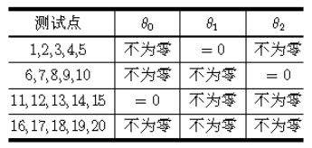
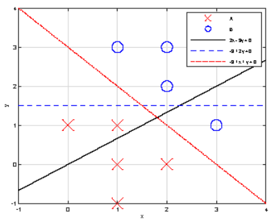
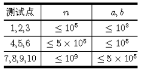

# 灰度直方图
<div class="problembox">
	<div class="problemheadbar">问题描述</div>
	<div class="problemdesc">
	<table class="probtable" style="font-size:14px; text-align:center; background:#c0d6dd;" align="center" width="100%" cellpadding="0" cellspacing="1">
	<tbody><tr><td class="probref">试题编号：</td><td>202104-1</td></tr>
	<tr><td class="probref">试题名称：</td><td>灰度直方图</td></tr>
	<tr><td class="probref">时间限制：</td><td>1.0s</td></tr>
	<tr><td class="probref">内存限制：</td><td>512.0MB</td></tr>
	<tr><td class="probref">问题描述：</td><td class="prob-cont"><h2 id="问题描述">问题描述</h2>
<p>一幅长宽分别为 <mjx-container class="MathJax CtxtMenu_Attached_0" jax="CHTML" role="presentation" tabindex="0" ctxtmenu_counter="0" style="font-size: 103.4%; position: relative;"><mjx-math class="MJX-TEX" aria-hidden="true"><mjx-mi class="mjx-i"><mjx-c class="mjx-c6E"></mjx-c></mjx-mi></mjx-math><mjx-assistive-mml role="presentation" unselectable="on" display="inline"><math xmlns="http://www.w3.org/1998/Math/MathML"><mi>n</mi></math></mjx-assistive-mml></mjx-container> 个像素和 <mjx-container class="MathJax CtxtMenu_Attached_0" jax="CHTML" role="presentation" tabindex="0" ctxtmenu_counter="1" style="font-size: 103.4%; position: relative;"><mjx-math class="MJX-TEX" aria-hidden="true"><mjx-mi class="mjx-i"><mjx-c class="mjx-c6D"></mjx-c></mjx-mi></mjx-math><mjx-assistive-mml role="presentation" unselectable="on" display="inline"><math xmlns="http://www.w3.org/1998/Math/MathML"><mi>m</mi></math></mjx-assistive-mml></mjx-container> 个像素的灰度图像可以表示为一个 <mjx-container class="MathJax CtxtMenu_Attached_0" jax="CHTML" role="presentation" tabindex="0" ctxtmenu_counter="2" style="font-size: 103.4%; position: relative;"><mjx-math class="MJX-TEX" aria-hidden="true"><mjx-mi class="mjx-i"><mjx-c class="mjx-c6E"></mjx-c></mjx-mi><mjx-mo class="mjx-n" space="3"><mjx-c class="mjx-cD7"></mjx-c></mjx-mo><mjx-mi class="mjx-i" space="3"><mjx-c class="mjx-c6D"></mjx-c></mjx-mi></mjx-math><mjx-assistive-mml role="presentation" unselectable="on" display="inline"><math xmlns="http://www.w3.org/1998/Math/MathML"><mi>n</mi><mo>×</mo><mi>m</mi></math></mjx-assistive-mml></mjx-container> 大小的矩阵 <mjx-container class="MathJax CtxtMenu_Attached_0" jax="CHTML" role="presentation" tabindex="0" ctxtmenu_counter="3" style="font-size: 103.4%; position: relative;"><mjx-math class="MJX-TEX" aria-hidden="true"><mjx-mi class="mjx-i"><mjx-c class="mjx-c41"></mjx-c></mjx-mi></mjx-math><mjx-assistive-mml role="presentation" unselectable="on" display="inline"><math xmlns="http://www.w3.org/1998/Math/MathML"><mi>A</mi></math></mjx-assistive-mml></mjx-container>。<br>其中每个元素 <mjx-container class="MathJax CtxtMenu_Attached_0" jax="CHTML" role="presentation" tabindex="0" ctxtmenu_counter="4" style="font-size: 103.4%; position: relative;"><mjx-math class="MJX-TEX" aria-hidden="true"><mjx-msub><mjx-mi class="mjx-i" noic="true"><mjx-c class="mjx-c41"></mjx-c></mjx-mi><mjx-script style="vertical-align: -0.15em;"><mjx-texatom size="s" texclass="ORD"><mjx-mi class="mjx-i"><mjx-c class="mjx-c69"></mjx-c></mjx-mi><mjx-mi class="mjx-i"><mjx-c class="mjx-c6A"></mjx-c></mjx-mi></mjx-texatom></mjx-script></mjx-msub></mjx-math><mjx-assistive-mml role="presentation" unselectable="on" display="inline"><math xmlns="http://www.w3.org/1998/Math/MathML"><msub><mi>A</mi><mrow><mi>i</mi><mi>j</mi></mrow></msub></math></mjx-assistive-mml></mjx-container>（<mjx-container class="MathJax CtxtMenu_Attached_0" jax="CHTML" role="presentation" tabindex="0" ctxtmenu_counter="5" style="font-size: 103.4%; position: relative;"><mjx-math class="MJX-TEX" aria-hidden="true"><mjx-mn class="mjx-n"><mjx-c class="mjx-c30"></mjx-c></mjx-mn><mjx-mo class="mjx-n" space="4"><mjx-c class="mjx-c2264"></mjx-c></mjx-mo><mjx-mi class="mjx-i" space="4"><mjx-c class="mjx-c69"></mjx-c></mjx-mi><mjx-mo class="mjx-n" space="4"><mjx-c class="mjx-c3C"></mjx-c></mjx-mo><mjx-mi class="mjx-i" space="4"><mjx-c class="mjx-c6E"></mjx-c></mjx-mi></mjx-math><mjx-assistive-mml role="presentation" unselectable="on" display="inline"><math xmlns="http://www.w3.org/1998/Math/MathML"><mn>0</mn><mo>≤</mo><mi>i</mi><mo>&lt;</mo><mi>n</mi></math></mjx-assistive-mml></mjx-container>、<mjx-container class="MathJax CtxtMenu_Attached_0" jax="CHTML" role="presentation" tabindex="0" ctxtmenu_counter="6" style="font-size: 103.4%; position: relative;"><mjx-math class="MJX-TEX" aria-hidden="true"><mjx-mn class="mjx-n"><mjx-c class="mjx-c30"></mjx-c></mjx-mn><mjx-mo class="mjx-n" space="4"><mjx-c class="mjx-c2264"></mjx-c></mjx-mo><mjx-mi class="mjx-i" space="4"><mjx-c class="mjx-c6A"></mjx-c></mjx-mi><mjx-mo class="mjx-n" space="4"><mjx-c class="mjx-c3C"></mjx-c></mjx-mo><mjx-mi class="mjx-i" space="4"><mjx-c class="mjx-c6D"></mjx-c></mjx-mi></mjx-math><mjx-assistive-mml role="presentation" unselectable="on" display="inline"><math xmlns="http://www.w3.org/1998/Math/MathML"><mn>0</mn><mo>≤</mo><mi>j</mi><mo>&lt;</mo><mi>m</mi></math></mjx-assistive-mml></mjx-container>）是一个 <mjx-container class="MathJax CtxtMenu_Attached_0" jax="CHTML" role="presentation" tabindex="0" ctxtmenu_counter="7" style="font-size: 103.4%; position: relative;"><mjx-math class="MJX-TEX" aria-hidden="true"><mjx-mo class="mjx-n"><mjx-c class="mjx-c5B"></mjx-c></mjx-mo><mjx-mn class="mjx-n"><mjx-c class="mjx-c30"></mjx-c></mjx-mn><mjx-mo class="mjx-n"><mjx-c class="mjx-c2C"></mjx-c></mjx-mo><mjx-mi class="mjx-i" space="2"><mjx-c class="mjx-c4C"></mjx-c></mjx-mi><mjx-mo class="mjx-n"><mjx-c class="mjx-c29"></mjx-c></mjx-mo></mjx-math><mjx-assistive-mml role="presentation" unselectable="on" display="inline"><math xmlns="http://www.w3.org/1998/Math/MathML"><mo stretchy="false">[</mo><mn>0</mn><mo>,</mo><mi>L</mi><mo stretchy="false">)</mo></math></mjx-assistive-mml></mjx-container> 范围内的整数，表示对应位置像素的灰度值。<br>具体来说，一个 <mjx-container class="MathJax CtxtMenu_Attached_0" jax="CHTML" role="presentation" tabindex="0" ctxtmenu_counter="8" style="font-size: 103.4%; position: relative;"><mjx-math class="MJX-TEX" aria-hidden="true"><mjx-mn class="mjx-n"><mjx-c class="mjx-c38"></mjx-c></mjx-mn></mjx-math><mjx-assistive-mml role="presentation" unselectable="on" display="inline"><math xmlns="http://www.w3.org/1998/Math/MathML"><mn>8</mn></math></mjx-assistive-mml></mjx-container> 比特的灰度图像中每个像素的灰度范围是 <mjx-container class="MathJax CtxtMenu_Attached_0" jax="CHTML" role="presentation" tabindex="0" ctxtmenu_counter="9" style="font-size: 103.4%; position: relative;"><mjx-math class="MJX-TEX" aria-hidden="true"><mjx-mo class="mjx-n"><mjx-c class="mjx-c5B"></mjx-c></mjx-mo><mjx-mn class="mjx-n"><mjx-c class="mjx-c30"></mjx-c></mjx-mn><mjx-mo class="mjx-n"><mjx-c class="mjx-c2C"></mjx-c></mjx-mo><mjx-mn class="mjx-n" space="2"><mjx-c class="mjx-c31"></mjx-c><mjx-c class="mjx-c32"></mjx-c><mjx-c class="mjx-c38"></mjx-c></mjx-mn><mjx-mo class="mjx-n"><mjx-c class="mjx-c29"></mjx-c></mjx-mo></mjx-math><mjx-assistive-mml role="presentation" unselectable="on" display="inline"><math xmlns="http://www.w3.org/1998/Math/MathML"><mo stretchy="false">[</mo><mn>0</mn><mo>,</mo><mn>128</mn><mo stretchy="false">)</mo></math></mjx-assistive-mml></mjx-container>。</p>
<p>一副灰度图像的灰度统计直方图（以下简称“直方图”）可以表示为一个长度为 <mjx-container class="MathJax CtxtMenu_Attached_0" jax="CHTML" role="presentation" tabindex="0" ctxtmenu_counter="10" style="font-size: 103.4%; position: relative;"><mjx-math class="MJX-TEX" aria-hidden="true"><mjx-mi class="mjx-i"><mjx-c class="mjx-c4C"></mjx-c></mjx-mi></mjx-math><mjx-assistive-mml role="presentation" unselectable="on" display="inline"><math xmlns="http://www.w3.org/1998/Math/MathML"><mi>L</mi></math></mjx-assistive-mml></mjx-container> 的数组 <mjx-container class="MathJax CtxtMenu_Attached_0" jax="CHTML" role="presentation" tabindex="0" ctxtmenu_counter="11" style="font-size: 103.4%; position: relative;"><mjx-math class="MJX-TEX" aria-hidden="true"><mjx-mi class="mjx-i"><mjx-c class="mjx-c68"></mjx-c></mjx-mi></mjx-math><mjx-assistive-mml role="presentation" unselectable="on" display="inline"><math xmlns="http://www.w3.org/1998/Math/MathML"><mi>h</mi></math></mjx-assistive-mml></mjx-container>，其中 <mjx-container class="MathJax CtxtMenu_Attached_0" jax="CHTML" role="presentation" tabindex="0" ctxtmenu_counter="12" style="font-size: 103.4%; position: relative;"><mjx-math class="MJX-TEX" aria-hidden="true"><mjx-mi class="mjx-i"><mjx-c class="mjx-c68"></mjx-c></mjx-mi><mjx-mo class="mjx-n"><mjx-c class="mjx-c5B"></mjx-c></mjx-mo><mjx-mi class="mjx-i"><mjx-c class="mjx-c78"></mjx-c></mjx-mi><mjx-mo class="mjx-n"><mjx-c class="mjx-c5D"></mjx-c></mjx-mo></mjx-math><mjx-assistive-mml role="presentation" unselectable="on" display="inline"><math xmlns="http://www.w3.org/1998/Math/MathML"><mi>h</mi><mo stretchy="false">[</mo><mi>x</mi><mo stretchy="false">]</mo></math></mjx-assistive-mml></mjx-container>（<mjx-container class="MathJax CtxtMenu_Attached_0" jax="CHTML" role="presentation" tabindex="0" ctxtmenu_counter="13" style="font-size: 103.4%; position: relative;"><mjx-math class="MJX-TEX" aria-hidden="true"><mjx-mn class="mjx-n"><mjx-c class="mjx-c30"></mjx-c></mjx-mn><mjx-mo class="mjx-n" space="4"><mjx-c class="mjx-c2264"></mjx-c></mjx-mo><mjx-mi class="mjx-i" space="4"><mjx-c class="mjx-c78"></mjx-c></mjx-mi><mjx-mo class="mjx-n" space="4"><mjx-c class="mjx-c3C"></mjx-c></mjx-mo><mjx-mi class="mjx-i" space="4"><mjx-c class="mjx-c4C"></mjx-c></mjx-mi></mjx-math><mjx-assistive-mml role="presentation" unselectable="on" display="inline"><math xmlns="http://www.w3.org/1998/Math/MathML"><mn>0</mn><mo>≤</mo><mi>x</mi><mo>&lt;</mo><mi>L</mi></math></mjx-assistive-mml></mjx-container>）表示该图像中灰度值为 <mjx-container class="MathJax CtxtMenu_Attached_0" jax="CHTML" role="presentation" tabindex="0" ctxtmenu_counter="14" style="font-size: 103.4%; position: relative;"><mjx-math class="MJX-TEX" aria-hidden="true"><mjx-mi class="mjx-i"><mjx-c class="mjx-c78"></mjx-c></mjx-mi></mjx-math><mjx-assistive-mml role="presentation" unselectable="on" display="inline"><math xmlns="http://www.w3.org/1998/Math/MathML"><mi>x</mi></math></mjx-assistive-mml></mjx-container> 的像素个数。显然，<mjx-container class="MathJax CtxtMenu_Attached_0" jax="CHTML" role="presentation" tabindex="0" ctxtmenu_counter="15" style="font-size: 103.4%; position: relative;"><mjx-math class="MJX-TEX" aria-hidden="true"><mjx-mi class="mjx-i"><mjx-c class="mjx-c68"></mjx-c></mjx-mi><mjx-mo class="mjx-n"><mjx-c class="mjx-c5B"></mjx-c></mjx-mo><mjx-mn class="mjx-n"><mjx-c class="mjx-c30"></mjx-c></mjx-mn><mjx-mo class="mjx-n"><mjx-c class="mjx-c5D"></mjx-c></mjx-mo></mjx-math><mjx-assistive-mml role="presentation" unselectable="on" display="inline"><math xmlns="http://www.w3.org/1998/Math/MathML"><mi>h</mi><mo stretchy="false">[</mo><mn>0</mn><mo stretchy="false">]</mo></math></mjx-assistive-mml></mjx-container> 到 <mjx-container class="MathJax CtxtMenu_Attached_0" jax="CHTML" role="presentation" tabindex="0" ctxtmenu_counter="16" style="font-size: 103.4%; position: relative;"><mjx-math class="MJX-TEX" aria-hidden="true"><mjx-mi class="mjx-i"><mjx-c class="mjx-c68"></mjx-c></mjx-mi><mjx-mo class="mjx-n"><mjx-c class="mjx-c5B"></mjx-c></mjx-mo><mjx-mi class="mjx-i"><mjx-c class="mjx-c4C"></mjx-c></mjx-mi><mjx-mo class="mjx-n" space="3"><mjx-c class="mjx-c2212"></mjx-c></mjx-mo><mjx-mn class="mjx-n" space="3"><mjx-c class="mjx-c31"></mjx-c></mjx-mn><mjx-mo class="mjx-n"><mjx-c class="mjx-c5D"></mjx-c></mjx-mo></mjx-math><mjx-assistive-mml role="presentation" unselectable="on" display="inline"><math xmlns="http://www.w3.org/1998/Math/MathML"><mi>h</mi><mo stretchy="false">[</mo><mi>L</mi><mo>−</mo><mn>1</mn><mo stretchy="false">]</mo></math></mjx-assistive-mml></mjx-container> 的总和应等于图像中的像素总数 <mjx-container class="MathJax CtxtMenu_Attached_0" jax="CHTML" role="presentation" tabindex="0" ctxtmenu_counter="17" style="font-size: 103.4%; position: relative;"><mjx-math class="MJX-TEX" aria-hidden="true"><mjx-mi class="mjx-i"><mjx-c class="mjx-c6E"></mjx-c></mjx-mi><mjx-mo class="mjx-n" space="3"><mjx-c class="mjx-c22C5"></mjx-c></mjx-mo><mjx-mi class="mjx-i" space="3"><mjx-c class="mjx-c6D"></mjx-c></mjx-mi></mjx-math><mjx-assistive-mml role="presentation" unselectable="on" display="inline"><math xmlns="http://www.w3.org/1998/Math/MathML"><mi>n</mi><mo>⋅</mo><mi>m</mi></math></mjx-assistive-mml></mjx-container>。</p>
<p>已知一副图像的灰度矩阵 <mjx-container class="MathJax CtxtMenu_Attached_0" jax="CHTML" role="presentation" tabindex="0" ctxtmenu_counter="18" style="font-size: 103.2%; position: relative;"><mjx-math class="MJX-TEX" aria-hidden="true"><mjx-mi class="mjx-i"><mjx-c class="mjx-c41"></mjx-c></mjx-mi></mjx-math><mjx-assistive-mml role="presentation" unselectable="on" display="inline"><math xmlns="http://www.w3.org/1998/Math/MathML"><mi>A</mi></math></mjx-assistive-mml></mjx-container>，试计算其灰度直方图 <mjx-container class="MathJax CtxtMenu_Attached_0" jax="CHTML" role="presentation" tabindex="0" ctxtmenu_counter="19" style="font-size: 103.2%; position: relative;"><mjx-math class="MJX-TEX" aria-hidden="true"><mjx-mi class="mjx-i"><mjx-c class="mjx-c68"></mjx-c></mjx-mi><mjx-mo class="mjx-n"><mjx-c class="mjx-c5B"></mjx-c></mjx-mo><mjx-mn class="mjx-n"><mjx-c class="mjx-c30"></mjx-c></mjx-mn><mjx-mo class="mjx-n"><mjx-c class="mjx-c5D"></mjx-c></mjx-mo><mjx-mo class="mjx-n"><mjx-c class="mjx-c2C"></mjx-c></mjx-mo><mjx-mi class="mjx-i" space="2"><mjx-c class="mjx-c68"></mjx-c></mjx-mi><mjx-mo class="mjx-n"><mjx-c class="mjx-c5B"></mjx-c></mjx-mo><mjx-mn class="mjx-n"><mjx-c class="mjx-c31"></mjx-c></mjx-mn><mjx-mo class="mjx-n"><mjx-c class="mjx-c5D"></mjx-c></mjx-mo><mjx-mo class="mjx-n"><mjx-c class="mjx-c2C"></mjx-c></mjx-mo><mjx-mo class="mjx-n" space="2"><mjx-c class="mjx-c22EF"></mjx-c></mjx-mo><mjx-mo class="mjx-n" space="2"><mjx-c class="mjx-c2C"></mjx-c></mjx-mo><mjx-mi class="mjx-i" space="2"><mjx-c class="mjx-c68"></mjx-c></mjx-mi><mjx-mo class="mjx-n"><mjx-c class="mjx-c5B"></mjx-c></mjx-mo><mjx-mi class="mjx-i"><mjx-c class="mjx-c4C"></mjx-c></mjx-mi><mjx-mo class="mjx-n" space="3"><mjx-c class="mjx-c2212"></mjx-c></mjx-mo><mjx-mn class="mjx-n" space="3"><mjx-c class="mjx-c31"></mjx-c></mjx-mn><mjx-mo class="mjx-n"><mjx-c class="mjx-c5D"></mjx-c></mjx-mo></mjx-math><mjx-assistive-mml role="presentation" unselectable="on" display="inline"><math xmlns="http://www.w3.org/1998/Math/MathML"><mi>h</mi><mo stretchy="false">[</mo><mn>0</mn><mo stretchy="false">]</mo><mo>,</mo><mi>h</mi><mo stretchy="false">[</mo><mn>1</mn><mo stretchy="false">]</mo><mo>,</mo><mo>⋯</mo><mo>,</mo><mi>h</mi><mo stretchy="false">[</mo><mi>L</mi><mo>−</mo><mn>1</mn><mo stretchy="false">]</mo></math></mjx-assistive-mml></mjx-container>。</p>
<h2 id="输入格式">输入格式</h2>
<p>输入共 <mjx-container class="MathJax CtxtMenu_Attached_0" jax="CHTML" role="presentation" tabindex="0" ctxtmenu_counter="20" style="font-size: 103.4%; position: relative;"><mjx-math class="MJX-TEX" aria-hidden="true"><mjx-mi class="mjx-i"><mjx-c class="mjx-c6E"></mjx-c></mjx-mi><mjx-mo class="mjx-n" space="3"><mjx-c class="mjx-c2B"></mjx-c></mjx-mo><mjx-mn class="mjx-n" space="3"><mjx-c class="mjx-c31"></mjx-c></mjx-mn></mjx-math><mjx-assistive-mml role="presentation" unselectable="on" display="inline"><math xmlns="http://www.w3.org/1998/Math/MathML"><mi>n</mi><mo>+</mo><mn>1</mn></math></mjx-assistive-mml></mjx-container> 行。</p>
<p>输入的第一行包含三个用空格分隔的正整数 <mjx-container class="MathJax CtxtMenu_Attached_0" jax="CHTML" role="presentation" tabindex="0" ctxtmenu_counter="21" style="font-size: 103.2%; position: relative;"><mjx-math class="MJX-TEX" aria-hidden="true"><mjx-mi class="mjx-i"><mjx-c class="mjx-c6E"></mjx-c></mjx-mi></mjx-math><mjx-assistive-mml role="presentation" unselectable="on" display="inline"><math xmlns="http://www.w3.org/1998/Math/MathML"><mi>n</mi></math></mjx-assistive-mml></mjx-container>、<mjx-container class="MathJax CtxtMenu_Attached_0" jax="CHTML" role="presentation" tabindex="0" ctxtmenu_counter="22" style="font-size: 103.2%; position: relative;"><mjx-math class="MJX-TEX" aria-hidden="true"><mjx-mi class="mjx-i"><mjx-c class="mjx-c6D"></mjx-c></mjx-mi></mjx-math><mjx-assistive-mml role="presentation" unselectable="on" display="inline"><math xmlns="http://www.w3.org/1998/Math/MathML"><mi>m</mi></math></mjx-assistive-mml></mjx-container> 和 <mjx-container class="MathJax CtxtMenu_Attached_0" jax="CHTML" role="presentation" tabindex="0" ctxtmenu_counter="23" style="font-size: 103.2%; position: relative;"><mjx-math class="MJX-TEX" aria-hidden="true"><mjx-mi class="mjx-i"><mjx-c class="mjx-c4C"></mjx-c></mjx-mi></mjx-math><mjx-assistive-mml role="presentation" unselectable="on" display="inline"><math xmlns="http://www.w3.org/1998/Math/MathML"><mi>L</mi></math></mjx-assistive-mml></mjx-container>，含义如前文所述。</p>
<p>第二到第 <mjx-container class="MathJax CtxtMenu_Attached_0" jax="CHTML" role="presentation" tabindex="0" ctxtmenu_counter="24" style="font-size: 103.4%; position: relative;"><mjx-math class="MJX-TEX" aria-hidden="true"><mjx-mi class="mjx-i"><mjx-c class="mjx-c6E"></mjx-c></mjx-mi><mjx-mo class="mjx-n" space="3"><mjx-c class="mjx-c2B"></mjx-c></mjx-mo><mjx-mn class="mjx-n" space="3"><mjx-c class="mjx-c31"></mjx-c></mjx-mn></mjx-math><mjx-assistive-mml role="presentation" unselectable="on" display="inline"><math xmlns="http://www.w3.org/1998/Math/MathML"><mi>n</mi><mo>+</mo><mn>1</mn></math></mjx-assistive-mml></mjx-container> 行输入矩阵 <mjx-container class="MathJax CtxtMenu_Attached_0" jax="CHTML" role="presentation" tabindex="0" ctxtmenu_counter="25" style="font-size: 103.4%; position: relative;"><mjx-math class="MJX-TEX" aria-hidden="true"><mjx-mi class="mjx-i"><mjx-c class="mjx-c41"></mjx-c></mjx-mi></mjx-math><mjx-assistive-mml role="presentation" unselectable="on" display="inline"><math xmlns="http://www.w3.org/1998/Math/MathML"><mi>A</mi></math></mjx-assistive-mml></mjx-container>。<br>第 <mjx-container class="MathJax CtxtMenu_Attached_0" jax="CHTML" role="presentation" tabindex="0" ctxtmenu_counter="26" style="font-size: 103.4%; position: relative;"><mjx-math class="MJX-TEX" aria-hidden="true"><mjx-mi class="mjx-i"><mjx-c class="mjx-c69"></mjx-c></mjx-mi><mjx-mo class="mjx-n" space="3"><mjx-c class="mjx-c2B"></mjx-c></mjx-mo><mjx-mn class="mjx-n" space="3"><mjx-c class="mjx-c32"></mjx-c></mjx-mn></mjx-math><mjx-assistive-mml role="presentation" unselectable="on" display="inline"><math xmlns="http://www.w3.org/1998/Math/MathML"><mi>i</mi><mo>+</mo><mn>2</mn></math></mjx-assistive-mml></mjx-container>（<mjx-container class="MathJax CtxtMenu_Attached_0" jax="CHTML" role="presentation" tabindex="0" ctxtmenu_counter="27" style="font-size: 103.4%; position: relative;"><mjx-math class="MJX-TEX" aria-hidden="true"><mjx-mn class="mjx-n"><mjx-c class="mjx-c30"></mjx-c></mjx-mn><mjx-mo class="mjx-n" space="4"><mjx-c class="mjx-c2264"></mjx-c></mjx-mo><mjx-mi class="mjx-i" space="4"><mjx-c class="mjx-c69"></mjx-c></mjx-mi><mjx-mo class="mjx-n" space="4"><mjx-c class="mjx-c3C"></mjx-c></mjx-mo><mjx-mi class="mjx-i" space="4"><mjx-c class="mjx-c6E"></mjx-c></mjx-mi></mjx-math><mjx-assistive-mml role="presentation" unselectable="on" display="inline"><math xmlns="http://www.w3.org/1998/Math/MathML"><mn>0</mn><mo>≤</mo><mi>i</mi><mo>&lt;</mo><mi>n</mi></math></mjx-assistive-mml></mjx-container>）行包含用空格分隔的 <mjx-container class="MathJax CtxtMenu_Attached_0" jax="CHTML" role="presentation" tabindex="0" ctxtmenu_counter="28" style="font-size: 103.4%; position: relative;"><mjx-math class="MJX-TEX" aria-hidden="true"><mjx-mi class="mjx-i"><mjx-c class="mjx-c6D"></mjx-c></mjx-mi></mjx-math><mjx-assistive-mml role="presentation" unselectable="on" display="inline"><math xmlns="http://www.w3.org/1998/Math/MathML"><mi>m</mi></math></mjx-assistive-mml></mjx-container> 个整数，依次为 <mjx-container class="MathJax CtxtMenu_Attached_0" jax="CHTML" role="presentation" tabindex="0" ctxtmenu_counter="29" style="font-size: 103.4%; position: relative;"><mjx-math class="MJX-TEX" aria-hidden="true"><mjx-msub><mjx-mi class="mjx-i" noic="true"><mjx-c class="mjx-c41"></mjx-c></mjx-mi><mjx-script style="vertical-align: -0.15em;"><mjx-texatom size="s" texclass="ORD"><mjx-mi class="mjx-i"><mjx-c class="mjx-c69"></mjx-c></mjx-mi><mjx-mn class="mjx-n"><mjx-c class="mjx-c30"></mjx-c></mjx-mn></mjx-texatom></mjx-script></mjx-msub><mjx-mo class="mjx-n"><mjx-c class="mjx-c2C"></mjx-c></mjx-mo><mjx-msub space="2"><mjx-mi class="mjx-i" noic="true"><mjx-c class="mjx-c41"></mjx-c></mjx-mi><mjx-script style="vertical-align: -0.15em;"><mjx-texatom size="s" texclass="ORD"><mjx-mi class="mjx-i"><mjx-c class="mjx-c69"></mjx-c></mjx-mi><mjx-mn class="mjx-n"><mjx-c class="mjx-c31"></mjx-c></mjx-mn></mjx-texatom></mjx-script></mjx-msub><mjx-mo class="mjx-n"><mjx-c class="mjx-c2C"></mjx-c></mjx-mo><mjx-mo class="mjx-n" space="2"><mjx-c class="mjx-c22EF"></mjx-c></mjx-mo><mjx-mo class="mjx-n" space="2"><mjx-c class="mjx-c2C"></mjx-c></mjx-mo><mjx-msub space="2"><mjx-mi class="mjx-i" noic="true"><mjx-c class="mjx-c41"></mjx-c></mjx-mi><mjx-script style="vertical-align: -0.177em;"><mjx-texatom size="s" texclass="ORD"><mjx-mi class="mjx-i"><mjx-c class="mjx-c69"></mjx-c></mjx-mi><mjx-mo class="mjx-n"><mjx-c class="mjx-c28"></mjx-c></mjx-mo><mjx-mi class="mjx-i"><mjx-c class="mjx-c6D"></mjx-c></mjx-mi><mjx-mo class="mjx-n"><mjx-c class="mjx-c2212"></mjx-c></mjx-mo><mjx-mn class="mjx-n"><mjx-c class="mjx-c31"></mjx-c></mjx-mn><mjx-mo class="mjx-n"><mjx-c class="mjx-c29"></mjx-c></mjx-mo></mjx-texatom></mjx-script></mjx-msub></mjx-math><mjx-assistive-mml role="presentation" unselectable="on" display="inline"><math xmlns="http://www.w3.org/1998/Math/MathML"><msub><mi>A</mi><mrow><mi>i</mi><mn>0</mn></mrow></msub><mo>,</mo><msub><mi>A</mi><mrow><mi>i</mi><mn>1</mn></mrow></msub><mo>,</mo><mo>⋯</mo><mo>,</mo><msub><mi>A</mi><mrow><mi>i</mi><mo stretchy="false">(</mo><mi>m</mi><mo>−</mo><mn>1</mn><mo stretchy="false">)</mo></mrow></msub></math></mjx-assistive-mml></mjx-container>。</p>
<h2 id="输出格式">输出格式</h2>
<p>输出仅一行，包含用空格分隔的 <mjx-container class="MathJax CtxtMenu_Attached_0" jax="CHTML" role="presentation" tabindex="0" ctxtmenu_counter="30" style="font-size: 103.2%; position: relative;"><mjx-math class="MJX-TEX" aria-hidden="true"><mjx-mi class="mjx-i"><mjx-c class="mjx-c4C"></mjx-c></mjx-mi></mjx-math><mjx-assistive-mml role="presentation" unselectable="on" display="inline"><math xmlns="http://www.w3.org/1998/Math/MathML"><mi>L</mi></math></mjx-assistive-mml></mjx-container> 个整数 <mjx-container class="MathJax CtxtMenu_Attached_0" jax="CHTML" role="presentation" tabindex="0" ctxtmenu_counter="31" style="font-size: 103.2%; position: relative;"><mjx-math class="MJX-TEX" aria-hidden="true"><mjx-mi class="mjx-i"><mjx-c class="mjx-c68"></mjx-c></mjx-mi><mjx-mo class="mjx-n"><mjx-c class="mjx-c5B"></mjx-c></mjx-mo><mjx-mn class="mjx-n"><mjx-c class="mjx-c30"></mjx-c></mjx-mn><mjx-mo class="mjx-n"><mjx-c class="mjx-c5D"></mjx-c></mjx-mo><mjx-mo class="mjx-n"><mjx-c class="mjx-c2C"></mjx-c></mjx-mo><mjx-mi class="mjx-i" space="2"><mjx-c class="mjx-c68"></mjx-c></mjx-mi><mjx-mo class="mjx-n"><mjx-c class="mjx-c5B"></mjx-c></mjx-mo><mjx-mn class="mjx-n"><mjx-c class="mjx-c31"></mjx-c></mjx-mn><mjx-mo class="mjx-n"><mjx-c class="mjx-c5D"></mjx-c></mjx-mo><mjx-mo class="mjx-n"><mjx-c class="mjx-c2C"></mjx-c></mjx-mo><mjx-mo class="mjx-n" space="2"><mjx-c class="mjx-c22EF"></mjx-c></mjx-mo><mjx-mo class="mjx-n" space="2"><mjx-c class="mjx-c2C"></mjx-c></mjx-mo><mjx-mi class="mjx-i" space="2"><mjx-c class="mjx-c68"></mjx-c></mjx-mi><mjx-mo class="mjx-n"><mjx-c class="mjx-c5B"></mjx-c></mjx-mo><mjx-mi class="mjx-i"><mjx-c class="mjx-c4C"></mjx-c></mjx-mi><mjx-mo class="mjx-n" space="3"><mjx-c class="mjx-c2212"></mjx-c></mjx-mo><mjx-mn class="mjx-n" space="3"><mjx-c class="mjx-c31"></mjx-c></mjx-mn><mjx-mo class="mjx-n"><mjx-c class="mjx-c5D"></mjx-c></mjx-mo></mjx-math><mjx-assistive-mml role="presentation" unselectable="on" display="inline"><math xmlns="http://www.w3.org/1998/Math/MathML"><mi>h</mi><mo stretchy="false">[</mo><mn>0</mn><mo stretchy="false">]</mo><mo>,</mo><mi>h</mi><mo stretchy="false">[</mo><mn>1</mn><mo stretchy="false">]</mo><mo>,</mo><mo>⋯</mo><mo>,</mo><mi>h</mi><mo stretchy="false">[</mo><mi>L</mi><mo>−</mo><mn>1</mn><mo stretchy="false">]</mo></math></mjx-assistive-mml></mjx-container>，表示输入图像的灰度直方图。</p>
<h2 id="样例输入">样例输入</h2>
<div class="code-toolbar"><pre class="  language-data"><code class="  language-data">4 4 16
0 1 2 3
4 5 6 7
8 9 10 11
12 13 14 15</code></pre><div class="toolbar"><div class="toolbar-item"><span>Data</span></div></div></div>
<h2 id="样例输出">样例输出</h2>
<div class="code-toolbar"><pre class="  language-data"><code class="  language-data">1 1 1 1 1 1 1 1 1 1 1 1 1 1 1 1</code></pre><div class="toolbar"><div class="toolbar-item"><span>Data</span></div></div></div>
<h2 id="样例输入-1">样例输入</h2>
<div class="code-toolbar"><pre class="  language-data"><code class="  language-data">7 11 8
0 7 0 0 0 7 0 0 7 7 0
7 0 7 0 7 0 7 0 7 0 7
7 0 0 0 7 0 0 0 7 0 7
7 0 0 0 0 7 0 0 7 7 0
7 0 0 0 0 0 7 0 7 0 0
7 0 7 0 7 0 7 0 7 0 0
0 7 0 0 0 7 0 0 7 0 0</code></pre><div class="toolbar"><div class="toolbar-item"><span>Data</span></div></div></div>
<h2 id="样例输出-1">样例输出</h2>
<div class="code-toolbar"><pre class="  language-data"><code class="  language-data">48 0 0 0 0 0 0 29</code></pre><div class="toolbar"><div class="toolbar-item"><span>Data</span></div></div></div>
<h2 id="评测用例规模与约定">评测用例规模与约定</h2>
<p>全部的测试数据满足 <mjx-container class="MathJax CtxtMenu_Attached_0" jax="CHTML" role="presentation" tabindex="0" ctxtmenu_counter="32" style="font-size: 103.4%; position: relative;"><mjx-math class="MJX-TEX" aria-hidden="true"><mjx-mn class="mjx-n"><mjx-c class="mjx-c30"></mjx-c></mjx-mn><mjx-mo class="mjx-n" space="4"><mjx-c class="mjx-c3C"></mjx-c></mjx-mo><mjx-mi class="mjx-i" space="4"><mjx-c class="mjx-c6E"></mjx-c></mjx-mi><mjx-mo class="mjx-n"><mjx-c class="mjx-c2C"></mjx-c></mjx-mo><mjx-mi class="mjx-i" space="2"><mjx-c class="mjx-c6D"></mjx-c></mjx-mi><mjx-mo class="mjx-n" space="4"><mjx-c class="mjx-c2264"></mjx-c></mjx-mo><mjx-mn class="mjx-n" space="4"><mjx-c class="mjx-c35"></mjx-c><mjx-c class="mjx-c30"></mjx-c><mjx-c class="mjx-c30"></mjx-c></mjx-mn></mjx-math><mjx-assistive-mml role="presentation" unselectable="on" display="inline"><math xmlns="http://www.w3.org/1998/Math/MathML"><mn>0</mn><mo>&lt;</mo><mi>n</mi><mo>,</mo><mi>m</mi><mo>≤</mo><mn>500</mn></math></mjx-assistive-mml></mjx-container> 且 <mjx-container class="MathJax CtxtMenu_Attached_0" jax="CHTML" role="presentation" tabindex="0" ctxtmenu_counter="33" style="font-size: 103.4%; position: relative;"><mjx-math class="MJX-TEX" aria-hidden="true"><mjx-mn class="mjx-n"><mjx-c class="mjx-c34"></mjx-c></mjx-mn><mjx-mo class="mjx-n" space="4"><mjx-c class="mjx-c2264"></mjx-c></mjx-mo><mjx-mi class="mjx-i" space="4"><mjx-c class="mjx-c4C"></mjx-c></mjx-mi><mjx-mo class="mjx-n" space="4"><mjx-c class="mjx-c2264"></mjx-c></mjx-mo><mjx-mn class="mjx-n" space="4"><mjx-c class="mjx-c32"></mjx-c><mjx-c class="mjx-c35"></mjx-c><mjx-c class="mjx-c36"></mjx-c></mjx-mn></mjx-math><mjx-assistive-mml role="presentation" unselectable="on" display="inline"><math xmlns="http://www.w3.org/1998/Math/MathML"><mn>4</mn><mo>≤</mo><mi>L</mi><mo>≤</mo><mn>256</mn></math></mjx-assistive-mml></mjx-container>。</p>


```cpp
#include <iostream>

using namespace std;
const int N = 256;
int a[N];
int n, m, l, t;

int main() {
    cin >> n >> m >> l;
    for (int i = 0; i < n; ++i) {
        for (int j = 0; j < m; ++j) {
            cin >> t;
            a[t]++;
        }
    }
    for (int i = 0; i < l; ++i) {
        cout << a[i] << " ";
    }
    return 0;
}
```


# 邻域均值

<div class="problembox">
	<div class="problemheadbar">问题描述</div>
	<div class="problemdesc">
	<table class="probtable" style="font-size:14px; text-align:center; background:#c0d6dd;" align="center" width="100%" cellpadding="0" cellspacing="1">
	<tbody><tr><td class="probref">试题编号：</td><td>202104-2</td></tr>
	<tr><td class="probref">试题名称：</td><td>邻域均值</td></tr>
	<tr><td class="probref">时间限制：</td><td>1.0s</td></tr>
	<tr><td class="probref">内存限制：</td><td>512.0MB</td></tr>
	<tr><td class="probref">问题描述：</td><td class="prob-cont"><h2 id="试题背景">试题背景</h2>
<p>顿顿在学习了数字图像处理后，想要对手上的一副灰度图像进行降噪处理。不过该图像仅在较暗区域有很多噪点，如果贸然对全图进行降噪，会在抹去噪点的同时也模糊了原有图像。因此顿顿打算先使用<strong>邻域均值</strong>来判断一个像素是否处于<strong>较暗区域</strong>，然后仅对处于<strong>较暗区域</strong>的像素进行降噪处理。</p>
<h2 id="问题描述">问题描述</h2>
<p>待处理的灰度图像长宽皆为 <mjx-container class="MathJax CtxtMenu_Attached_0" jax="CHTML" role="presentation" tabindex="0" ctxtmenu_counter="0" style="font-size: 103.4%; position: relative;"><mjx-math class="MJX-TEX" aria-hidden="true"><mjx-mi class="mjx-i"><mjx-c class="mjx-c6E"></mjx-c></mjx-mi></mjx-math><mjx-assistive-mml role="presentation" unselectable="on" display="inline"><math xmlns="http://www.w3.org/1998/Math/MathML"><mi>n</mi></math></mjx-assistive-mml></mjx-container> 个像素，可以表示为一个 <mjx-container class="MathJax CtxtMenu_Attached_0" jax="CHTML" role="presentation" tabindex="0" ctxtmenu_counter="1" style="font-size: 103.4%; position: relative;"><mjx-math class="MJX-TEX" aria-hidden="true"><mjx-mi class="mjx-i"><mjx-c class="mjx-c6E"></mjx-c></mjx-mi><mjx-mo class="mjx-n" space="3"><mjx-c class="mjx-cD7"></mjx-c></mjx-mo><mjx-mi class="mjx-i" space="3"><mjx-c class="mjx-c6E"></mjx-c></mjx-mi></mjx-math><mjx-assistive-mml role="presentation" unselectable="on" display="inline"><math xmlns="http://www.w3.org/1998/Math/MathML"><mi>n</mi><mo>×</mo><mi>n</mi></math></mjx-assistive-mml></mjx-container> 大小的矩阵 <mjx-container class="MathJax CtxtMenu_Attached_0" jax="CHTML" role="presentation" tabindex="0" ctxtmenu_counter="2" style="font-size: 103.4%; position: relative;"><mjx-math class="MJX-TEX" aria-hidden="true"><mjx-mi class="mjx-i"><mjx-c class="mjx-c41"></mjx-c></mjx-mi></mjx-math><mjx-assistive-mml role="presentation" unselectable="on" display="inline"><math xmlns="http://www.w3.org/1998/Math/MathML"><mi>A</mi></math></mjx-assistive-mml></mjx-container>，其中每个元素是一个 <mjx-container class="MathJax CtxtMenu_Attached_0" jax="CHTML" role="presentation" tabindex="0" ctxtmenu_counter="3" style="font-size: 103.4%; position: relative;"><mjx-math class="MJX-TEX" aria-hidden="true"><mjx-mo class="mjx-n"><mjx-c class="mjx-c5B"></mjx-c></mjx-mo><mjx-mn class="mjx-n"><mjx-c class="mjx-c30"></mjx-c></mjx-mn><mjx-mo class="mjx-n"><mjx-c class="mjx-c2C"></mjx-c></mjx-mo><mjx-mi class="mjx-i" space="2"><mjx-c class="mjx-c4C"></mjx-c></mjx-mi><mjx-mo class="mjx-n"><mjx-c class="mjx-c29"></mjx-c></mjx-mo></mjx-math><mjx-assistive-mml role="presentation" unselectable="on" display="inline"><math xmlns="http://www.w3.org/1998/Math/MathML"><mo stretchy="false">[</mo><mn>0</mn><mo>,</mo><mi>L</mi><mo stretchy="false">)</mo></math></mjx-assistive-mml></mjx-container> 范围内的整数，表示对应位置像素的灰度值。<br>对于矩阵中任意一个元素 <mjx-container class="MathJax CtxtMenu_Attached_0" jax="CHTML" role="presentation" tabindex="0" ctxtmenu_counter="4" style="font-size: 103.4%; position: relative;"><mjx-math class="MJX-TEX" aria-hidden="true"><mjx-msub><mjx-mi class="mjx-i" noic="true"><mjx-c class="mjx-c41"></mjx-c></mjx-mi><mjx-script style="vertical-align: -0.15em;"><mjx-texatom size="s" texclass="ORD"><mjx-mi class="mjx-i"><mjx-c class="mjx-c69"></mjx-c></mjx-mi><mjx-mi class="mjx-i"><mjx-c class="mjx-c6A"></mjx-c></mjx-mi></mjx-texatom></mjx-script></mjx-msub></mjx-math><mjx-assistive-mml role="presentation" unselectable="on" display="inline"><math xmlns="http://www.w3.org/1998/Math/MathML"><msub><mi>A</mi><mrow><mi>i</mi><mi>j</mi></mrow></msub></math></mjx-assistive-mml></mjx-container>（<mjx-container class="MathJax CtxtMenu_Attached_0" jax="CHTML" role="presentation" tabindex="0" ctxtmenu_counter="5" style="font-size: 103.4%; position: relative;"><mjx-math class="MJX-TEX" aria-hidden="true"><mjx-mn class="mjx-n"><mjx-c class="mjx-c30"></mjx-c></mjx-mn><mjx-mo class="mjx-n" space="4"><mjx-c class="mjx-c2264"></mjx-c></mjx-mo><mjx-mi class="mjx-i" space="4"><mjx-c class="mjx-c69"></mjx-c></mjx-mi><mjx-mo class="mjx-n"><mjx-c class="mjx-c2C"></mjx-c></mjx-mo><mjx-mi class="mjx-i" space="2"><mjx-c class="mjx-c6A"></mjx-c></mjx-mi><mjx-mo class="mjx-n" space="4"><mjx-c class="mjx-c3C"></mjx-c></mjx-mo><mjx-mi class="mjx-i" space="4"><mjx-c class="mjx-c6E"></mjx-c></mjx-mi></mjx-math><mjx-assistive-mml role="presentation" unselectable="on" display="inline"><math xmlns="http://www.w3.org/1998/Math/MathML"><mn>0</mn><mo>≤</mo><mi>i</mi><mo>,</mo><mi>j</mi><mo>&lt;</mo><mi>n</mi></math></mjx-assistive-mml></mjx-container>），其<strong>邻域</strong>定义为附近若干元素的集和：</p>
<p><mjx-container class="MathJax CtxtMenu_Attached_0" jax="CHTML" display="true" role="presentation" tabindex="0" ctxtmenu_counter="6" style="font-size: 103.4%; position: relative;"><mjx-math display="true" class="MJX-TEX" aria-hidden="true"><mjx-mi class="mjx-i"><mjx-c class="mjx-c4E"></mjx-c></mjx-mi><mjx-mi class="mjx-i"><mjx-c class="mjx-c65"></mjx-c></mjx-mi><mjx-mi class="mjx-i"><mjx-c class="mjx-c69"></mjx-c></mjx-mi><mjx-mi class="mjx-i"><mjx-c class="mjx-c67"></mjx-c></mjx-mi><mjx-mi class="mjx-i"><mjx-c class="mjx-c68"></mjx-c></mjx-mi><mjx-mi class="mjx-i"><mjx-c class="mjx-c62"></mjx-c></mjx-mi><mjx-mi class="mjx-i"><mjx-c class="mjx-c6F"></mjx-c></mjx-mi><mjx-mi class="mjx-i"><mjx-c class="mjx-c72"></mjx-c></mjx-mi><mjx-mo class="mjx-n"><mjx-c class="mjx-c28"></mjx-c></mjx-mo><mjx-mi class="mjx-i"><mjx-c class="mjx-c69"></mjx-c></mjx-mi><mjx-mo class="mjx-n"><mjx-c class="mjx-c2C"></mjx-c></mjx-mo><mjx-mi class="mjx-i" space="2"><mjx-c class="mjx-c6A"></mjx-c></mjx-mi><mjx-mo class="mjx-n"><mjx-c class="mjx-c2C"></mjx-c></mjx-mo><mjx-mi class="mjx-i" space="2"><mjx-c class="mjx-c72"></mjx-c></mjx-mi><mjx-mo class="mjx-n"><mjx-c class="mjx-c29"></mjx-c></mjx-mo><mjx-mo class="mjx-n" space="4"><mjx-c class="mjx-c3D"></mjx-c></mjx-mo><mjx-mrow space="4"><mjx-mo class="mjx-n"><mjx-c class="mjx-c7B"></mjx-c></mjx-mo><mjx-msub><mjx-mi class="mjx-i" noic="true"><mjx-c class="mjx-c41"></mjx-c></mjx-mi><mjx-script style="vertical-align: -0.15em;"><mjx-texatom size="s" texclass="ORD"><mjx-mi class="mjx-i"><mjx-c class="mjx-c78"></mjx-c></mjx-mi><mjx-mi class="mjx-i"><mjx-c class="mjx-c79"></mjx-c></mjx-mi></mjx-texatom></mjx-script></mjx-msub><mjx-texatom texclass="ORD"><mjx-mo class="mjx-n"><mjx-c class="mjx-c7C"></mjx-c></mjx-mo></mjx-texatom><mjx-mn class="mjx-n"><mjx-c class="mjx-c30"></mjx-c></mjx-mn><mjx-mo class="mjx-n" space="4"><mjx-c class="mjx-c2264"></mjx-c></mjx-mo><mjx-mi class="mjx-i" space="4"><mjx-c class="mjx-c78"></mjx-c></mjx-mi><mjx-mo class="mjx-n"><mjx-c class="mjx-c2C"></mjx-c></mjx-mo><mjx-mi class="mjx-i" space="2"><mjx-c class="mjx-c79"></mjx-c></mjx-mi><mjx-mo class="mjx-n" space="4"><mjx-c class="mjx-c3C"></mjx-c></mjx-mo><mjx-mi class="mjx-i" space="4"><mjx-c class="mjx-c6E"></mjx-c></mjx-mi><mjx-texatom texclass="ORD"><mjx-mtext class="mjx-n"><mjx-c class="mjx-cA0"></mjx-c></mjx-mtext><mjx-mi class="mjx-n"><mjx-c class="mjx-c61"></mjx-c></mjx-mi><mjx-mi class="mjx-n"><mjx-c class="mjx-c6E"></mjx-c></mjx-mi><mjx-mi class="mjx-n"><mjx-c class="mjx-c64"></mjx-c></mjx-mi><mjx-mtext class="mjx-n"><mjx-c class="mjx-cA0"></mjx-c></mjx-mtext></mjx-texatom><mjx-texatom texclass="ORD"><mjx-mo class="mjx-n"><mjx-c class="mjx-c7C"></mjx-c></mjx-mo></mjx-texatom><mjx-mi class="mjx-i"><mjx-c class="mjx-c78"></mjx-c></mjx-mi><mjx-mo class="mjx-n" space="3"><mjx-c class="mjx-c2212"></mjx-c></mjx-mo><mjx-mi class="mjx-i" space="3"><mjx-c class="mjx-c69"></mjx-c></mjx-mi><mjx-texatom texclass="ORD"><mjx-mo class="mjx-n"><mjx-c class="mjx-c7C"></mjx-c></mjx-mo></mjx-texatom><mjx-mo class="mjx-n" space="4"><mjx-c class="mjx-c2264"></mjx-c></mjx-mo><mjx-mi class="mjx-i" space="4"><mjx-c class="mjx-c72"></mjx-c></mjx-mi><mjx-texatom texclass="ORD"><mjx-mtext class="mjx-n"><mjx-c class="mjx-cA0"></mjx-c></mjx-mtext><mjx-mi class="mjx-n"><mjx-c class="mjx-c61"></mjx-c></mjx-mi><mjx-mi class="mjx-n"><mjx-c class="mjx-c6E"></mjx-c></mjx-mi><mjx-mi class="mjx-n"><mjx-c class="mjx-c64"></mjx-c></mjx-mi><mjx-mtext class="mjx-n"><mjx-c class="mjx-cA0"></mjx-c></mjx-mtext></mjx-texatom><mjx-texatom texclass="ORD"><mjx-mo class="mjx-n"><mjx-c class="mjx-c7C"></mjx-c></mjx-mo></mjx-texatom><mjx-mi class="mjx-i"><mjx-c class="mjx-c79"></mjx-c></mjx-mi><mjx-mo class="mjx-n" space="3"><mjx-c class="mjx-c2212"></mjx-c></mjx-mo><mjx-mi class="mjx-i" space="3"><mjx-c class="mjx-c6A"></mjx-c></mjx-mi><mjx-texatom texclass="ORD"><mjx-mo class="mjx-n"><mjx-c class="mjx-c7C"></mjx-c></mjx-mo></mjx-texatom><mjx-mo class="mjx-n" space="4"><mjx-c class="mjx-c2264"></mjx-c></mjx-mo><mjx-mi class="mjx-i" space="4"><mjx-c class="mjx-c72"></mjx-c></mjx-mi><mjx-mo class="mjx-n"><mjx-c class="mjx-c7D"></mjx-c></mjx-mo></mjx-mrow></mjx-math><mjx-assistive-mml role="presentation" unselectable="on" display="block"><math xmlns="http://www.w3.org/1998/Math/MathML" display="block"><mi>N</mi><mi>e</mi><mi>i</mi><mi>g</mi><mi>h</mi><mi>b</mi><mi>o</mi><mi>r</mi><mo stretchy="false">(</mo><mi>i</mi><mo>,</mo><mi>j</mi><mo>,</mo><mi>r</mi><mo stretchy="false">)</mo><mo>=</mo><mrow data-mjx-texclass="INNER"><mo data-mjx-texclass="OPEN">{</mo><msub><mi>A</mi><mrow><mi>x</mi><mi>y</mi></mrow></msub><mrow><mo stretchy="false">|</mo></mrow><mn>0</mn><mo>≤</mo><mi>x</mi><mo>,</mo><mi>y</mi><mo>&lt;</mo><mi>n</mi><mrow><mtext>&nbsp;</mtext><mi mathvariant="normal">a</mi><mi mathvariant="normal">n</mi><mi mathvariant="normal">d</mi><mtext>&nbsp;</mtext></mrow><mrow><mo stretchy="false">|</mo></mrow><mi>x</mi><mo>−</mo><mi>i</mi><mrow><mo stretchy="false">|</mo></mrow><mo>≤</mo><mi>r</mi><mrow><mtext>&nbsp;</mtext><mi mathvariant="normal">a</mi><mi mathvariant="normal">n</mi><mi mathvariant="normal">d</mi><mtext>&nbsp;</mtext></mrow><mrow><mo stretchy="false">|</mo></mrow><mi>y</mi><mo>−</mo><mi>j</mi><mrow><mo stretchy="false">|</mo></mrow><mo>≤</mo><mi>r</mi><mo data-mjx-texclass="CLOSE">}</mo></mrow></math></mjx-assistive-mml></mjx-container></p>
<p>这里使用了一个额外的参数 <mjx-container class="MathJax CtxtMenu_Attached_0" jax="CHTML" role="presentation" tabindex="0" ctxtmenu_counter="7" style="font-size: 103.4%; position: relative;"><mjx-math class="MJX-TEX" aria-hidden="true"><mjx-mi class="mjx-i"><mjx-c class="mjx-c72"></mjx-c></mjx-mi></mjx-math><mjx-assistive-mml role="presentation" unselectable="on" display="inline"><math xmlns="http://www.w3.org/1998/Math/MathML"><mi>r</mi></math></mjx-assistive-mml></mjx-container> 来指明 <mjx-container class="MathJax CtxtMenu_Attached_0" jax="CHTML" role="presentation" tabindex="0" ctxtmenu_counter="8" style="font-size: 103.4%; position: relative;"><mjx-math class="MJX-TEX" aria-hidden="true"><mjx-msub><mjx-mi class="mjx-i" noic="true"><mjx-c class="mjx-c41"></mjx-c></mjx-mi><mjx-script style="vertical-align: -0.15em;"><mjx-texatom size="s" texclass="ORD"><mjx-mi class="mjx-i"><mjx-c class="mjx-c69"></mjx-c></mjx-mi><mjx-mi class="mjx-i"><mjx-c class="mjx-c6A"></mjx-c></mjx-mi></mjx-texatom></mjx-script></mjx-msub></mjx-math><mjx-assistive-mml role="presentation" unselectable="on" display="inline"><math xmlns="http://www.w3.org/1998/Math/MathML"><msub><mi>A</mi><mrow><mi>i</mi><mi>j</mi></mrow></msub></math></mjx-assistive-mml></mjx-container> 附近元素的具体范围。根据定义，易知 <mjx-container class="MathJax CtxtMenu_Attached_0" jax="CHTML" role="presentation" tabindex="0" ctxtmenu_counter="9" style="font-size: 103.4%; position: relative;"><mjx-math class="MJX-TEX" aria-hidden="true"><mjx-mi class="mjx-i"><mjx-c class="mjx-c4E"></mjx-c></mjx-mi><mjx-mi class="mjx-i"><mjx-c class="mjx-c65"></mjx-c></mjx-mi><mjx-mi class="mjx-i"><mjx-c class="mjx-c69"></mjx-c></mjx-mi><mjx-mi class="mjx-i"><mjx-c class="mjx-c67"></mjx-c></mjx-mi><mjx-mi class="mjx-i"><mjx-c class="mjx-c68"></mjx-c></mjx-mi><mjx-mi class="mjx-i"><mjx-c class="mjx-c62"></mjx-c></mjx-mi><mjx-mi class="mjx-i"><mjx-c class="mjx-c6F"></mjx-c></mjx-mi><mjx-mi class="mjx-i"><mjx-c class="mjx-c72"></mjx-c></mjx-mi><mjx-mo class="mjx-n"><mjx-c class="mjx-c28"></mjx-c></mjx-mo><mjx-mi class="mjx-i"><mjx-c class="mjx-c69"></mjx-c></mjx-mi><mjx-mo class="mjx-n"><mjx-c class="mjx-c2C"></mjx-c></mjx-mo><mjx-mi class="mjx-i" space="2"><mjx-c class="mjx-c6A"></mjx-c></mjx-mi><mjx-mo class="mjx-n"><mjx-c class="mjx-c2C"></mjx-c></mjx-mo><mjx-mi class="mjx-i" space="2"><mjx-c class="mjx-c72"></mjx-c></mjx-mi><mjx-mo class="mjx-n"><mjx-c class="mjx-c29"></mjx-c></mjx-mo></mjx-math><mjx-assistive-mml role="presentation" unselectable="on" display="inline"><math xmlns="http://www.w3.org/1998/Math/MathML"><mi>N</mi><mi>e</mi><mi>i</mi><mi>g</mi><mi>h</mi><mi>b</mi><mi>o</mi><mi>r</mi><mo stretchy="false">(</mo><mi>i</mi><mo>,</mo><mi>j</mi><mo>,</mo><mi>r</mi><mo stretchy="false">)</mo></math></mjx-assistive-mml></mjx-container> 最多有 <mjx-container class="MathJax CtxtMenu_Attached_0" jax="CHTML" role="presentation" tabindex="0" ctxtmenu_counter="10" style="font-size: 103.4%; position: relative;"><mjx-math class="MJX-TEX" aria-hidden="true"><mjx-mo class="mjx-n"><mjx-c class="mjx-c28"></mjx-c></mjx-mo><mjx-mn class="mjx-n"><mjx-c class="mjx-c32"></mjx-c></mjx-mn><mjx-mi class="mjx-i"><mjx-c class="mjx-c72"></mjx-c></mjx-mi><mjx-mo class="mjx-n" space="3"><mjx-c class="mjx-c2B"></mjx-c></mjx-mo><mjx-mn class="mjx-n" space="3"><mjx-c class="mjx-c31"></mjx-c></mjx-mn><mjx-msup><mjx-mo class="mjx-n"><mjx-c class="mjx-c29"></mjx-c></mjx-mo><mjx-script style="vertical-align: 0.363em;"><mjx-mn class="mjx-n" size="s"><mjx-c class="mjx-c32"></mjx-c></mjx-mn></mjx-script></mjx-msup></mjx-math><mjx-assistive-mml role="presentation" unselectable="on" display="inline"><math xmlns="http://www.w3.org/1998/Math/MathML"><mo stretchy="false">(</mo><mn>2</mn><mi>r</mi><mo>+</mo><mn>1</mn><msup><mo stretchy="false">)</mo><mn>2</mn></msup></math></mjx-assistive-mml></mjx-container> 个元素。</p>
<p>如果元素 <mjx-container class="MathJax CtxtMenu_Attached_0" jax="CHTML" role="presentation" tabindex="0" ctxtmenu_counter="11" style="font-size: 103.4%; position: relative;"><mjx-math class="MJX-TEX" aria-hidden="true"><mjx-msub><mjx-mi class="mjx-i" noic="true"><mjx-c class="mjx-c41"></mjx-c></mjx-mi><mjx-script style="vertical-align: -0.15em;"><mjx-texatom size="s" texclass="ORD"><mjx-mi class="mjx-i"><mjx-c class="mjx-c69"></mjx-c></mjx-mi><mjx-mi class="mjx-i"><mjx-c class="mjx-c6A"></mjx-c></mjx-mi></mjx-texatom></mjx-script></mjx-msub></mjx-math><mjx-assistive-mml role="presentation" unselectable="on" display="inline"><math xmlns="http://www.w3.org/1998/Math/MathML"><msub><mi>A</mi><mrow><mi>i</mi><mi>j</mi></mrow></msub></math></mjx-assistive-mml></mjx-container> <strong>邻域</strong>中所有元素的<strong>平均值</strong>小于或等于一个给定的阈值 <mjx-container class="MathJax CtxtMenu_Attached_0" jax="CHTML" role="presentation" tabindex="0" ctxtmenu_counter="12" style="font-size: 103.4%; position: relative;"><mjx-math class="MJX-TEX" aria-hidden="true"><mjx-mi class="mjx-i"><mjx-c class="mjx-c74"></mjx-c></mjx-mi></mjx-math><mjx-assistive-mml role="presentation" unselectable="on" display="inline"><math xmlns="http://www.w3.org/1998/Math/MathML"><mi>t</mi></math></mjx-assistive-mml></mjx-container>，我们就认为该元素对应位置的像素处于<strong>较暗区域</strong>。<br>下图给出了两个例子，左侧图像的较暗区域在右侧图像中展示为黑色，其余区域展示为白色。</p>
<p></p>
<p>现给定邻域参数 <mjx-container class="MathJax CtxtMenu_Attached_0" jax="CHTML" role="presentation" tabindex="0" ctxtmenu_counter="13" style="font-size: 103.4%; position: relative;"><mjx-math class="MJX-TEX" aria-hidden="true"><mjx-mi class="mjx-i"><mjx-c class="mjx-c72"></mjx-c></mjx-mi></mjx-math><mjx-assistive-mml role="presentation" unselectable="on" display="inline"><math xmlns="http://www.w3.org/1998/Math/MathML"><mi>r</mi></math></mjx-assistive-mml></mjx-container> 和阈值 <mjx-container class="MathJax CtxtMenu_Attached_0" jax="CHTML" role="presentation" tabindex="0" ctxtmenu_counter="14" style="font-size: 103.4%; position: relative;"><mjx-math class="MJX-TEX" aria-hidden="true"><mjx-mi class="mjx-i"><mjx-c class="mjx-c74"></mjx-c></mjx-mi></mjx-math><mjx-assistive-mml role="presentation" unselectable="on" display="inline"><math xmlns="http://www.w3.org/1998/Math/MathML"><mi>t</mi></math></mjx-assistive-mml></mjx-container>，试统计输入灰度图像中有多少像素处于<strong>较暗区域</strong>。</p>
<h2 id="输入格式">输入格式</h2>
<p>输入共 <mjx-container class="MathJax CtxtMenu_Attached_0" jax="CHTML" role="presentation" tabindex="0" ctxtmenu_counter="15" style="font-size: 103.2%; position: relative;"><mjx-math class="MJX-TEX" aria-hidden="true"><mjx-mi class="mjx-i"><mjx-c class="mjx-c6E"></mjx-c></mjx-mi><mjx-mo class="mjx-n" space="3"><mjx-c class="mjx-c2B"></mjx-c></mjx-mo><mjx-mn class="mjx-n" space="3"><mjx-c class="mjx-c31"></mjx-c></mjx-mn></mjx-math><mjx-assistive-mml role="presentation" unselectable="on" display="inline"><math xmlns="http://www.w3.org/1998/Math/MathML"><mi>n</mi><mo>+</mo><mn>1</mn></math></mjx-assistive-mml></mjx-container> 行。</p>
<p>输入的第一行包含四个用空格分隔的正整数 <mjx-container class="MathJax CtxtMenu_Attached_0" jax="CHTML" role="presentation" tabindex="0" ctxtmenu_counter="16" style="font-size: 103.4%; position: relative;"><mjx-math class="MJX-TEX" aria-hidden="true"><mjx-mi class="mjx-i"><mjx-c class="mjx-c6E"></mjx-c></mjx-mi></mjx-math><mjx-assistive-mml role="presentation" unselectable="on" display="inline"><math xmlns="http://www.w3.org/1998/Math/MathML"><mi>n</mi></math></mjx-assistive-mml></mjx-container>、<mjx-container class="MathJax CtxtMenu_Attached_0" jax="CHTML" role="presentation" tabindex="0" ctxtmenu_counter="17" style="font-size: 103.4%; position: relative;"><mjx-math class="MJX-TEX" aria-hidden="true"><mjx-mi class="mjx-i"><mjx-c class="mjx-c4C"></mjx-c></mjx-mi></mjx-math><mjx-assistive-mml role="presentation" unselectable="on" display="inline"><math xmlns="http://www.w3.org/1998/Math/MathML"><mi>L</mi></math></mjx-assistive-mml></mjx-container>、<mjx-container class="MathJax CtxtMenu_Attached_0" jax="CHTML" role="presentation" tabindex="0" ctxtmenu_counter="18" style="font-size: 103.4%; position: relative;"><mjx-math class="MJX-TEX" aria-hidden="true"><mjx-mi class="mjx-i"><mjx-c class="mjx-c72"></mjx-c></mjx-mi></mjx-math><mjx-assistive-mml role="presentation" unselectable="on" display="inline"><math xmlns="http://www.w3.org/1998/Math/MathML"><mi>r</mi></math></mjx-assistive-mml></mjx-container> 和 <mjx-container class="MathJax CtxtMenu_Attached_0" jax="CHTML" role="presentation" tabindex="0" ctxtmenu_counter="19" style="font-size: 103.4%; position: relative;"><mjx-math class="MJX-TEX" aria-hidden="true"><mjx-mi class="mjx-i"><mjx-c class="mjx-c74"></mjx-c></mjx-mi></mjx-math><mjx-assistive-mml role="presentation" unselectable="on" display="inline"><math xmlns="http://www.w3.org/1998/Math/MathML"><mi>t</mi></math></mjx-assistive-mml></mjx-container>，含义如前文所述。</p>
<p>第二到第 <mjx-container class="MathJax CtxtMenu_Attached_0" jax="CHTML" role="presentation" tabindex="0" ctxtmenu_counter="20" style="font-size: 103.4%; position: relative;"><mjx-math class="MJX-TEX" aria-hidden="true"><mjx-mi class="mjx-i"><mjx-c class="mjx-c6E"></mjx-c></mjx-mi><mjx-mo class="mjx-n" space="3"><mjx-c class="mjx-c2B"></mjx-c></mjx-mo><mjx-mn class="mjx-n" space="3"><mjx-c class="mjx-c31"></mjx-c></mjx-mn></mjx-math><mjx-assistive-mml role="presentation" unselectable="on" display="inline"><math xmlns="http://www.w3.org/1998/Math/MathML"><mi>n</mi><mo>+</mo><mn>1</mn></math></mjx-assistive-mml></mjx-container> 行输入矩阵 <mjx-container class="MathJax CtxtMenu_Attached_0" jax="CHTML" role="presentation" tabindex="0" ctxtmenu_counter="21" style="font-size: 103.4%; position: relative;"><mjx-math class="MJX-TEX" aria-hidden="true"><mjx-mi class="mjx-i"><mjx-c class="mjx-c41"></mjx-c></mjx-mi></mjx-math><mjx-assistive-mml role="presentation" unselectable="on" display="inline"><math xmlns="http://www.w3.org/1998/Math/MathML"><mi>A</mi></math></mjx-assistive-mml></mjx-container>。<br>第 <mjx-container class="MathJax CtxtMenu_Attached_0" jax="CHTML" role="presentation" tabindex="0" ctxtmenu_counter="22" style="font-size: 103.4%; position: relative;"><mjx-math class="MJX-TEX" aria-hidden="true"><mjx-mi class="mjx-i"><mjx-c class="mjx-c69"></mjx-c></mjx-mi><mjx-mo class="mjx-n" space="3"><mjx-c class="mjx-c2B"></mjx-c></mjx-mo><mjx-mn class="mjx-n" space="3"><mjx-c class="mjx-c32"></mjx-c></mjx-mn></mjx-math><mjx-assistive-mml role="presentation" unselectable="on" display="inline"><math xmlns="http://www.w3.org/1998/Math/MathML"><mi>i</mi><mo>+</mo><mn>2</mn></math></mjx-assistive-mml></mjx-container>（<mjx-container class="MathJax CtxtMenu_Attached_0" jax="CHTML" role="presentation" tabindex="0" ctxtmenu_counter="23" style="font-size: 103.4%; position: relative;"><mjx-math class="MJX-TEX" aria-hidden="true"><mjx-mn class="mjx-n"><mjx-c class="mjx-c30"></mjx-c></mjx-mn><mjx-mo class="mjx-n" space="4"><mjx-c class="mjx-c2264"></mjx-c></mjx-mo><mjx-mi class="mjx-i" space="4"><mjx-c class="mjx-c69"></mjx-c></mjx-mi><mjx-mo class="mjx-n" space="4"><mjx-c class="mjx-c3C"></mjx-c></mjx-mo><mjx-mi class="mjx-i" space="4"><mjx-c class="mjx-c6E"></mjx-c></mjx-mi></mjx-math><mjx-assistive-mml role="presentation" unselectable="on" display="inline"><math xmlns="http://www.w3.org/1998/Math/MathML"><mn>0</mn><mo>≤</mo><mi>i</mi><mo>&lt;</mo><mi>n</mi></math></mjx-assistive-mml></mjx-container>）行包含用空格分隔的 <mjx-container class="MathJax CtxtMenu_Attached_0" jax="CHTML" role="presentation" tabindex="0" ctxtmenu_counter="24" style="font-size: 103.4%; position: relative;"><mjx-math class="MJX-TEX" aria-hidden="true"><mjx-mi class="mjx-i"><mjx-c class="mjx-c6E"></mjx-c></mjx-mi></mjx-math><mjx-assistive-mml role="presentation" unselectable="on" display="inline"><math xmlns="http://www.w3.org/1998/Math/MathML"><mi>n</mi></math></mjx-assistive-mml></mjx-container> 个整数，依次为 <mjx-container class="MathJax CtxtMenu_Attached_0" jax="CHTML" role="presentation" tabindex="0" ctxtmenu_counter="25" style="font-size: 103.4%; position: relative;"><mjx-math class="MJX-TEX" aria-hidden="true"><mjx-msub><mjx-mi class="mjx-i" noic="true"><mjx-c class="mjx-c41"></mjx-c></mjx-mi><mjx-script style="vertical-align: -0.15em;"><mjx-texatom size="s" texclass="ORD"><mjx-mi class="mjx-i"><mjx-c class="mjx-c69"></mjx-c></mjx-mi><mjx-mn class="mjx-n"><mjx-c class="mjx-c30"></mjx-c></mjx-mn></mjx-texatom></mjx-script></mjx-msub><mjx-mo class="mjx-n"><mjx-c class="mjx-c2C"></mjx-c></mjx-mo><mjx-msub space="2"><mjx-mi class="mjx-i" noic="true"><mjx-c class="mjx-c41"></mjx-c></mjx-mi><mjx-script style="vertical-align: -0.15em;"><mjx-texatom size="s" texclass="ORD"><mjx-mi class="mjx-i"><mjx-c class="mjx-c69"></mjx-c></mjx-mi><mjx-mn class="mjx-n"><mjx-c class="mjx-c31"></mjx-c></mjx-mn></mjx-texatom></mjx-script></mjx-msub><mjx-mo class="mjx-n"><mjx-c class="mjx-c2C"></mjx-c></mjx-mo><mjx-mo class="mjx-n" space="2"><mjx-c class="mjx-c22EF"></mjx-c></mjx-mo><mjx-mo class="mjx-n" space="2"><mjx-c class="mjx-c2C"></mjx-c></mjx-mo><mjx-msub space="2"><mjx-mi class="mjx-i" noic="true"><mjx-c class="mjx-c41"></mjx-c></mjx-mi><mjx-script style="vertical-align: -0.177em;"><mjx-texatom size="s" texclass="ORD"><mjx-mi class="mjx-i"><mjx-c class="mjx-c69"></mjx-c></mjx-mi><mjx-mo class="mjx-n"><mjx-c class="mjx-c28"></mjx-c></mjx-mo><mjx-mi class="mjx-i"><mjx-c class="mjx-c6E"></mjx-c></mjx-mi><mjx-mo class="mjx-n"><mjx-c class="mjx-c2212"></mjx-c></mjx-mo><mjx-mn class="mjx-n"><mjx-c class="mjx-c31"></mjx-c></mjx-mn><mjx-mo class="mjx-n"><mjx-c class="mjx-c29"></mjx-c></mjx-mo></mjx-texatom></mjx-script></mjx-msub></mjx-math><mjx-assistive-mml role="presentation" unselectable="on" display="inline"><math xmlns="http://www.w3.org/1998/Math/MathML"><msub><mi>A</mi><mrow><mi>i</mi><mn>0</mn></mrow></msub><mo>,</mo><msub><mi>A</mi><mrow><mi>i</mi><mn>1</mn></mrow></msub><mo>,</mo><mo>⋯</mo><mo>,</mo><msub><mi>A</mi><mrow><mi>i</mi><mo stretchy="false">(</mo><mi>n</mi><mo>−</mo><mn>1</mn><mo stretchy="false">)</mo></mrow></msub></math></mjx-assistive-mml></mjx-container>。</p>
<h2 id="输出格式">输出格式</h2>
<p>输出一个整数，表示输入灰度图像中处于较暗区域的像素总数。</p>
<h2 id="样例输入">样例输入</h2>
<div class="code-toolbar"><pre class="  language-data"><code class="  language-data">4 16 1 6
0 1 2 3
4 5 6 7
8 9 10 11
12 13 14 15</code></pre><div class="toolbar"><div class="toolbar-item"><span>Data</span></div></div></div>
<h2 id="样例输出">样例输出</h2>
<div class="code-toolbar"><pre class="  language-data"><code class="  language-data">7</code></pre><div class="toolbar"><div class="toolbar-item"><span>Data</span></div></div></div>
<h2 id="样例输入-1">样例输入</h2>
<div class="code-toolbar"><pre class="  language-data"><code class="  language-data">11 8 2 2
0 0 0 0 0 0 0 0 0 0 0
0 0 0 0 0 0 0 0 0 0 0
0 7 0 0 0 7 0 0 7 7 0
7 0 7 0 7 0 7 0 7 0 7
7 0 0 0 7 0 0 0 7 0 7
7 0 0 0 0 7 0 0 7 7 0
7 0 0 0 0 0 7 0 7 0 0
7 0 7 0 7 0 7 0 7 0 0
0 7 0 0 0 7 0 0 7 0 0
0 0 0 0 0 0 0 0 0 0 0
0 0 0 0 0 0 0 0 0 0 0</code></pre><div class="toolbar"><div class="toolbar-item"><span>Data</span></div></div></div>
<h2 id="样例输出-1">样例输出</h2>
<div class="code-toolbar"><pre class="  language-data"><code class="  language-data">83</code></pre><div class="toolbar"><div class="toolbar-item"><span>Data</span></div></div></div>
<h2 id="评测用例规模与约定">评测用例规模与约定</h2>
<p><mjx-container class="MathJax CtxtMenu_Attached_0" jax="CHTML" role="presentation" tabindex="0" ctxtmenu_counter="26" style="font-size: 103.4%; position: relative;"><mjx-math class="MJX-TEX" aria-hidden="true"><mjx-mn class="mjx-n"><mjx-c class="mjx-c37"></mjx-c><mjx-c class="mjx-c30"></mjx-c></mjx-mn><mjx-mi class="mjx-n"><mjx-c class="mjx-c25"></mjx-c></mjx-mi></mjx-math><mjx-assistive-mml role="presentation" unselectable="on" display="inline"><math xmlns="http://www.w3.org/1998/Math/MathML"><mn>70</mn><mi mathvariant="normal">%</mi></math></mjx-assistive-mml></mjx-container> 的测试数据满足 <mjx-container class="MathJax CtxtMenu_Attached_0" jax="CHTML" role="presentation" tabindex="0" ctxtmenu_counter="27" style="font-size: 103.4%; position: relative;"><mjx-math class="MJX-TEX" aria-hidden="true"><mjx-mi class="mjx-i"><mjx-c class="mjx-c6E"></mjx-c></mjx-mi><mjx-mo class="mjx-n" space="4"><mjx-c class="mjx-c2264"></mjx-c></mjx-mo><mjx-mn class="mjx-n" space="4"><mjx-c class="mjx-c31"></mjx-c><mjx-c class="mjx-c30"></mjx-c><mjx-c class="mjx-c30"></mjx-c></mjx-mn></mjx-math><mjx-assistive-mml role="presentation" unselectable="on" display="inline"><math xmlns="http://www.w3.org/1998/Math/MathML"><mi>n</mi><mo>≤</mo><mn>100</mn></math></mjx-assistive-mml></mjx-container>、<mjx-container class="MathJax CtxtMenu_Attached_0" jax="CHTML" role="presentation" tabindex="0" ctxtmenu_counter="28" style="font-size: 103.4%; position: relative;"><mjx-math class="MJX-TEX" aria-hidden="true"><mjx-mi class="mjx-i"><mjx-c class="mjx-c72"></mjx-c></mjx-mi><mjx-mo class="mjx-n" space="4"><mjx-c class="mjx-c2264"></mjx-c></mjx-mo><mjx-mn class="mjx-n" space="4"><mjx-c class="mjx-c31"></mjx-c><mjx-c class="mjx-c30"></mjx-c></mjx-mn></mjx-math><mjx-assistive-mml role="presentation" unselectable="on" display="inline"><math xmlns="http://www.w3.org/1998/Math/MathML"><mi>r</mi><mo>≤</mo><mn>10</mn></math></mjx-assistive-mml></mjx-container>。</p>
<p>全部的测试数据满足 <mjx-container class="MathJax CtxtMenu_Attached_0" jax="CHTML" role="presentation" tabindex="0" ctxtmenu_counter="29" style="font-size: 103.4%; position: relative;"><mjx-math class="MJX-TEX" aria-hidden="true"><mjx-mn class="mjx-n"><mjx-c class="mjx-c30"></mjx-c></mjx-mn><mjx-mo class="mjx-n" space="4"><mjx-c class="mjx-c3C"></mjx-c></mjx-mo><mjx-mi class="mjx-i" space="4"><mjx-c class="mjx-c6E"></mjx-c></mjx-mi><mjx-mo class="mjx-n" space="4"><mjx-c class="mjx-c2264"></mjx-c></mjx-mo><mjx-mn class="mjx-n" space="4"><mjx-c class="mjx-c36"></mjx-c><mjx-c class="mjx-c30"></mjx-c><mjx-c class="mjx-c30"></mjx-c></mjx-mn></mjx-math><mjx-assistive-mml role="presentation" unselectable="on" display="inline"><math xmlns="http://www.w3.org/1998/Math/MathML"><mn>0</mn><mo>&lt;</mo><mi>n</mi><mo>≤</mo><mn>600</mn></math></mjx-assistive-mml></mjx-container>、<mjx-container class="MathJax CtxtMenu_Attached_0" jax="CHTML" role="presentation" tabindex="0" ctxtmenu_counter="30" style="font-size: 103.4%; position: relative;"><mjx-math class="MJX-TEX" aria-hidden="true"><mjx-mn class="mjx-n"><mjx-c class="mjx-c30"></mjx-c></mjx-mn><mjx-mo class="mjx-n" space="4"><mjx-c class="mjx-c3C"></mjx-c></mjx-mo><mjx-mi class="mjx-i" space="4"><mjx-c class="mjx-c72"></mjx-c></mjx-mi><mjx-mo class="mjx-n" space="4"><mjx-c class="mjx-c2264"></mjx-c></mjx-mo><mjx-mn class="mjx-n" space="4"><mjx-c class="mjx-c31"></mjx-c><mjx-c class="mjx-c30"></mjx-c><mjx-c class="mjx-c30"></mjx-c></mjx-mn></mjx-math><mjx-assistive-mml role="presentation" unselectable="on" display="inline"><math xmlns="http://www.w3.org/1998/Math/MathML"><mn>0</mn><mo>&lt;</mo><mi>r</mi><mo>≤</mo><mn>100</mn></math></mjx-assistive-mml></mjx-container> 且 <mjx-container class="MathJax CtxtMenu_Attached_0" jax="CHTML" role="presentation" tabindex="0" ctxtmenu_counter="31" style="font-size: 103.4%; position: relative;"><mjx-math class="MJX-TEX" aria-hidden="true"><mjx-mn class="mjx-n"><mjx-c class="mjx-c32"></mjx-c></mjx-mn><mjx-mo class="mjx-n" space="4"><mjx-c class="mjx-c2264"></mjx-c></mjx-mo><mjx-mi class="mjx-i" space="4"><mjx-c class="mjx-c74"></mjx-c></mjx-mi><mjx-mo class="mjx-n" space="4"><mjx-c class="mjx-c3C"></mjx-c></mjx-mo><mjx-mi class="mjx-i" space="4"><mjx-c class="mjx-c4C"></mjx-c></mjx-mi><mjx-mo class="mjx-n" space="4"><mjx-c class="mjx-c2264"></mjx-c></mjx-mo><mjx-mn class="mjx-n" space="4"><mjx-c class="mjx-c32"></mjx-c><mjx-c class="mjx-c35"></mjx-c><mjx-c class="mjx-c36"></mjx-c></mjx-mn></mjx-math><mjx-assistive-mml role="presentation" unselectable="on" display="inline"><math xmlns="http://www.w3.org/1998/Math/MathML"><mn>2</mn><mo>≤</mo><mi>t</mi><mo>&lt;</mo><mi>L</mi><mo>≤</mo><mn>256</mn></math></mjx-assistive-mml></mjx-container>。</p>


```cpp
//二维前缀和
#include <iostream>
#include <cstring>
#include <algorithm>
#include <cstdio>

using namespace std;
const int N = 610;
int n, m, t, l, r, T;
int a[N][N];

int main() {
    scanf("%d%d%d%d", &n, &l, &r, &t);
    for (int i = 1; i <= n; ++i) {
        for (int j = 1; j <= n; ++j) {
            scanf("%d", &a[i][j]);
            a[i][j] += a[i - 1][j] + a[i][j - 1] - a[i - 1][j - 1];
        }
    }
//    r--;
    int res = 0;
    for (int i = 1; i <= n; ++i) {
        for (int j = 1; j <= n; ++j) {
            int aa = i <= r ? 1 : i - r;
            int bb = j <= r ? 1 : j - r;
            int cc = i + r >= n ? n : i + r;
            int dd = j + r >= n ? n : j + r;
            int tem = a[cc][dd] - a[cc][bb - 1]
                      - a[aa - 1][dd] + a[aa - 1][bb - 1];
            int square = (cc - aa + 1) * (dd - bb + 1);
            double temp = 1.0 * tem / square;
            if (temp <= t) {
                res++;
            }
        }
    }
    cout << res << endl;
    return 0;
}
```
# 期末预测之安全指数

<div class="problembox">
	<div class="problemheadbar">问题描述</div>
	<div class="problemdesc">
	<table class="probtable" style="font-size:14px; text-align:center; background:#c0d6dd;" align="center" width="100%" cellpadding="0" cellspacing="1">
	<tbody><tr><td class="probref">试题编号：</td><td>202012-1</td></tr>
	<tr><td class="probref">试题名称：</td><td>期末预测之安全指数</td></tr>
	<tr><td class="probref">时间限制：</td><td>1.0s</td></tr>
	<tr><td class="probref">内存限制：</td><td>512.0MB</td></tr>
	<tr><td class="probref">问题描述：</td><td class="prob-cont"><h2 id="题目背景">题目背景</h2>
<p>期末要到了，小菜同学找到了自己的好朋友顿顿，希望可以预测一下自己这学期是否会挂科。</p>
<h2 id="题目描述">题目描述</h2>
<p>首先，顿顿选取了如“课堂表现”、“自习时长”、“作业得分”、“社团活动参与度”等 <mjx-container class="MathJax CtxtMenu_Attached_0" jax="CHTML" role="presentation" tabindex="0" ctxtmenu_counter="0" style="font-size: 103.4%; position: relative;"><mjx-math class="MJX-TEX" aria-hidden="true"><mjx-mi class="mjx-i"><mjx-c class="mjx-c6E"></mjx-c></mjx-mi></mjx-math><mjx-assistive-mml role="presentation" unselectable="on" display="inline"><math xmlns="http://www.w3.org/1998/Math/MathML"><mi>n</mi></math></mjx-assistive-mml></mjx-container> 项指标作为预测的依据。<br>然后，顿顿根据自己平日里对小菜的暗中观察，以百分制给每一项指标打分，即小菜同学第 <mjx-container class="MathJax CtxtMenu_Attached_0" jax="CHTML" role="presentation" tabindex="0" ctxtmenu_counter="1" style="font-size: 103.4%; position: relative;"><mjx-math class="MJX-TEX" aria-hidden="true"><mjx-mi class="mjx-i"><mjx-c class="mjx-c69"></mjx-c></mjx-mi></mjx-math><mjx-assistive-mml role="presentation" unselectable="on" display="inline"><math xmlns="http://www.w3.org/1998/Math/MathML"><mi>i</mi></math></mjx-assistive-mml></mjx-container>（<mjx-container class="MathJax CtxtMenu_Attached_0" jax="CHTML" role="presentation" tabindex="0" ctxtmenu_counter="2" style="font-size: 103.4%; position: relative;"><mjx-math class="MJX-TEX" aria-hidden="true"><mjx-mn class="mjx-n"><mjx-c class="mjx-c31"></mjx-c></mjx-mn><mjx-mo class="mjx-n" space="4"><mjx-c class="mjx-c2264"></mjx-c></mjx-mo><mjx-mi class="mjx-i" space="4"><mjx-c class="mjx-c69"></mjx-c></mjx-mi><mjx-mo class="mjx-n" space="4"><mjx-c class="mjx-c2264"></mjx-c></mjx-mo><mjx-mi class="mjx-i" space="4"><mjx-c class="mjx-c6E"></mjx-c></mjx-mi></mjx-math><mjx-assistive-mml role="presentation" unselectable="on" display="inline"><math xmlns="http://www.w3.org/1998/Math/MathML"><mn>1</mn><mo>≤</mo><mi>i</mi><mo>≤</mo><mi>n</mi></math></mjx-assistive-mml></mjx-container>）项指标的得分 <mjx-container class="MathJax CtxtMenu_Attached_0" jax="CHTML" role="presentation" tabindex="0" ctxtmenu_counter="3" style="font-size: 103.4%; position: relative;"><mjx-math class="MJX-TEX" aria-hidden="true"><mjx-mi class="mjx-i"><mjx-c class="mjx-c73"></mjx-c></mjx-mi><mjx-mi class="mjx-i"><mjx-c class="mjx-c63"></mjx-c></mjx-mi><mjx-mi class="mjx-i"><mjx-c class="mjx-c6F"></mjx-c></mjx-mi><mjx-mi class="mjx-i"><mjx-c class="mjx-c72"></mjx-c></mjx-mi><mjx-msub><mjx-mi class="mjx-i" noic="true"><mjx-c class="mjx-c65"></mjx-c></mjx-mi><mjx-script style="vertical-align: -0.15em;"><mjx-mi class="mjx-i" size="s"><mjx-c class="mjx-c69"></mjx-c></mjx-mi></mjx-script></mjx-msub></mjx-math><mjx-assistive-mml role="presentation" unselectable="on" display="inline"><math xmlns="http://www.w3.org/1998/Math/MathML"><mi>s</mi><mi>c</mi><mi>o</mi><mi>r</mi><msub><mi>e</mi><mi>i</mi></msub></math></mjx-assistive-mml></mjx-container> 是一个 <mjx-container class="MathJax CtxtMenu_Attached_0" jax="CHTML" role="presentation" tabindex="0" ctxtmenu_counter="4" style="font-size: 103.4%; position: relative;"><mjx-math class="MJX-TEX" aria-hidden="true"><mjx-mrow><mjx-mo class="mjx-n"><mjx-c class="mjx-c5B"></mjx-c></mjx-mo><mjx-mn class="mjx-n"><mjx-c class="mjx-c30"></mjx-c></mjx-mn><mjx-mo class="mjx-n"><mjx-c class="mjx-c2C"></mjx-c></mjx-mo><mjx-mn class="mjx-n" space="2"><mjx-c class="mjx-c31"></mjx-c><mjx-c class="mjx-c30"></mjx-c><mjx-c class="mjx-c30"></mjx-c></mjx-mn><mjx-mo class="mjx-n"><mjx-c class="mjx-c5D"></mjx-c></mjx-mo></mjx-mrow></mjx-math><mjx-assistive-mml role="presentation" unselectable="on" display="inline"><math xmlns="http://www.w3.org/1998/Math/MathML"><mrow data-mjx-texclass="INNER"><mo data-mjx-texclass="OPEN">[</mo><mn>0</mn><mo>,</mo><mn>100</mn><mo data-mjx-texclass="CLOSE">]</mo></mrow></math></mjx-assistive-mml></mjx-container> 范围内的整数。<br>鉴于每一项指标的重要性不尽相同，顿顿用一个 <mjx-container class="MathJax CtxtMenu_Attached_0" jax="CHTML" role="presentation" tabindex="0" ctxtmenu_counter="5" style="font-size: 103.4%; position: relative;"><mjx-math class="MJX-TEX" aria-hidden="true"><mjx-mrow><mjx-mo class="mjx-n"><mjx-c class="mjx-c5B"></mjx-c></mjx-mo><mjx-mo class="mjx-n"><mjx-c class="mjx-c2212"></mjx-c></mjx-mo><mjx-mn class="mjx-n"><mjx-c class="mjx-c31"></mjx-c><mjx-c class="mjx-c30"></mjx-c></mjx-mn><mjx-mo class="mjx-n"><mjx-c class="mjx-c2C"></mjx-c></mjx-mo><mjx-mn class="mjx-n" space="2"><mjx-c class="mjx-c31"></mjx-c><mjx-c class="mjx-c30"></mjx-c></mjx-mn><mjx-mo class="mjx-n"><mjx-c class="mjx-c5D"></mjx-c></mjx-mo></mjx-mrow></mjx-math><mjx-assistive-mml role="presentation" unselectable="on" display="inline"><math xmlns="http://www.w3.org/1998/Math/MathML"><mrow data-mjx-texclass="INNER"><mo data-mjx-texclass="OPEN">[</mo><mo>−</mo><mn>10</mn><mo>,</mo><mn>10</mn><mo data-mjx-texclass="CLOSE">]</mo></mrow></math></mjx-assistive-mml></mjx-container> 范围内的整数 <mjx-container class="MathJax CtxtMenu_Attached_0" jax="CHTML" role="presentation" tabindex="0" ctxtmenu_counter="6" style="font-size: 103.4%; position: relative;"><mjx-math class="MJX-TEX" aria-hidden="true"><mjx-msub><mjx-mi class="mjx-i" noic="true"><mjx-c class="mjx-c77"></mjx-c></mjx-mi><mjx-script style="vertical-align: -0.15em;"><mjx-mi class="mjx-i" size="s"><mjx-c class="mjx-c69"></mjx-c></mjx-mi></mjx-script></mjx-msub></mjx-math><mjx-assistive-mml role="presentation" unselectable="on" display="inline"><math xmlns="http://www.w3.org/1998/Math/MathML"><msub><mi>w</mi><mi>i</mi></msub></math></mjx-assistive-mml></mjx-container> 来表示第 <mjx-container class="MathJax CtxtMenu_Attached_0" jax="CHTML" role="presentation" tabindex="0" ctxtmenu_counter="7" style="font-size: 103.4%; position: relative;"><mjx-math class="MJX-TEX" aria-hidden="true"><mjx-mi class="mjx-i"><mjx-c class="mjx-c69"></mjx-c></mjx-mi></mjx-math><mjx-assistive-mml role="presentation" unselectable="on" display="inline"><math xmlns="http://www.w3.org/1998/Math/MathML"><mi>i</mi></math></mjx-assistive-mml></mjx-container>（<mjx-container class="MathJax CtxtMenu_Attached_0" jax="CHTML" role="presentation" tabindex="0" ctxtmenu_counter="8" style="font-size: 103.4%; position: relative;"><mjx-math class="MJX-TEX" aria-hidden="true"><mjx-mn class="mjx-n"><mjx-c class="mjx-c31"></mjx-c></mjx-mn><mjx-mo class="mjx-n" space="4"><mjx-c class="mjx-c2264"></mjx-c></mjx-mo><mjx-mi class="mjx-i" space="4"><mjx-c class="mjx-c69"></mjx-c></mjx-mi><mjx-mo class="mjx-n" space="4"><mjx-c class="mjx-c2264"></mjx-c></mjx-mo><mjx-mi class="mjx-i" space="4"><mjx-c class="mjx-c6E"></mjx-c></mjx-mi></mjx-math><mjx-assistive-mml role="presentation" unselectable="on" display="inline"><math xmlns="http://www.w3.org/1998/Math/MathML"><mn>1</mn><mo>≤</mo><mi>i</mi><mo>≤</mo><mi>n</mi></math></mjx-assistive-mml></mjx-container>）项指标的重要程度。</p>
<p>最后，小菜同学期末的安全指数 <mjx-container class="MathJax CtxtMenu_Attached_0" jax="CHTML" role="presentation" tabindex="0" ctxtmenu_counter="9" style="font-size: 103.4%; position: relative;"><mjx-math class="MJX-TEX" aria-hidden="true"><mjx-mi class="mjx-i"><mjx-c class="mjx-c79"></mjx-c></mjx-mi></mjx-math><mjx-assistive-mml role="presentation" unselectable="on" display="inline"><math xmlns="http://www.w3.org/1998/Math/MathML"><mi>y</mi></math></mjx-assistive-mml></mjx-container> 定义如下：<br><mjx-container class="MathJax CtxtMenu_Attached_0" jax="CHTML" display="true" role="presentation" tabindex="0" ctxtmenu_counter="10" style="font-size: 103.4%; position: relative;"><mjx-math display="true" class="MJX-TEX" aria-hidden="true"><mjx-mi class="mjx-i"><mjx-c class="mjx-c79"></mjx-c></mjx-mi><mjx-mo class="mjx-n" space="4"><mjx-c class="mjx-c3D"></mjx-c></mjx-mo><mjx-texatom space="4" texclass="ORD"><mjx-mi class="mjx-n"><mjx-c class="mjx-c52"></mjx-c></mjx-mi><mjx-mi class="mjx-n"><mjx-c class="mjx-c65"></mjx-c></mjx-mi><mjx-mi class="mjx-n"><mjx-c class="mjx-c4C"></mjx-c></mjx-mi><mjx-mi class="mjx-n"><mjx-c class="mjx-c55"></mjx-c></mjx-mi></mjx-texatom><mjx-mrow><mjx-mo class="mjx-s4"><mjx-c class="mjx-c28"></mjx-c></mjx-mo><mjx-munderover><mjx-over style="padding-bottom: 0.192em; padding-left: 0.51em;"><mjx-texatom size="s" texclass="ORD"><mjx-mi class="mjx-i"><mjx-c class="mjx-c6E"></mjx-c></mjx-mi></mjx-texatom></mjx-over><mjx-box><mjx-munder><mjx-row><mjx-base><mjx-mo class="mjx-lop"><mjx-c class="mjx-c2211"></mjx-c></mjx-mo></mjx-base></mjx-row><mjx-row><mjx-under style="padding-top: 0.167em; padding-left: 0.148em;"><mjx-texatom size="s" texclass="ORD"><mjx-mi class="mjx-i"><mjx-c class="mjx-c69"></mjx-c></mjx-mi><mjx-mo class="mjx-n"><mjx-c class="mjx-c3D"></mjx-c></mjx-mo><mjx-mn class="mjx-n"><mjx-c class="mjx-c31"></mjx-c></mjx-mn></mjx-texatom></mjx-under></mjx-row></mjx-munder></mjx-box></mjx-munderover><mjx-mi class="mjx-i" space="2"><mjx-c class="mjx-c73"></mjx-c></mjx-mi><mjx-mi class="mjx-i"><mjx-c class="mjx-c63"></mjx-c></mjx-mi><mjx-mi class="mjx-i"><mjx-c class="mjx-c6F"></mjx-c></mjx-mi><mjx-mi class="mjx-i"><mjx-c class="mjx-c72"></mjx-c></mjx-mi><mjx-msub><mjx-mi class="mjx-i" noic="true"><mjx-c class="mjx-c65"></mjx-c></mjx-mi><mjx-script style="vertical-align: -0.15em;"><mjx-mi class="mjx-i" size="s"><mjx-c class="mjx-c69"></mjx-c></mjx-mi></mjx-script></mjx-msub><mjx-mo class="mjx-n" space="3"><mjx-c class="mjx-c22C5"></mjx-c></mjx-mo><mjx-msub space="3"><mjx-mi class="mjx-i" noic="true"><mjx-c class="mjx-c77"></mjx-c></mjx-mi><mjx-script style="vertical-align: -0.15em;"><mjx-mi class="mjx-i" size="s"><mjx-c class="mjx-c69"></mjx-c></mjx-mi></mjx-script></mjx-msub><mjx-mo class="mjx-s4"><mjx-c class="mjx-c29"></mjx-c></mjx-mo></mjx-mrow></mjx-math><mjx-assistive-mml role="presentation" unselectable="on" display="block"><math xmlns="http://www.w3.org/1998/Math/MathML" display="block"><mi>y</mi><mo>=</mo><mrow><mi mathvariant="normal">R</mi><mi mathvariant="normal">e</mi><mi mathvariant="normal">L</mi><mi mathvariant="normal">U</mi></mrow><mrow data-mjx-texclass="INNER"><mo data-mjx-texclass="OPEN">(</mo><munderover><mo data-mjx-texclass="OP" movablelimits="false">∑</mo><mrow><mi>i</mi><mo>=</mo><mn>1</mn></mrow><mrow><mi>n</mi></mrow></munderover><mi>s</mi><mi>c</mi><mi>o</mi><mi>r</mi><msub><mi>e</mi><mi>i</mi></msub><mo>⋅</mo><msub><mi>w</mi><mi>i</mi></msub><mo data-mjx-texclass="CLOSE">)</mo></mrow></math></mjx-assistive-mml></mjx-container></p>
<p>其中 <mjx-container class="MathJax CtxtMenu_Attached_0" jax="CHTML" role="presentation" tabindex="0" ctxtmenu_counter="11" style="font-size: 103.2%; position: relative;"><mjx-math class="MJX-TEX" aria-hidden="true"><mjx-texatom texclass="ORD"><mjx-mi class="mjx-n"><mjx-c class="mjx-c52"></mjx-c></mjx-mi><mjx-mi class="mjx-n"><mjx-c class="mjx-c65"></mjx-c></mjx-mi><mjx-mi class="mjx-n"><mjx-c class="mjx-c4C"></mjx-c></mjx-mi><mjx-mi class="mjx-n"><mjx-c class="mjx-c55"></mjx-c></mjx-mi></mjx-texatom><mjx-mrow><mjx-mo class="mjx-n"><mjx-c class="mjx-c28"></mjx-c></mjx-mo><mjx-mi class="mjx-i"><mjx-c class="mjx-c78"></mjx-c></mjx-mi><mjx-mo class="mjx-n"><mjx-c class="mjx-c29"></mjx-c></mjx-mo></mjx-mrow><mjx-mo class="mjx-n" space="4"><mjx-c class="mjx-c3D"></mjx-c></mjx-mo><mjx-mo class="mjx-n" space="4"><mjx-c class="mjx-c6D"></mjx-c><mjx-c class="mjx-c61"></mjx-c><mjx-c class="mjx-c78"></mjx-c></mjx-mo><mjx-mrow><mjx-mo class="mjx-n"><mjx-c class="mjx-c28"></mjx-c></mjx-mo><mjx-mn class="mjx-n"><mjx-c class="mjx-c30"></mjx-c></mjx-mn><mjx-mo class="mjx-n"><mjx-c class="mjx-c2C"></mjx-c></mjx-mo><mjx-mi class="mjx-i" space="2"><mjx-c class="mjx-c78"></mjx-c></mjx-mi><mjx-mo class="mjx-n"><mjx-c class="mjx-c29"></mjx-c></mjx-mo></mjx-mrow></mjx-math><mjx-assistive-mml role="presentation" unselectable="on" display="inline"><math xmlns="http://www.w3.org/1998/Math/MathML"><mrow><mi mathvariant="normal">R</mi><mi mathvariant="normal">e</mi><mi mathvariant="normal">L</mi><mi mathvariant="normal">U</mi></mrow><mrow data-mjx-texclass="INNER"><mo data-mjx-texclass="OPEN">(</mo><mi>x</mi><mo data-mjx-texclass="CLOSE">)</mo></mrow><mo>=</mo><mo data-mjx-texclass="OP" movablelimits="true">max</mo><mrow data-mjx-texclass="INNER"><mo data-mjx-texclass="OPEN">(</mo><mn>0</mn><mo>,</mo><mi>x</mi><mo data-mjx-texclass="CLOSE">)</mo></mrow></math></mjx-assistive-mml></mjx-container> 是一种常见的激活函数。<br>因为使用了 <mjx-container class="MathJax CtxtMenu_Attached_0" jax="CHTML" role="presentation" tabindex="0" ctxtmenu_counter="12" style="font-size: 103.2%; position: relative;"><mjx-math class="MJX-TEX" aria-hidden="true"><mjx-texatom texclass="ORD"><mjx-mi class="mjx-n"><mjx-c class="mjx-c52"></mjx-c></mjx-mi><mjx-mi class="mjx-n"><mjx-c class="mjx-c65"></mjx-c></mjx-mi><mjx-mi class="mjx-n"><mjx-c class="mjx-c4C"></mjx-c></mjx-mi><mjx-mi class="mjx-n"><mjx-c class="mjx-c55"></mjx-c></mjx-mi></mjx-texatom></mjx-math><mjx-assistive-mml role="presentation" unselectable="on" display="inline"><math xmlns="http://www.w3.org/1998/Math/MathML"><mrow><mi mathvariant="normal">R</mi><mi mathvariant="normal">e</mi><mi mathvariant="normal">L</mi><mi mathvariant="normal">U</mi></mrow></math></mjx-assistive-mml></mjx-container> 函数，安全指数一定是个非负值。<br>如果安全指数过低（甚至为零），则说明小菜同学这学期很可能要挂科了……</p>
<p>已知每一项指标的重要程度 <mjx-container class="MathJax CtxtMenu_Attached_0" jax="CHTML" role="presentation" tabindex="0" ctxtmenu_counter="13" style="font-size: 103.4%; position: relative;"><mjx-math class="MJX-TEX" aria-hidden="true"><mjx-msub><mjx-mi class="mjx-i" noic="true"><mjx-c class="mjx-c77"></mjx-c></mjx-mi><mjx-script style="vertical-align: -0.15em;"><mjx-mi class="mjx-i" size="s"><mjx-c class="mjx-c69"></mjx-c></mjx-mi></mjx-script></mjx-msub></mjx-math><mjx-assistive-mml role="presentation" unselectable="on" display="inline"><math xmlns="http://www.w3.org/1998/Math/MathML"><msub><mi>w</mi><mi>i</mi></msub></math></mjx-assistive-mml></mjx-container> 和相应的得分 <mjx-container class="MathJax CtxtMenu_Attached_0" jax="CHTML" role="presentation" tabindex="0" ctxtmenu_counter="14" style="font-size: 103.4%; position: relative;"><mjx-math class="MJX-TEX" aria-hidden="true"><mjx-mi class="mjx-i"><mjx-c class="mjx-c73"></mjx-c></mjx-mi><mjx-mi class="mjx-i"><mjx-c class="mjx-c63"></mjx-c></mjx-mi><mjx-mi class="mjx-i"><mjx-c class="mjx-c6F"></mjx-c></mjx-mi><mjx-mi class="mjx-i"><mjx-c class="mjx-c72"></mjx-c></mjx-mi><mjx-msub><mjx-mi class="mjx-i" noic="true"><mjx-c class="mjx-c65"></mjx-c></mjx-mi><mjx-script style="vertical-align: -0.15em;"><mjx-mi class="mjx-i" size="s"><mjx-c class="mjx-c69"></mjx-c></mjx-mi></mjx-script></mjx-msub></mjx-math><mjx-assistive-mml role="presentation" unselectable="on" display="inline"><math xmlns="http://www.w3.org/1998/Math/MathML"><mi>s</mi><mi>c</mi><mi>o</mi><mi>r</mi><msub><mi>e</mi><mi>i</mi></msub></math></mjx-assistive-mml></mjx-container>，快来算算小菜同学期末的安全指数吧。</p>
<h2 id="输入格式">输入格式</h2>
<p>从标准输入读入数据。</p>
<p>输入的第一行包含一个正整数 <mjx-container class="MathJax CtxtMenu_Attached_0" jax="CHTML" role="presentation" tabindex="0" ctxtmenu_counter="15" style="font-size: 103.4%; position: relative;"><mjx-math class="MJX-TEX" aria-hidden="true"><mjx-mi class="mjx-i"><mjx-c class="mjx-c6E"></mjx-c></mjx-mi></mjx-math><mjx-assistive-mml role="presentation" unselectable="on" display="inline"><math xmlns="http://www.w3.org/1998/Math/MathML"><mi>n</mi></math></mjx-assistive-mml></mjx-container>，保证 <mjx-container class="MathJax CtxtMenu_Attached_0" jax="CHTML" role="presentation" tabindex="0" ctxtmenu_counter="16" style="font-size: 103.4%; position: relative;"><mjx-math class="MJX-TEX" aria-hidden="true"><mjx-mn class="mjx-n"><mjx-c class="mjx-c32"></mjx-c></mjx-mn><mjx-mo class="mjx-n" space="4"><mjx-c class="mjx-c2264"></mjx-c></mjx-mo><mjx-mi class="mjx-i" space="4"><mjx-c class="mjx-c6E"></mjx-c></mjx-mi><mjx-mo class="mjx-n" space="4"><mjx-c class="mjx-c2264"></mjx-c></mjx-mo><mjx-msup space="4"><mjx-mn class="mjx-n"><mjx-c class="mjx-c31"></mjx-c><mjx-c class="mjx-c30"></mjx-c></mjx-mn><mjx-script style="vertical-align: 0.393em;"><mjx-texatom size="s" texclass="ORD"><mjx-mn class="mjx-n"><mjx-c class="mjx-c35"></mjx-c></mjx-mn></mjx-texatom></mjx-script></mjx-msup></mjx-math><mjx-assistive-mml role="presentation" unselectable="on" display="inline"><math xmlns="http://www.w3.org/1998/Math/MathML"><mn>2</mn><mo>≤</mo><mi>n</mi><mo>≤</mo><msup><mn>10</mn><mrow><mn>5</mn></mrow></msup></math></mjx-assistive-mml></mjx-container>。</p>
<p>接下来输入 <mjx-container class="MathJax CtxtMenu_Attached_0" jax="CHTML" role="presentation" tabindex="0" ctxtmenu_counter="17" style="font-size: 103.4%; position: relative;"><mjx-math class="MJX-TEX" aria-hidden="true"><mjx-mi class="mjx-i"><mjx-c class="mjx-c6E"></mjx-c></mjx-mi></mjx-math><mjx-assistive-mml role="presentation" unselectable="on" display="inline"><math xmlns="http://www.w3.org/1998/Math/MathML"><mi>n</mi></math></mjx-assistive-mml></mjx-container> 行，其中第 <mjx-container class="MathJax CtxtMenu_Attached_0" jax="CHTML" role="presentation" tabindex="0" ctxtmenu_counter="18" style="font-size: 103.4%; position: relative;"><mjx-math class="MJX-TEX" aria-hidden="true"><mjx-mi class="mjx-i"><mjx-c class="mjx-c69"></mjx-c></mjx-mi></mjx-math><mjx-assistive-mml role="presentation" unselectable="on" display="inline"><math xmlns="http://www.w3.org/1998/Math/MathML"><mi>i</mi></math></mjx-assistive-mml></mjx-container>（<mjx-container class="MathJax CtxtMenu_Attached_0" jax="CHTML" role="presentation" tabindex="0" ctxtmenu_counter="19" style="font-size: 103.4%; position: relative;"><mjx-math class="MJX-TEX" aria-hidden="true"><mjx-mn class="mjx-n"><mjx-c class="mjx-c31"></mjx-c></mjx-mn><mjx-mo class="mjx-n" space="4"><mjx-c class="mjx-c2264"></mjx-c></mjx-mo><mjx-mi class="mjx-i" space="4"><mjx-c class="mjx-c69"></mjx-c></mjx-mi><mjx-mo class="mjx-n" space="4"><mjx-c class="mjx-c2264"></mjx-c></mjx-mo><mjx-mi class="mjx-i" space="4"><mjx-c class="mjx-c6E"></mjx-c></mjx-mi></mjx-math><mjx-assistive-mml role="presentation" unselectable="on" display="inline"><math xmlns="http://www.w3.org/1998/Math/MathML"><mn>1</mn><mo>≤</mo><mi>i</mi><mo>≤</mo><mi>n</mi></math></mjx-assistive-mml></mjx-container>）行包含用空格分隔的两个整数 <mjx-container class="MathJax CtxtMenu_Attached_0" jax="CHTML" role="presentation" tabindex="0" ctxtmenu_counter="20" style="font-size: 103.4%; position: relative;"><mjx-math class="MJX-TEX" aria-hidden="true"><mjx-msub><mjx-mi class="mjx-i" noic="true"><mjx-c class="mjx-c77"></mjx-c></mjx-mi><mjx-script style="vertical-align: -0.15em;"><mjx-mi class="mjx-i" size="s"><mjx-c class="mjx-c69"></mjx-c></mjx-mi></mjx-script></mjx-msub></mjx-math><mjx-assistive-mml role="presentation" unselectable="on" display="inline"><math xmlns="http://www.w3.org/1998/Math/MathML"><msub><mi>w</mi><mi>i</mi></msub></math></mjx-assistive-mml></mjx-container> 和 <mjx-container class="MathJax CtxtMenu_Attached_0" jax="CHTML" role="presentation" tabindex="0" ctxtmenu_counter="21" style="font-size: 103.4%; position: relative;"><mjx-math class="MJX-TEX" aria-hidden="true"><mjx-mi class="mjx-i"><mjx-c class="mjx-c73"></mjx-c></mjx-mi><mjx-mi class="mjx-i"><mjx-c class="mjx-c63"></mjx-c></mjx-mi><mjx-mi class="mjx-i"><mjx-c class="mjx-c6F"></mjx-c></mjx-mi><mjx-mi class="mjx-i"><mjx-c class="mjx-c72"></mjx-c></mjx-mi><mjx-msub><mjx-mi class="mjx-i" noic="true"><mjx-c class="mjx-c65"></mjx-c></mjx-mi><mjx-script style="vertical-align: -0.15em;"><mjx-mi class="mjx-i" size="s"><mjx-c class="mjx-c69"></mjx-c></mjx-mi></mjx-script></mjx-msub></mjx-math><mjx-assistive-mml role="presentation" unselectable="on" display="inline"><math xmlns="http://www.w3.org/1998/Math/MathML"><mi>s</mi><mi>c</mi><mi>o</mi><mi>r</mi><msub><mi>e</mi><mi>i</mi></msub></math></mjx-assistive-mml></mjx-container>，分别表示第 <mjx-container class="MathJax CtxtMenu_Attached_0" jax="CHTML" role="presentation" tabindex="0" ctxtmenu_counter="22" style="font-size: 103.4%; position: relative;"><mjx-math class="MJX-TEX" aria-hidden="true"><mjx-mi class="mjx-i"><mjx-c class="mjx-c69"></mjx-c></mjx-mi></mjx-math><mjx-assistive-mml role="presentation" unselectable="on" display="inline"><math xmlns="http://www.w3.org/1998/Math/MathML"><mi>i</mi></math></mjx-assistive-mml></mjx-container> 项指标的重要程度和小菜同学该项的得分。</p>
<h2 id="输出格式">输出格式</h2>
<p>输出到标准输出。</p>
<p>输出一个非负整数 <mjx-container class="MathJax CtxtMenu_Attached_0" jax="CHTML" role="presentation" tabindex="0" ctxtmenu_counter="23" style="font-size: 103.2%; position: relative;"><mjx-math class="MJX-TEX" aria-hidden="true"><mjx-mi class="mjx-i"><mjx-c class="mjx-c79"></mjx-c></mjx-mi></mjx-math><mjx-assistive-mml role="presentation" unselectable="on" display="inline"><math xmlns="http://www.w3.org/1998/Math/MathML"><mi>y</mi></math></mjx-assistive-mml></mjx-container>，表示小菜同学期末的安全指数。</p>
<h2 id="样例1输入">样例1输入</h2>
<div class="code-toolbar"><pre class="  language-data"><code class="  language-data">6
2 60
10 100
0 70
0 0
-10 50
10 60
</code></pre><div class="toolbar"><div class="toolbar-item"><span>Data</span></div></div></div>
<h2 id="样例1输出">样例1输出</h2>
<div class="code-toolbar"><pre class="  language-data"><code class="  language-data">1220</code></pre><div class="toolbar"><div class="toolbar-item"><span>Data</span></div></div></div>
<h2 id="样例1解释">样例1解释</h2>
<p><mjx-container class="MathJax CtxtMenu_Attached_0" jax="CHTML" role="presentation" tabindex="0" ctxtmenu_counter="24" style="font-size: 103.4%; position: relative;"><mjx-math class="MJX-TEX" aria-hidden="true"><mjx-mi class="mjx-i"><mjx-c class="mjx-c79"></mjx-c></mjx-mi><mjx-mo class="mjx-n" space="4"><mjx-c class="mjx-c3D"></mjx-c></mjx-mo><mjx-texatom space="4" texclass="ORD"><mjx-mi class="mjx-n"><mjx-c class="mjx-c52"></mjx-c></mjx-mi><mjx-mi class="mjx-n"><mjx-c class="mjx-c65"></mjx-c></mjx-mi><mjx-mi class="mjx-n"><mjx-c class="mjx-c4C"></mjx-c></mjx-mi><mjx-mi class="mjx-n"><mjx-c class="mjx-c55"></mjx-c></mjx-mi></mjx-texatom><mjx-mrow><mjx-mo class="mjx-n"><mjx-c class="mjx-c28"></mjx-c></mjx-mo><mjx-mn class="mjx-n"><mjx-c class="mjx-c31"></mjx-c><mjx-c class="mjx-c32"></mjx-c><mjx-c class="mjx-c32"></mjx-c><mjx-c class="mjx-c30"></mjx-c></mjx-mn><mjx-mo class="mjx-n"><mjx-c class="mjx-c29"></mjx-c></mjx-mo></mjx-mrow><mjx-mo class="mjx-n" space="4"><mjx-c class="mjx-c3D"></mjx-c></mjx-mo><mjx-mn class="mjx-n" space="4"><mjx-c class="mjx-c31"></mjx-c><mjx-c class="mjx-c32"></mjx-c><mjx-c class="mjx-c32"></mjx-c><mjx-c class="mjx-c30"></mjx-c></mjx-mn></mjx-math><mjx-assistive-mml role="presentation" unselectable="on" display="inline"><math xmlns="http://www.w3.org/1998/Math/MathML"><mi>y</mi><mo>=</mo><mrow><mi mathvariant="normal">R</mi><mi mathvariant="normal">e</mi><mi mathvariant="normal">L</mi><mi mathvariant="normal">U</mi></mrow><mrow data-mjx-texclass="INNER"><mo data-mjx-texclass="OPEN">(</mo><mn>1220</mn><mo data-mjx-texclass="CLOSE">)</mo></mrow><mo>=</mo><mn>1220</mn></math></mjx-assistive-mml></mjx-container></p>
<h2 id="样例2输入">样例2输入</h2>
<div class="code-toolbar"><pre class="  language-data"><code class="  language-data">2
-10 100
-1 15
</code></pre><div class="toolbar"><div class="toolbar-item"><span>Data</span></div></div></div>
<h2 id="样例2输出">样例2输出</h2>
<div class="code-toolbar"><pre class="  language-data"><code class="  language-data">0</code></pre><div class="toolbar"><div class="toolbar-item"><span>Data</span></div></div></div>
<h2 id="样例2解释">样例2解释</h2>
<p><mjx-container class="MathJax CtxtMenu_Attached_0" jax="CHTML" role="presentation" tabindex="0" ctxtmenu_counter="25" style="font-size: 103.4%; position: relative;"><mjx-math class="MJX-TEX" aria-hidden="true"><mjx-mi class="mjx-i"><mjx-c class="mjx-c79"></mjx-c></mjx-mi><mjx-mo class="mjx-n" space="4"><mjx-c class="mjx-c3D"></mjx-c></mjx-mo><mjx-texatom space="4" texclass="ORD"><mjx-mi class="mjx-n"><mjx-c class="mjx-c52"></mjx-c></mjx-mi><mjx-mi class="mjx-n"><mjx-c class="mjx-c65"></mjx-c></mjx-mi><mjx-mi class="mjx-n"><mjx-c class="mjx-c4C"></mjx-c></mjx-mi><mjx-mi class="mjx-n"><mjx-c class="mjx-c55"></mjx-c></mjx-mi></mjx-texatom><mjx-mrow><mjx-mo class="mjx-n"><mjx-c class="mjx-c28"></mjx-c></mjx-mo><mjx-mo class="mjx-n"><mjx-c class="mjx-c2212"></mjx-c></mjx-mo><mjx-mn class="mjx-n"><mjx-c class="mjx-c31"></mjx-c><mjx-c class="mjx-c30"></mjx-c><mjx-c class="mjx-c31"></mjx-c><mjx-c class="mjx-c35"></mjx-c></mjx-mn><mjx-mo class="mjx-n"><mjx-c class="mjx-c29"></mjx-c></mjx-mo></mjx-mrow><mjx-mo class="mjx-n" space="4"><mjx-c class="mjx-c3D"></mjx-c></mjx-mo><mjx-mn class="mjx-n" space="4"><mjx-c class="mjx-c30"></mjx-c></mjx-mn></mjx-math><mjx-assistive-mml role="presentation" unselectable="on" display="inline"><math xmlns="http://www.w3.org/1998/Math/MathML"><mi>y</mi><mo>=</mo><mrow><mi mathvariant="normal">R</mi><mi mathvariant="normal">e</mi><mi mathvariant="normal">L</mi><mi mathvariant="normal">U</mi></mrow><mrow data-mjx-texclass="INNER"><mo data-mjx-texclass="OPEN">(</mo><mo>−</mo><mn>1015</mn><mo data-mjx-texclass="CLOSE">)</mo></mrow><mo>=</mo><mn>0</mn></math></mjx-assistive-mml></mjx-container></p>


```cpp
#include <iostream>
#include <cstring>
#include <algorithm>
#include <cstdio>

using namespace std;
int n, m, T;

int main() {
    scanf("%d", &n);
    int res = 0, a, b;
    for (int i = 0; i < n; ++i) {
        scanf("%d%d", &a, &b);
        res += a * b;
    }
    res = max(0, res);
    printf("%d", res);
    return 0;
}
```

# 期末预测之最佳阈值


<div class="problembox">
	<div class="problemheadbar">问题描述</div>
	<div class="problemdesc">
	<table class="probtable" style="font-size:14px; text-align:center; background:#c0d6dd;" align="center" width="100%" cellpadding="0" cellspacing="1">
	<tbody><tr><td class="probref">试题编号：</td><td>202012-2</td></tr>
	<tr><td class="probref">试题名称：</td><td>期末预测之最佳阈值</td></tr>
	<tr><td class="probref">时间限制：</td><td>1.0s</td></tr>
	<tr><td class="probref">内存限制：</td><td>512.0MB</td></tr>
	<tr><td class="probref">问题描述：</td><td class="prob-cont"><h2 id="题目背景">题目背景</h2>
<p>考虑到安全指数是一个较大范围内的整数、小菜很可能搞不清楚自己是否真的安全，顿顿决定设置一个阈值 <mjx-container class="MathJax CtxtMenu_Attached_0" jax="CHTML" role="presentation" tabindex="0" ctxtmenu_counter="0" style="font-size: 103.4%; position: relative;"><mjx-math class="MJX-TEX" aria-hidden="true"><mjx-mi class="mjx-i"><mjx-c class="mjx-c3B8"></mjx-c></mjx-mi></mjx-math><mjx-assistive-mml role="presentation" unselectable="on" display="inline"><math xmlns="http://www.w3.org/1998/Math/MathML"><mi>θ</mi></math></mjx-assistive-mml></mjx-container>，以便将安全指数 <mjx-container class="MathJax CtxtMenu_Attached_0" jax="CHTML" role="presentation" tabindex="0" ctxtmenu_counter="1" style="font-size: 103.4%; position: relative;"><mjx-math class="MJX-TEX" aria-hidden="true"><mjx-mi class="mjx-i"><mjx-c class="mjx-c79"></mjx-c></mjx-mi></mjx-math><mjx-assistive-mml role="presentation" unselectable="on" display="inline"><math xmlns="http://www.w3.org/1998/Math/MathML"><mi>y</mi></math></mjx-assistive-mml></mjx-container> 转化为一个具体的预测结果——“会挂科”或“不会挂科”。</p>
<p>因为安全指数越高表明小菜同学挂科的可能性越低，所以当 <mjx-container class="MathJax CtxtMenu_Attached_0" jax="CHTML" role="presentation" tabindex="0" ctxtmenu_counter="2" style="font-size: 103.4%; position: relative;"><mjx-math class="MJX-TEX" aria-hidden="true"><mjx-mi class="mjx-i"><mjx-c class="mjx-c79"></mjx-c></mjx-mi><mjx-mo class="mjx-n" space="4"><mjx-c class="mjx-c2265"></mjx-c></mjx-mo><mjx-mi class="mjx-i" space="4"><mjx-c class="mjx-c3B8"></mjx-c></mjx-mi></mjx-math><mjx-assistive-mml role="presentation" unselectable="on" display="inline"><math xmlns="http://www.w3.org/1998/Math/MathML"><mi>y</mi><mo>≥</mo><mi>θ</mi></math></mjx-assistive-mml></mjx-container> 时，顿顿会预测小菜这学期很安全、不会挂科；反之若 <mjx-container class="MathJax CtxtMenu_Attached_0" jax="CHTML" role="presentation" tabindex="0" ctxtmenu_counter="3" style="font-size: 103.4%; position: relative;"><mjx-math class="MJX-TEX" aria-hidden="true"><mjx-mi class="mjx-i"><mjx-c class="mjx-c79"></mjx-c></mjx-mi><mjx-mo class="mjx-n" space="4"><mjx-c class="mjx-c3C"></mjx-c></mjx-mo><mjx-mi class="mjx-i" space="4"><mjx-c class="mjx-c3B8"></mjx-c></mjx-mi></mjx-math><mjx-assistive-mml role="presentation" unselectable="on" display="inline"><math xmlns="http://www.w3.org/1998/Math/MathML"><mi>y</mi><mo>&lt;</mo><mi>θ</mi></math></mjx-assistive-mml></mjx-container>，顿顿就会劝诫小菜：“你期末要挂科了，勿谓言之不预也。”</p>
<p>那么这个阈值该如何设定呢？顿顿准备从过往中寻找答案。</p>
<h2 id="题目描述">题目描述</h2>
<p>具体来说，顿顿评估了 <mjx-container class="MathJax CtxtMenu_Attached_0" jax="CHTML" role="presentation" tabindex="0" ctxtmenu_counter="4" style="font-size: 103.2%; position: relative;"><mjx-math class="MJX-TEX" aria-hidden="true"><mjx-mi class="mjx-i"><mjx-c class="mjx-c6D"></mjx-c></mjx-mi></mjx-math><mjx-assistive-mml role="presentation" unselectable="on" display="inline"><math xmlns="http://www.w3.org/1998/Math/MathML"><mi>m</mi></math></mjx-assistive-mml></mjx-container> 位同学上学期的安全指数，其中第 <mjx-container class="MathJax CtxtMenu_Attached_0" jax="CHTML" role="presentation" tabindex="0" ctxtmenu_counter="5" style="font-size: 103.2%; position: relative;"><mjx-math class="MJX-TEX" aria-hidden="true"><mjx-mi class="mjx-i"><mjx-c class="mjx-c69"></mjx-c></mjx-mi></mjx-math><mjx-assistive-mml role="presentation" unselectable="on" display="inline"><math xmlns="http://www.w3.org/1998/Math/MathML"><mi>i</mi></math></mjx-assistive-mml></mjx-container>（<mjx-container class="MathJax CtxtMenu_Attached_0" jax="CHTML" role="presentation" tabindex="0" ctxtmenu_counter="6" style="font-size: 103.2%; position: relative;"><mjx-math class="MJX-TEX" aria-hidden="true"><mjx-mn class="mjx-n"><mjx-c class="mjx-c31"></mjx-c></mjx-mn><mjx-mo class="mjx-n" space="4"><mjx-c class="mjx-c2264"></mjx-c></mjx-mo><mjx-mi class="mjx-i" space="4"><mjx-c class="mjx-c69"></mjx-c></mjx-mi><mjx-mo class="mjx-n" space="4"><mjx-c class="mjx-c2264"></mjx-c></mjx-mo><mjx-mi class="mjx-i" space="4"><mjx-c class="mjx-c6D"></mjx-c></mjx-mi></mjx-math><mjx-assistive-mml role="presentation" unselectable="on" display="inline"><math xmlns="http://www.w3.org/1998/Math/MathML"><mn>1</mn><mo>≤</mo><mi>i</mi><mo>≤</mo><mi>m</mi></math></mjx-assistive-mml></mjx-container>）位同学的安全指数为 <mjx-container class="MathJax CtxtMenu_Attached_0" jax="CHTML" role="presentation" tabindex="0" ctxtmenu_counter="7" style="font-size: 103.2%; position: relative;"><mjx-math class="MJX-TEX" aria-hidden="true"><mjx-msub><mjx-mi class="mjx-i" noic="true"><mjx-c class="mjx-c79"></mjx-c></mjx-mi><mjx-script style="vertical-align: -0.15em;"><mjx-mi class="mjx-i" size="s"><mjx-c class="mjx-c69"></mjx-c></mjx-mi></mjx-script></mjx-msub></mjx-math><mjx-assistive-mml role="presentation" unselectable="on" display="inline"><math xmlns="http://www.w3.org/1998/Math/MathML"><msub><mi>y</mi><mi>i</mi></msub></math></mjx-assistive-mml></mjx-container>，是一个 <mjx-container class="MathJax CtxtMenu_Attached_0" jax="CHTML" role="presentation" tabindex="0" ctxtmenu_counter="8" style="font-size: 103.2%; position: relative;"><mjx-math class="MJX-TEX" aria-hidden="true"><mjx-mo class="mjx-n"><mjx-c class="mjx-c5B"></mjx-c></mjx-mo><mjx-mn class="mjx-n"><mjx-c class="mjx-c30"></mjx-c></mjx-mn><mjx-mo class="mjx-n"><mjx-c class="mjx-c2C"></mjx-c></mjx-mo><mjx-msup space="2"><mjx-mn class="mjx-n"><mjx-c class="mjx-c31"></mjx-c><mjx-c class="mjx-c30"></mjx-c></mjx-mn><mjx-script style="vertical-align: 0.393em;"><mjx-mn class="mjx-n" size="s"><mjx-c class="mjx-c38"></mjx-c></mjx-mn></mjx-script></mjx-msup><mjx-mo class="mjx-n"><mjx-c class="mjx-c5D"></mjx-c></mjx-mo></mjx-math><mjx-assistive-mml role="presentation" unselectable="on" display="inline"><math xmlns="http://www.w3.org/1998/Math/MathML"><mo stretchy="false">[</mo><mn>0</mn><mo>,</mo><msup><mn>10</mn><mn>8</mn></msup><mo stretchy="false">]</mo></math></mjx-assistive-mml></mjx-container> 范围内的整数；同时，该同学上学期的挂科情况记作 <mjx-container class="MathJax CtxtMenu_Attached_0" jax="CHTML" role="presentation" tabindex="0" ctxtmenu_counter="9" style="font-size: 103.2%; position: relative;"><mjx-math class="MJX-TEX" aria-hidden="true"><mjx-mi class="mjx-i"><mjx-c class="mjx-c72"></mjx-c></mjx-mi><mjx-mi class="mjx-i"><mjx-c class="mjx-c65"></mjx-c></mjx-mi><mjx-mi class="mjx-i"><mjx-c class="mjx-c73"></mjx-c></mjx-mi><mjx-mi class="mjx-i"><mjx-c class="mjx-c75"></mjx-c></mjx-mi><mjx-mi class="mjx-i"><mjx-c class="mjx-c6C"></mjx-c></mjx-mi><mjx-msub><mjx-mi class="mjx-i" noic="true"><mjx-c class="mjx-c74"></mjx-c></mjx-mi><mjx-script style="vertical-align: -0.15em;"><mjx-mi class="mjx-i" size="s"><mjx-c class="mjx-c69"></mjx-c></mjx-mi></mjx-script></mjx-msub><mjx-mo class="mjx-n" space="4"><mjx-c class="mjx-c2208"></mjx-c></mjx-mo><mjx-texatom space="4" texclass="ORD"><mjx-mn class="mjx-n"><mjx-c class="mjx-c30"></mjx-c></mjx-mn><mjx-mo class="mjx-n"><mjx-c class="mjx-c2C"></mjx-c></mjx-mo><mjx-mn class="mjx-n" space="2"><mjx-c class="mjx-c31"></mjx-c></mjx-mn></mjx-texatom></mjx-math><mjx-assistive-mml role="presentation" unselectable="on" display="inline"><math xmlns="http://www.w3.org/1998/Math/MathML"><mi>r</mi><mi>e</mi><mi>s</mi><mi>u</mi><mi>l</mi><msub><mi>t</mi><mi>i</mi></msub><mo>∈</mo><mrow><mn>0</mn><mo>,</mo><mn>1</mn></mrow></math></mjx-assistive-mml></mjx-container>，其中 <mjx-container class="MathJax CtxtMenu_Attached_0" jax="CHTML" role="presentation" tabindex="0" ctxtmenu_counter="10" style="font-size: 103.2%; position: relative;"><mjx-math class="MJX-TEX" aria-hidden="true"><mjx-mn class="mjx-n"><mjx-c class="mjx-c30"></mjx-c></mjx-mn></mjx-math><mjx-assistive-mml role="presentation" unselectable="on" display="inline"><math xmlns="http://www.w3.org/1998/Math/MathML"><mn>0</mn></math></mjx-assistive-mml></mjx-container> 表示挂科、<mjx-container class="MathJax CtxtMenu_Attached_0" jax="CHTML" role="presentation" tabindex="0" ctxtmenu_counter="11" style="font-size: 103.2%; position: relative;"><mjx-math class="MJX-TEX" aria-hidden="true"><mjx-mn class="mjx-n"><mjx-c class="mjx-c31"></mjx-c></mjx-mn></mjx-math><mjx-assistive-mml role="presentation" unselectable="on" display="inline"><math xmlns="http://www.w3.org/1998/Math/MathML"><mn>1</mn></math></mjx-assistive-mml></mjx-container> 表示未挂科。</p>
<p>相应地，顿顿用 <mjx-container class="MathJax CtxtMenu_Attached_0" jax="CHTML" role="presentation" tabindex="0" ctxtmenu_counter="12" style="font-size: 103.4%; position: relative;"><mjx-math class="MJX-TEX" aria-hidden="true"><mjx-mi class="mjx-i"><mjx-c class="mjx-c70"></mjx-c></mjx-mi><mjx-mi class="mjx-i"><mjx-c class="mjx-c72"></mjx-c></mjx-mi><mjx-mi class="mjx-i"><mjx-c class="mjx-c65"></mjx-c></mjx-mi><mjx-mi class="mjx-i"><mjx-c class="mjx-c64"></mjx-c></mjx-mi><mjx-mi class="mjx-i"><mjx-c class="mjx-c69"></mjx-c></mjx-mi><mjx-mi class="mjx-i"><mjx-c class="mjx-c63"></mjx-c></mjx-mi><mjx-msub><mjx-mi class="mjx-i" noic="true"><mjx-c class="mjx-c74"></mjx-c></mjx-mi><mjx-script style="vertical-align: -0.15em;"><mjx-texatom size="s" texclass="ORD"><mjx-mi class="mjx-i"><mjx-c class="mjx-c3B8"></mjx-c></mjx-mi></mjx-texatom></mjx-script></mjx-msub><mjx-mo class="mjx-n"><mjx-c class="mjx-c28"></mjx-c></mjx-mo><mjx-mi class="mjx-i"><mjx-c class="mjx-c79"></mjx-c></mjx-mi><mjx-mo class="mjx-n"><mjx-c class="mjx-c29"></mjx-c></mjx-mo></mjx-math><mjx-assistive-mml role="presentation" unselectable="on" display="inline"><math xmlns="http://www.w3.org/1998/Math/MathML"><mi>p</mi><mi>r</mi><mi>e</mi><mi>d</mi><mi>i</mi><mi>c</mi><msub><mi>t</mi><mrow><mi>θ</mi></mrow></msub><mo stretchy="false">(</mo><mi>y</mi><mo stretchy="false">)</mo></math></mjx-assistive-mml></mjx-container> 表示根据阈值 <mjx-container class="MathJax CtxtMenu_Attached_0" jax="CHTML" role="presentation" tabindex="0" ctxtmenu_counter="13" style="font-size: 103.4%; position: relative;"><mjx-math class="MJX-TEX" aria-hidden="true"><mjx-mi class="mjx-i"><mjx-c class="mjx-c3B8"></mjx-c></mjx-mi></mjx-math><mjx-assistive-mml role="presentation" unselectable="on" display="inline"><math xmlns="http://www.w3.org/1998/Math/MathML"><mi>θ</mi></math></mjx-assistive-mml></mjx-container> 将安全指数 <mjx-container class="MathJax CtxtMenu_Attached_0" jax="CHTML" role="presentation" tabindex="0" ctxtmenu_counter="14" style="font-size: 103.4%; position: relative;"><mjx-math class="MJX-TEX" aria-hidden="true"><mjx-mi class="mjx-i"><mjx-c class="mjx-c79"></mjx-c></mjx-mi></mjx-math><mjx-assistive-mml role="presentation" unselectable="on" display="inline"><math xmlns="http://www.w3.org/1998/Math/MathML"><mi>y</mi></math></mjx-assistive-mml></mjx-container> 转化为的具体预测结果。<br>如果 <mjx-container class="MathJax CtxtMenu_Attached_0" jax="CHTML" role="presentation" tabindex="0" ctxtmenu_counter="15" style="font-size: 103.4%; position: relative;"><mjx-math class="MJX-TEX" aria-hidden="true"><mjx-mi class="mjx-i"><mjx-c class="mjx-c70"></mjx-c></mjx-mi><mjx-mi class="mjx-i"><mjx-c class="mjx-c72"></mjx-c></mjx-mi><mjx-mi class="mjx-i"><mjx-c class="mjx-c65"></mjx-c></mjx-mi><mjx-mi class="mjx-i"><mjx-c class="mjx-c64"></mjx-c></mjx-mi><mjx-mi class="mjx-i"><mjx-c class="mjx-c69"></mjx-c></mjx-mi><mjx-mi class="mjx-i"><mjx-c class="mjx-c63"></mjx-c></mjx-mi><mjx-msub><mjx-mi class="mjx-i" noic="true"><mjx-c class="mjx-c74"></mjx-c></mjx-mi><mjx-script style="vertical-align: -0.15em;"><mjx-texatom size="s" texclass="ORD"><mjx-mi class="mjx-i"><mjx-c class="mjx-c3B8"></mjx-c></mjx-mi></mjx-texatom></mjx-script></mjx-msub><mjx-mo class="mjx-n"><mjx-c class="mjx-c28"></mjx-c></mjx-mo><mjx-msub><mjx-mi class="mjx-i" noic="true"><mjx-c class="mjx-c79"></mjx-c></mjx-mi><mjx-script style="vertical-align: -0.15em;"><mjx-mi class="mjx-i" size="s"><mjx-c class="mjx-c6A"></mjx-c></mjx-mi></mjx-script></mjx-msub><mjx-mo class="mjx-n"><mjx-c class="mjx-c29"></mjx-c></mjx-mo></mjx-math><mjx-assistive-mml role="presentation" unselectable="on" display="inline"><math xmlns="http://www.w3.org/1998/Math/MathML"><mi>p</mi><mi>r</mi><mi>e</mi><mi>d</mi><mi>i</mi><mi>c</mi><msub><mi>t</mi><mrow><mi>θ</mi></mrow></msub><mo stretchy="false">(</mo><msub><mi>y</mi><mi>j</mi></msub><mo stretchy="false">)</mo></math></mjx-assistive-mml></mjx-container> 与 <mjx-container class="MathJax CtxtMenu_Attached_0" jax="CHTML" role="presentation" tabindex="0" ctxtmenu_counter="16" style="font-size: 103.4%; position: relative;"><mjx-math class="MJX-TEX" aria-hidden="true"><mjx-mi class="mjx-i"><mjx-c class="mjx-c72"></mjx-c></mjx-mi><mjx-mi class="mjx-i"><mjx-c class="mjx-c65"></mjx-c></mjx-mi><mjx-mi class="mjx-i"><mjx-c class="mjx-c73"></mjx-c></mjx-mi><mjx-mi class="mjx-i"><mjx-c class="mjx-c75"></mjx-c></mjx-mi><mjx-mi class="mjx-i"><mjx-c class="mjx-c6C"></mjx-c></mjx-mi><mjx-msub><mjx-mi class="mjx-i" noic="true"><mjx-c class="mjx-c74"></mjx-c></mjx-mi><mjx-script style="vertical-align: -0.15em;"><mjx-mi class="mjx-i" size="s"><mjx-c class="mjx-c6A"></mjx-c></mjx-mi></mjx-script></mjx-msub></mjx-math><mjx-assistive-mml role="presentation" unselectable="on" display="inline"><math xmlns="http://www.w3.org/1998/Math/MathML"><mi>r</mi><mi>e</mi><mi>s</mi><mi>u</mi><mi>l</mi><msub><mi>t</mi><mi>j</mi></msub></math></mjx-assistive-mml></mjx-container> 相同，则说明阈值为 <mjx-container class="MathJax CtxtMenu_Attached_0" jax="CHTML" role="presentation" tabindex="0" ctxtmenu_counter="17" style="font-size: 103.4%; position: relative;"><mjx-math class="MJX-TEX" aria-hidden="true"><mjx-mi class="mjx-i"><mjx-c class="mjx-c3B8"></mjx-c></mjx-mi></mjx-math><mjx-assistive-mml role="presentation" unselectable="on" display="inline"><math xmlns="http://www.w3.org/1998/Math/MathML"><mi>θ</mi></math></mjx-assistive-mml></mjx-container> 时顿顿对第 <mjx-container class="MathJax CtxtMenu_Attached_0" jax="CHTML" role="presentation" tabindex="0" ctxtmenu_counter="18" style="font-size: 103.4%; position: relative;"><mjx-math class="MJX-TEX" aria-hidden="true"><mjx-mi class="mjx-i"><mjx-c class="mjx-c6A"></mjx-c></mjx-mi></mjx-math><mjx-assistive-mml role="presentation" unselectable="on" display="inline"><math xmlns="http://www.w3.org/1998/Math/MathML"><mi>j</mi></math></mjx-assistive-mml></mjx-container> 位同学是否挂科预测正确；不同则说明预测错误。</p>
<p><mjx-container class="MathJax CtxtMenu_Attached_0" jax="CHTML" display="true" role="presentation" tabindex="0" ctxtmenu_counter="19" style="font-size: 103.4%; position: relative;"><mjx-math display="true" class="MJX-TEX" aria-hidden="true"><mjx-msub><mjx-texatom texclass="ORD"><mjx-mi class="mjx-n"><mjx-c class="mjx-c70"></mjx-c></mjx-mi><mjx-mi class="mjx-n"><mjx-c class="mjx-c72"></mjx-c></mjx-mi><mjx-mi class="mjx-n"><mjx-c class="mjx-c65"></mjx-c></mjx-mi><mjx-mi class="mjx-n"><mjx-c class="mjx-c64"></mjx-c></mjx-mi><mjx-mi class="mjx-n"><mjx-c class="mjx-c69"></mjx-c></mjx-mi><mjx-mi class="mjx-n"><mjx-c class="mjx-c63"></mjx-c></mjx-mi><mjx-mi class="mjx-n"><mjx-c class="mjx-c74"></mjx-c></mjx-mi></mjx-texatom><mjx-script style="vertical-align: -0.229em;"><mjx-texatom size="s" texclass="ORD"><mjx-mi class="mjx-i"><mjx-c class="mjx-c3B8"></mjx-c></mjx-mi></mjx-texatom></mjx-script></mjx-msub><mjx-mo class="mjx-n"><mjx-c class="mjx-c28"></mjx-c></mjx-mo><mjx-mi class="mjx-i"><mjx-c class="mjx-c79"></mjx-c></mjx-mi><mjx-mo class="mjx-n"><mjx-c class="mjx-c29"></mjx-c></mjx-mo><mjx-mo class="mjx-n" space="4"><mjx-c class="mjx-c3D"></mjx-c></mjx-mo><mjx-mrow space="4"><mjx-mo class="mjx-s3"><mjx-c class="mjx-c7B"></mjx-c></mjx-mo><mjx-mtable style="min-width: 4.571em;"><mjx-table><mjx-itable><mjx-mtr><mjx-mtd style="padding-right: 0.5em; padding-bottom: 0.2em;"><mjx-mn class="mjx-n"><mjx-c class="mjx-c30"></mjx-c></mjx-mn><mjx-tstrut></mjx-tstrut></mjx-mtd><mjx-mtd style="padding-left: 0.5em; padding-bottom: 0.2em;"><mjx-texatom texclass="ORD"><mjx-mo class="mjx-n"><mjx-c class="mjx-c28"></mjx-c></mjx-mo><mjx-mi class="mjx-i"><mjx-c class="mjx-c79"></mjx-c></mjx-mi><mjx-mo class="mjx-n" space="4"><mjx-c class="mjx-c3C"></mjx-c></mjx-mo><mjx-mi class="mjx-i" space="4"><mjx-c class="mjx-c3B8"></mjx-c></mjx-mi><mjx-mo class="mjx-n"><mjx-c class="mjx-c29"></mjx-c></mjx-mo></mjx-texatom><mjx-tstrut></mjx-tstrut></mjx-mtd></mjx-mtr><mjx-mtr><mjx-mtd style="padding-right: 0.5em; padding-top: 0.2em;"><mjx-mn class="mjx-n"><mjx-c class="mjx-c31"></mjx-c></mjx-mn><mjx-tstrut></mjx-tstrut></mjx-mtd><mjx-mtd style="padding-left: 0.5em; padding-top: 0.2em;"><mjx-texatom texclass="ORD"><mjx-mo class="mjx-n"><mjx-c class="mjx-c28"></mjx-c></mjx-mo><mjx-mi class="mjx-i"><mjx-c class="mjx-c79"></mjx-c></mjx-mi><mjx-mo class="mjx-n" space="4"><mjx-c class="mjx-c2265"></mjx-c></mjx-mo><mjx-mi class="mjx-i" space="4"><mjx-c class="mjx-c3B8"></mjx-c></mjx-mi><mjx-mo class="mjx-n"><mjx-c class="mjx-c29"></mjx-c></mjx-mo></mjx-texatom><mjx-tstrut></mjx-tstrut></mjx-mtd></mjx-mtr></mjx-itable></mjx-table></mjx-mtable><mjx-mo class="mjx-n"></mjx-mo></mjx-mrow></mjx-math><mjx-assistive-mml role="presentation" unselectable="on" display="block"><math xmlns="http://www.w3.org/1998/Math/MathML" display="block"><msub><mrow><mi mathvariant="normal">p</mi><mi mathvariant="normal">r</mi><mi mathvariant="normal">e</mi><mi mathvariant="normal">d</mi><mi mathvariant="normal">i</mi><mi mathvariant="normal">c</mi><mi mathvariant="normal">t</mi></mrow><mrow><mi>θ</mi></mrow></msub><mo stretchy="false">(</mo><mi>y</mi><mo stretchy="false">)</mo><mo>=</mo><mrow data-mjx-texclass="INNER"><mo data-mjx-texclass="OPEN">{</mo><mtable columnalign="center center" columnspacing="1em" rowspacing="4pt"><mtr><mtd><mn>0</mn></mtd><mtd><mrow><mo stretchy="false">(</mo><mi>y</mi><mo>&lt;</mo><mi>θ</mi><mo stretchy="false">)</mo></mrow></mtd></mtr><mtr><mtd><mn>1</mn></mtd><mtd><mrow><mo stretchy="false">(</mo><mi>y</mi><mo>≥</mo><mi>θ</mi><mo stretchy="false">)</mo></mrow></mtd></mtr></mtable><mo data-mjx-texclass="CLOSE" fence="true" stretchy="true" symmetric="true"></mo></mrow></math></mjx-assistive-mml></mjx-container></p>
<p>最后，顿顿设计了如下公式来计算最佳阈值 <mjx-container class="MathJax CtxtMenu_Attached_0" jax="CHTML" role="presentation" tabindex="0" ctxtmenu_counter="20" style="font-size: 103.2%; position: relative;"><mjx-math class="MJX-TEX" aria-hidden="true"><mjx-msup><mjx-mi class="mjx-i"><mjx-c class="mjx-c3B8"></mjx-c></mjx-mi><mjx-script style="vertical-align: 0.363em;"><mjx-mo class="mjx-n" size="s"><mjx-c class="mjx-c2217"></mjx-c></mjx-mo></mjx-script></mjx-msup></mjx-math><mjx-assistive-mml role="presentation" unselectable="on" display="inline"><math xmlns="http://www.w3.org/1998/Math/MathML"><msup><mi>θ</mi><mo>∗</mo></msup></math></mjx-assistive-mml></mjx-container>：</p>
<p><mjx-container class="MathJax CtxtMenu_Attached_0" jax="CHTML" display="true" role="presentation" tabindex="0" ctxtmenu_counter="21" style="font-size: 103.4%; position: relative;"><mjx-math display="true" class="MJX-TEX" aria-hidden="true"><mjx-msup><mjx-mi class="mjx-i"><mjx-c class="mjx-c3B8"></mjx-c></mjx-mi><mjx-script style="vertical-align: 0.413em;"><mjx-mo class="mjx-n" size="s"><mjx-c class="mjx-c2217"></mjx-c></mjx-mo></mjx-script></mjx-msup><mjx-mo class="mjx-n" space="4"><mjx-c class="mjx-c3D"></mjx-c></mjx-mo><mjx-mo class="mjx-n" space="4"><mjx-c class="mjx-c6D"></mjx-c><mjx-c class="mjx-c61"></mjx-c><mjx-c class="mjx-c78"></mjx-c></mjx-mo><mjx-texatom space="2" texclass="ORD"><mjx-munder><mjx-row><mjx-base><mjx-texatom texclass="OP"><mjx-texatom texclass="ORD"><mjx-mi class="mjx-n"><mjx-c class="mjx-c61"></mjx-c></mjx-mi><mjx-mi class="mjx-n"><mjx-c class="mjx-c72"></mjx-c></mjx-mi><mjx-mi class="mjx-n"><mjx-c class="mjx-c67"></mjx-c></mjx-mi><mjx-mi class="mjx-n"><mjx-c class="mjx-c6D"></mjx-c></mjx-mi><mjx-mi class="mjx-n"><mjx-c class="mjx-c61"></mjx-c></mjx-mi><mjx-mi class="mjx-n"><mjx-c class="mjx-c78"></mjx-c></mjx-mi></mjx-texatom></mjx-texatom></mjx-base></mjx-row><mjx-row><mjx-under style="padding-top: 0.167em; padding-left: 0.939em;"><mjx-texatom size="s" texclass="ORD"><mjx-mi class="mjx-i"><mjx-c class="mjx-c3B8"></mjx-c></mjx-mi><mjx-mo class="mjx-n"><mjx-c class="mjx-c2208"></mjx-c></mjx-mo><mjx-texatom texclass="ORD"><mjx-msub><mjx-mi class="mjx-i" noic="true"><mjx-c class="mjx-c79"></mjx-c></mjx-mi><mjx-script style="vertical-align: -0.163em;"><mjx-mi class="mjx-i" style="font-size: 78.1%;"><mjx-c class="mjx-c69"></mjx-c></mjx-mi></mjx-script></mjx-msub></mjx-texatom></mjx-texatom></mjx-under></mjx-row></mjx-munder><mjx-mo class="mjx-n"><mjx-c class="mjx-c2061"></mjx-c></mjx-mo><mjx-munderover space="2"><mjx-over style="padding-bottom: 0.192em; padding-left: 0.412em;"><mjx-texatom size="s" texclass="ORD"><mjx-mi class="mjx-i"><mjx-c class="mjx-c6D"></mjx-c></mjx-mi></mjx-texatom></mjx-over><mjx-box><mjx-munder><mjx-row><mjx-base><mjx-mo class="mjx-lop"><mjx-c class="mjx-c2211"></mjx-c></mjx-mo></mjx-base></mjx-row><mjx-row><mjx-under style="padding-top: 0.167em; padding-left: 0.124em;"><mjx-texatom size="s" texclass="ORD"><mjx-mi class="mjx-i"><mjx-c class="mjx-c6A"></mjx-c></mjx-mi><mjx-mo class="mjx-n"><mjx-c class="mjx-c3D"></mjx-c></mjx-mo><mjx-mn class="mjx-n"><mjx-c class="mjx-c31"></mjx-c></mjx-mn></mjx-texatom></mjx-under></mjx-row></mjx-munder></mjx-box></mjx-munderover><mjx-mo class="mjx-n"><mjx-c class="mjx-c28"></mjx-c></mjx-mo><mjx-msub><mjx-texatom texclass="ORD"><mjx-mi class="mjx-n"><mjx-c class="mjx-c70"></mjx-c></mjx-mi><mjx-mi class="mjx-n"><mjx-c class="mjx-c72"></mjx-c></mjx-mi><mjx-mi class="mjx-n"><mjx-c class="mjx-c65"></mjx-c></mjx-mi><mjx-mi class="mjx-n"><mjx-c class="mjx-c64"></mjx-c></mjx-mi><mjx-mi class="mjx-n"><mjx-c class="mjx-c69"></mjx-c></mjx-mi><mjx-mi class="mjx-n"><mjx-c class="mjx-c63"></mjx-c></mjx-mi><mjx-mi class="mjx-n"><mjx-c class="mjx-c74"></mjx-c></mjx-mi></mjx-texatom><mjx-script style="vertical-align: -0.229em;"><mjx-texatom size="s" texclass="ORD"><mjx-mi class="mjx-i"><mjx-c class="mjx-c3B8"></mjx-c></mjx-mi></mjx-texatom></mjx-script></mjx-msub><mjx-mo class="mjx-n"><mjx-c class="mjx-c28"></mjx-c></mjx-mo><mjx-msub><mjx-mi class="mjx-i" noic="true"><mjx-c class="mjx-c79"></mjx-c></mjx-mi><mjx-script style="vertical-align: -0.15em;"><mjx-mi class="mjx-i" size="s"><mjx-c class="mjx-c6A"></mjx-c></mjx-mi></mjx-script></mjx-msub><mjx-mo class="mjx-n"><mjx-c class="mjx-c29"></mjx-c></mjx-mo><mjx-mo class="mjx-n" space="4"><mjx-c class="mjx-c3D"></mjx-c><mjx-c class="mjx-c3D"></mjx-c></mjx-mo><mjx-mi class="mjx-i" space="4"><mjx-c class="mjx-c72"></mjx-c></mjx-mi><mjx-mi class="mjx-i"><mjx-c class="mjx-c65"></mjx-c></mjx-mi><mjx-mi class="mjx-i"><mjx-c class="mjx-c73"></mjx-c></mjx-mi><mjx-mi class="mjx-i"><mjx-c class="mjx-c75"></mjx-c></mjx-mi><mjx-mi class="mjx-i"><mjx-c class="mjx-c6C"></mjx-c></mjx-mi><mjx-msub><mjx-mi class="mjx-i" noic="true"><mjx-c class="mjx-c74"></mjx-c></mjx-mi><mjx-script style="vertical-align: -0.15em;"><mjx-mi class="mjx-i" size="s"><mjx-c class="mjx-c6A"></mjx-c></mjx-mi></mjx-script></mjx-msub><mjx-mo class="mjx-n"><mjx-c class="mjx-c29"></mjx-c></mjx-mo></mjx-texatom></mjx-math><mjx-assistive-mml role="presentation" unselectable="on" display="block"><math xmlns="http://www.w3.org/1998/Math/MathML" display="block"><msup><mi>θ</mi><mo>∗</mo></msup><mo>=</mo><mo data-mjx-texclass="OP" movablelimits="true">max</mo><mrow><munder><mrow data-mjx-texclass="OP"><mrow><mi mathvariant="normal">a</mi><mi mathvariant="normal">r</mi><mi mathvariant="normal">g</mi><mi mathvariant="normal">m</mi><mi mathvariant="normal">a</mi><mi mathvariant="normal">x</mi></mrow></mrow><mrow><mi>θ</mi><mo>∈</mo><mrow><msub><mi>y</mi><mi>i</mi></msub></mrow></mrow></munder><mo data-mjx-texclass="NONE">⁡</mo><munderover><mo data-mjx-texclass="OP" movablelimits="false">∑</mo><mrow><mi>j</mi><mo>=</mo><mn>1</mn></mrow><mrow><mi>m</mi></mrow></munderover><mo stretchy="false">(</mo><msub><mrow><mi mathvariant="normal">p</mi><mi mathvariant="normal">r</mi><mi mathvariant="normal">e</mi><mi mathvariant="normal">d</mi><mi mathvariant="normal">i</mi><mi mathvariant="normal">c</mi><mi mathvariant="normal">t</mi></mrow><mrow><mi>θ</mi></mrow></msub><mo stretchy="false">(</mo><msub><mi>y</mi><mi>j</mi></msub><mo stretchy="false">)</mo><mo>==</mo><mi>r</mi><mi>e</mi><mi>s</mi><mi>u</mi><mi>l</mi><msub><mi>t</mi><mi>j</mi></msub><mo stretchy="false">)</mo></mrow></math></mjx-assistive-mml></mjx-container></p>
<p>该公式亦可等价地表述为如下规则：</p>
<ol>
<li><p>最佳阈值仅在 <mjx-container class="MathJax CtxtMenu_Attached_0" jax="CHTML" role="presentation" tabindex="0" ctxtmenu_counter="22" style="font-size: 103.4%; position: relative;"><mjx-math class="MJX-TEX" aria-hidden="true"><mjx-texatom texclass="ORD"><mjx-msub><mjx-mi class="mjx-i" noic="true"><mjx-c class="mjx-c79"></mjx-c></mjx-mi><mjx-script style="vertical-align: -0.15em;"><mjx-mi class="mjx-i" size="s"><mjx-c class="mjx-c69"></mjx-c></mjx-mi></mjx-script></mjx-msub></mjx-texatom></mjx-math><mjx-assistive-mml role="presentation" unselectable="on" display="inline"><math xmlns="http://www.w3.org/1998/Math/MathML"><mrow><msub><mi>y</mi><mi>i</mi></msub></mrow></math></mjx-assistive-mml></mjx-container> 中选取，即与某位同学的安全指数相同；</p>
</li>
<li><p>按照该阈值对这 <mjx-container class="MathJax CtxtMenu_Attached_0" jax="CHTML" role="presentation" tabindex="0" ctxtmenu_counter="23" style="font-size: 103.4%; position: relative;"><mjx-math class="MJX-TEX" aria-hidden="true"><mjx-mi class="mjx-i"><mjx-c class="mjx-c6D"></mjx-c></mjx-mi></mjx-math><mjx-assistive-mml role="presentation" unselectable="on" display="inline"><math xmlns="http://www.w3.org/1998/Math/MathML"><mi>m</mi></math></mjx-assistive-mml></mjx-container> 位同学上学期的挂科情况进行预测，预测正确的次数最多（即准确率最高）；</p>
</li>
<li><p>多个阈值均可以达到最高准确率时，选取其中最大的。</p>
</li>
</ol>
<h2 id="输入格式">输入格式</h2>
<p>从标准输入读入数据。</p>
<p>输入的第一行包含一个正整数 <mjx-container class="MathJax CtxtMenu_Attached_0" jax="CHTML" role="presentation" tabindex="0" ctxtmenu_counter="24" style="font-size: 103.4%; position: relative;"><mjx-math class="MJX-TEX" aria-hidden="true"><mjx-mi class="mjx-i"><mjx-c class="mjx-c6D"></mjx-c></mjx-mi></mjx-math><mjx-assistive-mml role="presentation" unselectable="on" display="inline"><math xmlns="http://www.w3.org/1998/Math/MathML"><mi>m</mi></math></mjx-assistive-mml></mjx-container>。</p>
<p>接下来输入 <mjx-container class="MathJax CtxtMenu_Attached_0" jax="CHTML" role="presentation" tabindex="0" ctxtmenu_counter="25" style="font-size: 103.4%; position: relative;"><mjx-math class="MJX-TEX" aria-hidden="true"><mjx-mi class="mjx-i"><mjx-c class="mjx-c6D"></mjx-c></mjx-mi></mjx-math><mjx-assistive-mml role="presentation" unselectable="on" display="inline"><math xmlns="http://www.w3.org/1998/Math/MathML"><mi>m</mi></math></mjx-assistive-mml></mjx-container> 行，其中第 <mjx-container class="MathJax CtxtMenu_Attached_0" jax="CHTML" role="presentation" tabindex="0" ctxtmenu_counter="26" style="font-size: 103.4%; position: relative;"><mjx-math class="MJX-TEX" aria-hidden="true"><mjx-mi class="mjx-i"><mjx-c class="mjx-c69"></mjx-c></mjx-mi></mjx-math><mjx-assistive-mml role="presentation" unselectable="on" display="inline"><math xmlns="http://www.w3.org/1998/Math/MathML"><mi>i</mi></math></mjx-assistive-mml></mjx-container>（<mjx-container class="MathJax CtxtMenu_Attached_0" jax="CHTML" role="presentation" tabindex="0" ctxtmenu_counter="27" style="font-size: 103.4%; position: relative;"><mjx-math class="MJX-TEX" aria-hidden="true"><mjx-mn class="mjx-n"><mjx-c class="mjx-c31"></mjx-c></mjx-mn><mjx-mo class="mjx-n" space="4"><mjx-c class="mjx-c2264"></mjx-c></mjx-mo><mjx-mi class="mjx-i" space="4"><mjx-c class="mjx-c69"></mjx-c></mjx-mi><mjx-mo class="mjx-n" space="4"><mjx-c class="mjx-c2264"></mjx-c></mjx-mo><mjx-mi class="mjx-i" space="4"><mjx-c class="mjx-c6D"></mjx-c></mjx-mi></mjx-math><mjx-assistive-mml role="presentation" unselectable="on" display="inline"><math xmlns="http://www.w3.org/1998/Math/MathML"><mn>1</mn><mo>≤</mo><mi>i</mi><mo>≤</mo><mi>m</mi></math></mjx-assistive-mml></mjx-container>）行包括用空格分隔的两个整数 <mjx-container class="MathJax CtxtMenu_Attached_0" jax="CHTML" role="presentation" tabindex="0" ctxtmenu_counter="28" style="font-size: 103.4%; position: relative;"><mjx-math class="MJX-TEX" aria-hidden="true"><mjx-msub><mjx-mi class="mjx-i" noic="true"><mjx-c class="mjx-c79"></mjx-c></mjx-mi><mjx-script style="vertical-align: -0.15em;"><mjx-mi class="mjx-i" size="s"><mjx-c class="mjx-c69"></mjx-c></mjx-mi></mjx-script></mjx-msub></mjx-math><mjx-assistive-mml role="presentation" unselectable="on" display="inline"><math xmlns="http://www.w3.org/1998/Math/MathML"><msub><mi>y</mi><mi>i</mi></msub></math></mjx-assistive-mml></mjx-container> 和 <mjx-container class="MathJax CtxtMenu_Attached_0" jax="CHTML" role="presentation" tabindex="0" ctxtmenu_counter="29" style="font-size: 103.4%; position: relative;"><mjx-math class="MJX-TEX" aria-hidden="true"><mjx-mi class="mjx-i"><mjx-c class="mjx-c72"></mjx-c></mjx-mi><mjx-mi class="mjx-i"><mjx-c class="mjx-c65"></mjx-c></mjx-mi><mjx-mi class="mjx-i"><mjx-c class="mjx-c73"></mjx-c></mjx-mi><mjx-mi class="mjx-i"><mjx-c class="mjx-c75"></mjx-c></mjx-mi><mjx-mi class="mjx-i"><mjx-c class="mjx-c6C"></mjx-c></mjx-mi><mjx-msub><mjx-mi class="mjx-i" noic="true"><mjx-c class="mjx-c74"></mjx-c></mjx-mi><mjx-script style="vertical-align: -0.15em;"><mjx-mi class="mjx-i" size="s"><mjx-c class="mjx-c69"></mjx-c></mjx-mi></mjx-script></mjx-msub></mjx-math><mjx-assistive-mml role="presentation" unselectable="on" display="inline"><math xmlns="http://www.w3.org/1998/Math/MathML"><mi>r</mi><mi>e</mi><mi>s</mi><mi>u</mi><mi>l</mi><msub><mi>t</mi><mi>i</mi></msub></math></mjx-assistive-mml></mjx-container>，含义如上文所述。</p>
<h2 id="输出格式">输出格式</h2>
<p>输出到标准输出。</p>
<p>输出一个整数，表示最佳阈值 <mjx-container class="MathJax CtxtMenu_Attached_0" jax="CHTML" role="presentation" tabindex="0" ctxtmenu_counter="30" style="font-size: 103.4%; position: relative;"><mjx-math class="MJX-TEX" aria-hidden="true"><mjx-msup><mjx-mi class="mjx-i"><mjx-c class="mjx-c3B8"></mjx-c></mjx-mi><mjx-script style="vertical-align: 0.363em;"><mjx-mo class="mjx-n" size="s"><mjx-c class="mjx-c2217"></mjx-c></mjx-mo></mjx-script></mjx-msup></mjx-math><mjx-assistive-mml role="presentation" unselectable="on" display="inline"><math xmlns="http://www.w3.org/1998/Math/MathML"><msup><mi>θ</mi><mo>∗</mo></msup></math></mjx-assistive-mml></mjx-container>。</p>
<h2 id="样例1输入">样例1输入</h2>
<div class="code-toolbar"><pre class="  language-data"><code class="  language-data">6
0 0
1 0
1 1
3 1
5 1
7 1
</code></pre><div class="toolbar"><div class="toolbar-item"><span>Data</span></div></div></div>
<h2 id="样例1输出">样例1输出</h2>
<div class="code-toolbar"><pre class="  language-data"><code class="  language-data">3</code></pre><div class="toolbar"><div class="toolbar-item"><span>Data</span></div></div></div>
<h2 id="样例1解释">样例1解释</h2>
<p>按照规则一，最佳阈值的选取范围为 <mjx-container class="MathJax CtxtMenu_Attached_0" jax="CHTML" role="presentation" tabindex="0" ctxtmenu_counter="31" style="font-size: 103.4%; position: relative;"><mjx-math class="MJX-TEX" aria-hidden="true"><mjx-texatom texclass="ORD"><mjx-mn class="mjx-n"><mjx-c class="mjx-c30"></mjx-c></mjx-mn><mjx-mo class="mjx-n"><mjx-c class="mjx-c2C"></mjx-c></mjx-mo><mjx-mn class="mjx-n" space="2"><mjx-c class="mjx-c31"></mjx-c></mjx-mn><mjx-mo class="mjx-n"><mjx-c class="mjx-c2C"></mjx-c></mjx-mo><mjx-mn class="mjx-n" space="2"><mjx-c class="mjx-c33"></mjx-c></mjx-mn><mjx-mo class="mjx-n"><mjx-c class="mjx-c2C"></mjx-c></mjx-mo><mjx-mn class="mjx-n" space="2"><mjx-c class="mjx-c35"></mjx-c></mjx-mn><mjx-mo class="mjx-n"><mjx-c class="mjx-c2C"></mjx-c></mjx-mo><mjx-mn class="mjx-n" space="2"><mjx-c class="mjx-c37"></mjx-c></mjx-mn></mjx-texatom></mjx-math><mjx-assistive-mml role="presentation" unselectable="on" display="inline"><math xmlns="http://www.w3.org/1998/Math/MathML"><mrow><mn>0</mn><mo>,</mo><mn>1</mn><mo>,</mo><mn>3</mn><mo>,</mo><mn>5</mn><mo>,</mo><mn>7</mn></mrow></math></mjx-assistive-mml></mjx-container>。</p>
<p><mjx-container class="MathJax CtxtMenu_Attached_0" jax="CHTML" role="presentation" tabindex="0" ctxtmenu_counter="32" style="font-size: 103.4%; position: relative;"><mjx-math class="MJX-TEX" aria-hidden="true"><mjx-mi class="mjx-i"><mjx-c class="mjx-c3B8"></mjx-c></mjx-mi><mjx-mo class="mjx-n" space="4"><mjx-c class="mjx-c3D"></mjx-c></mjx-mo><mjx-mn class="mjx-n" space="4"><mjx-c class="mjx-c30"></mjx-c></mjx-mn></mjx-math><mjx-assistive-mml role="presentation" unselectable="on" display="inline"><math xmlns="http://www.w3.org/1998/Math/MathML"><mi>θ</mi><mo>=</mo><mn>0</mn></math></mjx-assistive-mml></mjx-container> 时，预测正确次数为 <mjx-container class="MathJax CtxtMenu_Attached_0" jax="CHTML" role="presentation" tabindex="0" ctxtmenu_counter="33" style="font-size: 103.4%; position: relative;"><mjx-math class="MJX-TEX" aria-hidden="true"><mjx-mn class="mjx-n"><mjx-c class="mjx-c34"></mjx-c></mjx-mn></mjx-math><mjx-assistive-mml role="presentation" unselectable="on" display="inline"><math xmlns="http://www.w3.org/1998/Math/MathML"><mn>4</mn></math></mjx-assistive-mml></mjx-container>；</p>
<p><mjx-container class="MathJax CtxtMenu_Attached_0" jax="CHTML" role="presentation" tabindex="0" ctxtmenu_counter="34" style="font-size: 103.2%; position: relative;"><mjx-math class="MJX-TEX" aria-hidden="true"><mjx-mi class="mjx-i"><mjx-c class="mjx-c3B8"></mjx-c></mjx-mi><mjx-mo class="mjx-n" space="4"><mjx-c class="mjx-c3D"></mjx-c></mjx-mo><mjx-mn class="mjx-n" space="4"><mjx-c class="mjx-c31"></mjx-c></mjx-mn></mjx-math><mjx-assistive-mml role="presentation" unselectable="on" display="inline"><math xmlns="http://www.w3.org/1998/Math/MathML"><mi>θ</mi><mo>=</mo><mn>1</mn></math></mjx-assistive-mml></mjx-container> 时，预测正确次数为 <mjx-container class="MathJax CtxtMenu_Attached_0" jax="CHTML" role="presentation" tabindex="0" ctxtmenu_counter="35" style="font-size: 103.2%; position: relative;"><mjx-math class="MJX-TEX" aria-hidden="true"><mjx-mn class="mjx-n"><mjx-c class="mjx-c35"></mjx-c></mjx-mn></mjx-math><mjx-assistive-mml role="presentation" unselectable="on" display="inline"><math xmlns="http://www.w3.org/1998/Math/MathML"><mn>5</mn></math></mjx-assistive-mml></mjx-container>；</p>
<p><mjx-container class="MathJax CtxtMenu_Attached_0" jax="CHTML" role="presentation" tabindex="0" ctxtmenu_counter="36" style="font-size: 103.4%; position: relative;"><mjx-math class="MJX-TEX" aria-hidden="true"><mjx-mi class="mjx-i"><mjx-c class="mjx-c3B8"></mjx-c></mjx-mi><mjx-mo class="mjx-n" space="4"><mjx-c class="mjx-c3D"></mjx-c></mjx-mo><mjx-mn class="mjx-n" space="4"><mjx-c class="mjx-c33"></mjx-c></mjx-mn></mjx-math><mjx-assistive-mml role="presentation" unselectable="on" display="inline"><math xmlns="http://www.w3.org/1998/Math/MathML"><mi>θ</mi><mo>=</mo><mn>3</mn></math></mjx-assistive-mml></mjx-container> 时，预测正确次数为 <mjx-container class="MathJax CtxtMenu_Attached_0" jax="CHTML" role="presentation" tabindex="0" ctxtmenu_counter="37" style="font-size: 103.4%; position: relative;"><mjx-math class="MJX-TEX" aria-hidden="true"><mjx-mn class="mjx-n"><mjx-c class="mjx-c35"></mjx-c></mjx-mn></mjx-math><mjx-assistive-mml role="presentation" unselectable="on" display="inline"><math xmlns="http://www.w3.org/1998/Math/MathML"><mn>5</mn></math></mjx-assistive-mml></mjx-container>；</p>
<p><mjx-container class="MathJax CtxtMenu_Attached_0" jax="CHTML" role="presentation" tabindex="0" ctxtmenu_counter="38" style="font-size: 103.4%; position: relative;"><mjx-math class="MJX-TEX" aria-hidden="true"><mjx-mi class="mjx-i"><mjx-c class="mjx-c3B8"></mjx-c></mjx-mi><mjx-mo class="mjx-n" space="4"><mjx-c class="mjx-c3D"></mjx-c></mjx-mo><mjx-mn class="mjx-n" space="4"><mjx-c class="mjx-c35"></mjx-c></mjx-mn></mjx-math><mjx-assistive-mml role="presentation" unselectable="on" display="inline"><math xmlns="http://www.w3.org/1998/Math/MathML"><mi>θ</mi><mo>=</mo><mn>5</mn></math></mjx-assistive-mml></mjx-container> 时，预测正确次数为 <mjx-container class="MathJax CtxtMenu_Attached_0" jax="CHTML" role="presentation" tabindex="0" ctxtmenu_counter="39" style="font-size: 103.4%; position: relative;"><mjx-math class="MJX-TEX" aria-hidden="true"><mjx-mn class="mjx-n"><mjx-c class="mjx-c34"></mjx-c></mjx-mn></mjx-math><mjx-assistive-mml role="presentation" unselectable="on" display="inline"><math xmlns="http://www.w3.org/1998/Math/MathML"><mn>4</mn></math></mjx-assistive-mml></mjx-container>；</p>
<p><mjx-container class="MathJax CtxtMenu_Attached_0" jax="CHTML" role="presentation" tabindex="0" ctxtmenu_counter="40" style="font-size: 103.4%; position: relative;"><mjx-math class="MJX-TEX" aria-hidden="true"><mjx-mi class="mjx-i"><mjx-c class="mjx-c3B8"></mjx-c></mjx-mi><mjx-mo class="mjx-n" space="4"><mjx-c class="mjx-c3D"></mjx-c></mjx-mo><mjx-mn class="mjx-n" space="4"><mjx-c class="mjx-c37"></mjx-c></mjx-mn></mjx-math><mjx-assistive-mml role="presentation" unselectable="on" display="inline"><math xmlns="http://www.w3.org/1998/Math/MathML"><mi>θ</mi><mo>=</mo><mn>7</mn></math></mjx-assistive-mml></mjx-container> 时，预测正确次数为 <mjx-container class="MathJax CtxtMenu_Attached_0" jax="CHTML" role="presentation" tabindex="0" ctxtmenu_counter="41" style="font-size: 103.4%; position: relative;"><mjx-math class="MJX-TEX" aria-hidden="true"><mjx-mn class="mjx-n"><mjx-c class="mjx-c33"></mjx-c></mjx-mn></mjx-math><mjx-assistive-mml role="presentation" unselectable="on" display="inline"><math xmlns="http://www.w3.org/1998/Math/MathML"><mn>3</mn></math></mjx-assistive-mml></mjx-container>。</p>
<p>阈值选取为 <mjx-container class="MathJax CtxtMenu_Attached_0" jax="CHTML" role="presentation" tabindex="0" ctxtmenu_counter="42" style="font-size: 103.2%; position: relative;"><mjx-math class="MJX-TEX" aria-hidden="true"><mjx-mn class="mjx-n"><mjx-c class="mjx-c31"></mjx-c></mjx-mn></mjx-math><mjx-assistive-mml role="presentation" unselectable="on" display="inline"><math xmlns="http://www.w3.org/1998/Math/MathML"><mn>1</mn></math></mjx-assistive-mml></mjx-container> 或 <mjx-container class="MathJax CtxtMenu_Attached_0" jax="CHTML" role="presentation" tabindex="0" ctxtmenu_counter="43" style="font-size: 103.2%; position: relative;"><mjx-math class="MJX-TEX" aria-hidden="true"><mjx-mn class="mjx-n"><mjx-c class="mjx-c33"></mjx-c></mjx-mn></mjx-math><mjx-assistive-mml role="presentation" unselectable="on" display="inline"><math xmlns="http://www.w3.org/1998/Math/MathML"><mn>3</mn></math></mjx-assistive-mml></mjx-container> 时，预测准确率最高；<br>所以按照规则二，最佳阈值的选取范围缩小为 <mjx-container class="MathJax CtxtMenu_Attached_0" jax="CHTML" role="presentation" tabindex="0" ctxtmenu_counter="44" style="font-size: 103.2%; position: relative;"><mjx-math class="MJX-TEX" aria-hidden="true"><mjx-texatom texclass="ORD"><mjx-mn class="mjx-n"><mjx-c class="mjx-c31"></mjx-c></mjx-mn><mjx-mo class="mjx-n"><mjx-c class="mjx-c2C"></mjx-c></mjx-mo><mjx-mn class="mjx-n" space="2"><mjx-c class="mjx-c33"></mjx-c></mjx-mn></mjx-texatom></mjx-math><mjx-assistive-mml role="presentation" unselectable="on" display="inline"><math xmlns="http://www.w3.org/1998/Math/MathML"><mrow><mn>1</mn><mo>,</mo><mn>3</mn></mrow></math></mjx-assistive-mml></mjx-container>。</p>
<p>依规则三，<mjx-container class="MathJax CtxtMenu_Attached_0" jax="CHTML" role="presentation" tabindex="0" ctxtmenu_counter="45" style="font-size: 103.4%; position: relative;"><mjx-math class="MJX-TEX" aria-hidden="true"><mjx-msup><mjx-mi class="mjx-i"><mjx-c class="mjx-c3B8"></mjx-c></mjx-mi><mjx-script style="vertical-align: 0.363em;"><mjx-mo class="mjx-n" size="s"><mjx-c class="mjx-c2217"></mjx-c></mjx-mo></mjx-script></mjx-msup><mjx-mo class="mjx-n" space="4"><mjx-c class="mjx-c3D"></mjx-c></mjx-mo><mjx-mo class="mjx-n" space="4"><mjx-c class="mjx-c6D"></mjx-c><mjx-c class="mjx-c61"></mjx-c><mjx-c class="mjx-c78"></mjx-c></mjx-mo><mjx-texatom space="2" texclass="ORD"><mjx-mn class="mjx-n"><mjx-c class="mjx-c31"></mjx-c></mjx-mn><mjx-mo class="mjx-n"><mjx-c class="mjx-c2C"></mjx-c></mjx-mo><mjx-mn class="mjx-n" space="2"><mjx-c class="mjx-c33"></mjx-c></mjx-mn></mjx-texatom><mjx-mo class="mjx-n" space="4"><mjx-c class="mjx-c3D"></mjx-c></mjx-mo><mjx-mn class="mjx-n" space="4"><mjx-c class="mjx-c33"></mjx-c></mjx-mn></mjx-math><mjx-assistive-mml role="presentation" unselectable="on" display="inline"><math xmlns="http://www.w3.org/1998/Math/MathML"><msup><mi>θ</mi><mo>∗</mo></msup><mo>=</mo><mo data-mjx-texclass="OP" movablelimits="true">max</mo><mrow><mn>1</mn><mo>,</mo><mn>3</mn></mrow><mo>=</mo><mn>3</mn></math></mjx-assistive-mml></mjx-container>。</p>
<h2 id="样例2输入">样例2输入</h2>
<div class="code-toolbar"><pre class="  language-data"><code class="  language-data">8
5 1
5 0
5 0
2 1
3 0
4 0
100000000 1
1 0</code></pre><div class="toolbar"><div class="toolbar-item"><span>Data</span></div></div></div>
<h2 id="样例2输出">样例2输出</h2>
<div class="code-toolbar"><pre class="  language-data"><code class="  language-data">100000000</code></pre><div class="toolbar"><div class="toolbar-item"><span>Data</span></div></div></div>
<h2 id="子任务">子任务</h2>
<p><mjx-container class="MathJax CtxtMenu_Attached_0" jax="CHTML" role="presentation" tabindex="0" ctxtmenu_counter="46" style="font-size: 103.2%; position: relative;"><mjx-math class="MJX-TEX" aria-hidden="true"><mjx-mn class="mjx-n"><mjx-c class="mjx-c37"></mjx-c><mjx-c class="mjx-c30"></mjx-c></mjx-mn><mjx-mi class="mjx-n"><mjx-c class="mjx-c25"></mjx-c></mjx-mi></mjx-math><mjx-assistive-mml role="presentation" unselectable="on" display="inline"><math xmlns="http://www.w3.org/1998/Math/MathML"><mn>70</mn><mi mathvariant="normal">%</mi></math></mjx-assistive-mml></mjx-container> 的测试数据保证 <mjx-container class="MathJax CtxtMenu_Attached_0" jax="CHTML" role="presentation" tabindex="0" ctxtmenu_counter="47" style="font-size: 103.2%; position: relative;"><mjx-math class="MJX-TEX" aria-hidden="true"><mjx-mi class="mjx-i"><mjx-c class="mjx-c6D"></mjx-c></mjx-mi><mjx-mo class="mjx-n" space="4"><mjx-c class="mjx-c2264"></mjx-c></mjx-mo><mjx-mn class="mjx-n" space="4"><mjx-c class="mjx-c32"></mjx-c><mjx-c class="mjx-c30"></mjx-c><mjx-c class="mjx-c30"></mjx-c></mjx-mn></mjx-math><mjx-assistive-mml role="presentation" unselectable="on" display="inline"><math xmlns="http://www.w3.org/1998/Math/MathML"><mi>m</mi><mo>≤</mo><mn>200</mn></math></mjx-assistive-mml></mjx-container>；</p>
<p>全部的测试数据保证 <mjx-container class="MathJax CtxtMenu_Attached_0" jax="CHTML" role="presentation" tabindex="0" ctxtmenu_counter="48" style="font-size: 103.4%; position: relative;"><mjx-math class="MJX-TEX" aria-hidden="true"><mjx-mn class="mjx-n"><mjx-c class="mjx-c32"></mjx-c></mjx-mn><mjx-mo class="mjx-n" space="4"><mjx-c class="mjx-c2264"></mjx-c></mjx-mo><mjx-mi class="mjx-i" space="4"><mjx-c class="mjx-c6D"></mjx-c></mjx-mi><mjx-mo class="mjx-n" space="4"><mjx-c class="mjx-c2264"></mjx-c></mjx-mo><mjx-msup space="4"><mjx-mn class="mjx-n"><mjx-c class="mjx-c31"></mjx-c><mjx-c class="mjx-c30"></mjx-c></mjx-mn><mjx-script style="vertical-align: 0.393em;"><mjx-texatom size="s" texclass="ORD"><mjx-mn class="mjx-n"><mjx-c class="mjx-c35"></mjx-c></mjx-mn></mjx-texatom></mjx-script></mjx-msup></mjx-math><mjx-assistive-mml role="presentation" unselectable="on" display="inline"><math xmlns="http://www.w3.org/1998/Math/MathML"><mn>2</mn><mo>≤</mo><mi>m</mi><mo>≤</mo><msup><mn>10</mn><mrow><mn>5</mn></mrow></msup></math></mjx-assistive-mml></mjx-container>。</p>

```cpp
// 排序+模拟，类前缀和判断
#include <iostream>
#include <cstring>
#include <algorithm>
#include <cstdio>

#define x first
#define y second

using namespace std;
typedef pair<int, int> PII;
const int N = 100010;
int n, m, T;
int s[N];
PII a[N];

bool cmp(PII q, PII u) {
    if (q.x == u.x)return q.y > u.y;
    return q.x < u.x;
}

int main() {
    scanf("%d", &m);
    for (int i = 1; i <= m; ++i) {
        scanf("%d%d", &a[i].x, &a[i].y);
    }
    sort(a + 1, a + m + 1, cmp);
    for (int i = 1; i <= m; ++i) {
        s[i] = a[i].y + s[i - 1];
    }
    int mmax = 0, m_idx = 0;
    for (int i = 1; i <= m; ++i) {
        int t = (s[m] - s[i - 1]) + i - (s[i - 1] - s[0]);
        if (mmax <= t) {
            mmax = t;
            m_idx = i;
        }
    }
    printf("%d", a[m_idx].x);
    return 0;
}
```


# 称检测点查询


<div class="problembox">
	<div class="problemheadbar">问题描述</div>
	<div class="problemdesc">
	<table class="probtable" style="font-size:14px; text-align:center; background:#c0d6dd;" align="center" width="100%" cellpadding="0" cellspacing="1">
	<tbody><tr><td class="probref">试题编号：</td><td>202009-1</td></tr>
	<tr><td class="probref">试题名称：</td><td>称检测点查询</td></tr>
	<tr><td class="probref">时间限制：</td><td>1.0s</td></tr>
	<tr><td class="probref">内存限制：</td><td>256.0MB</td></tr>
	<tr><td class="probref">问题描述：</td><td class="prob-cont"><h2 id="题目背景">题目背景</h2>
<p>2020 年 6 月 8 日，国务院联防联控机制发布《关于加快推进新冠病毒核酸检测的实施意见》，提出对“密切接触者”等八类重点人群“应检尽检”，其他人群“愿检尽检”。</p>
<h2 id="问题描述">问题描述</h2>
<p>某市设有 <mjx-container class="MathJax CtxtMenu_Attached_0" jax="CHTML" role="presentation" tabindex="0" ctxtmenu_counter="0" style="font-size: 103.4%; position: relative;"><mjx-math class="MJX-TEX" aria-hidden="true"><mjx-mi class="mjx-i"><mjx-c class="mjx-c6E"></mjx-c></mjx-mi></mjx-math><mjx-assistive-mml role="presentation" unselectable="on" display="inline"><math xmlns="http://www.w3.org/1998/Math/MathML"><mi>n</mi></math></mjx-assistive-mml></mjx-container> 个核酸检测点，编号从 <mjx-container class="MathJax CtxtMenu_Attached_0" jax="CHTML" role="presentation" tabindex="0" ctxtmenu_counter="1" style="font-size: 103.4%; position: relative;"><mjx-math class="MJX-TEX" aria-hidden="true"><mjx-mn class="mjx-n"><mjx-c class="mjx-c31"></mjx-c></mjx-mn></mjx-math><mjx-assistive-mml role="presentation" unselectable="on" display="inline"><math xmlns="http://www.w3.org/1998/Math/MathML"><mn>1</mn></math></mjx-assistive-mml></mjx-container> 到 <mjx-container class="MathJax CtxtMenu_Attached_0" jax="CHTML" role="presentation" tabindex="0" ctxtmenu_counter="2" style="font-size: 103.4%; position: relative;"><mjx-math class="MJX-TEX" aria-hidden="true"><mjx-mi class="mjx-i"><mjx-c class="mjx-c6E"></mjx-c></mjx-mi></mjx-math><mjx-assistive-mml role="presentation" unselectable="on" display="inline"><math xmlns="http://www.w3.org/1998/Math/MathML"><mi>n</mi></math></mjx-assistive-mml></mjx-container>，其中 <mjx-container class="MathJax CtxtMenu_Attached_0" jax="CHTML" role="presentation" tabindex="0" ctxtmenu_counter="3" style="font-size: 103.4%; position: relative;"><mjx-math class="MJX-TEX" aria-hidden="true"><mjx-mi class="mjx-i"><mjx-c class="mjx-c69"></mjx-c></mjx-mi></mjx-math><mjx-assistive-mml role="presentation" unselectable="on" display="inline"><math xmlns="http://www.w3.org/1998/Math/MathML"><mi>i</mi></math></mjx-assistive-mml></mjx-container> 号检测点的位置可以表示为一个平面整数坐标 <mjx-container class="MathJax CtxtMenu_Attached_0" jax="CHTML" role="presentation" tabindex="0" ctxtmenu_counter="4" style="font-size: 103.4%; position: relative;"><mjx-math class="MJX-TEX" aria-hidden="true"><mjx-mo class="mjx-n"><mjx-c class="mjx-c28"></mjx-c></mjx-mo><mjx-msub><mjx-mi class="mjx-i" noic="true"><mjx-c class="mjx-c78"></mjx-c></mjx-mi><mjx-script style="vertical-align: -0.15em;"><mjx-mi class="mjx-i" size="s"><mjx-c class="mjx-c69"></mjx-c></mjx-mi></mjx-script></mjx-msub><mjx-mo class="mjx-n"><mjx-c class="mjx-c2C"></mjx-c></mjx-mo><mjx-msub space="2"><mjx-mi class="mjx-i" noic="true"><mjx-c class="mjx-c79"></mjx-c></mjx-mi><mjx-script style="vertical-align: -0.15em;"><mjx-mi class="mjx-i" size="s"><mjx-c class="mjx-c69"></mjx-c></mjx-mi></mjx-script></mjx-msub><mjx-mo class="mjx-n"><mjx-c class="mjx-c29"></mjx-c></mjx-mo></mjx-math><mjx-assistive-mml role="presentation" unselectable="on" display="inline"><math xmlns="http://www.w3.org/1998/Math/MathML"><mo stretchy="false">(</mo><msub><mi>x</mi><mi>i</mi></msub><mo>,</mo><msub><mi>y</mi><mi>i</mi></msub><mo stretchy="false">)</mo></math></mjx-assistive-mml></mjx-container>。</p>
<p>为方便预约核酸检测，请根据市民所在位置 <mjx-container class="MathJax CtxtMenu_Attached_0" jax="CHTML" role="presentation" tabindex="0" ctxtmenu_counter="5" style="font-size: 103.4%; position: relative;"><mjx-math class="MJX-TEX" aria-hidden="true"><mjx-mo class="mjx-n"><mjx-c class="mjx-c28"></mjx-c></mjx-mo><mjx-mi class="mjx-i"><mjx-c class="mjx-c58"></mjx-c></mjx-mi><mjx-mo class="mjx-n"><mjx-c class="mjx-c2C"></mjx-c></mjx-mo><mjx-mi class="mjx-i" space="2"><mjx-c class="mjx-c59"></mjx-c></mjx-mi><mjx-mo class="mjx-n"><mjx-c class="mjx-c29"></mjx-c></mjx-mo></mjx-math><mjx-assistive-mml role="presentation" unselectable="on" display="inline"><math xmlns="http://www.w3.org/1998/Math/MathML"><mo stretchy="false">(</mo><mi>X</mi><mo>,</mo><mi>Y</mi><mo stretchy="false">)</mo></math></mjx-assistive-mml></mjx-container>，查询距其最近的三个检测点。<br>多个检测点距离相同时，编号较小的视为更近。</p>
<h2 id="输入格式">输入格式</h2>
<p>输入共 <mjx-container class="MathJax CtxtMenu_Attached_0" jax="CHTML" role="presentation" tabindex="0" ctxtmenu_counter="6" style="font-size: 103.4%; position: relative;"><mjx-math class="MJX-TEX" aria-hidden="true"><mjx-mi class="mjx-i"><mjx-c class="mjx-c6E"></mjx-c></mjx-mi><mjx-mo class="mjx-n" space="3"><mjx-c class="mjx-c2B"></mjx-c></mjx-mo><mjx-mn class="mjx-n" space="3"><mjx-c class="mjx-c31"></mjx-c></mjx-mn></mjx-math><mjx-assistive-mml role="presentation" unselectable="on" display="inline"><math xmlns="http://www.w3.org/1998/Math/MathML"><mi>n</mi><mo>+</mo><mn>1</mn></math></mjx-assistive-mml></mjx-container> 行。</p>
<p>第一行包含用空格分隔的三个整数 <mjx-container class="MathJax CtxtMenu_Attached_0" jax="CHTML" role="presentation" tabindex="0" ctxtmenu_counter="7" style="font-size: 103.4%; position: relative;"><mjx-math class="MJX-TEX" aria-hidden="true"><mjx-mi class="mjx-i"><mjx-c class="mjx-c6E"></mjx-c></mjx-mi></mjx-math><mjx-assistive-mml role="presentation" unselectable="on" display="inline"><math xmlns="http://www.w3.org/1998/Math/MathML"><mi>n</mi></math></mjx-assistive-mml></mjx-container>、<mjx-container class="MathJax CtxtMenu_Attached_0" jax="CHTML" role="presentation" tabindex="0" ctxtmenu_counter="8" style="font-size: 103.4%; position: relative;"><mjx-math class="MJX-TEX" aria-hidden="true"><mjx-mi class="mjx-i"><mjx-c class="mjx-c58"></mjx-c></mjx-mi></mjx-math><mjx-assistive-mml role="presentation" unselectable="on" display="inline"><math xmlns="http://www.w3.org/1998/Math/MathML"><mi>X</mi></math></mjx-assistive-mml></mjx-container> 和 <mjx-container class="MathJax CtxtMenu_Attached_0" jax="CHTML" role="presentation" tabindex="0" ctxtmenu_counter="9" style="font-size: 103.4%; position: relative;"><mjx-math class="MJX-TEX" aria-hidden="true"><mjx-mi class="mjx-i"><mjx-c class="mjx-c59"></mjx-c></mjx-mi></mjx-math><mjx-assistive-mml role="presentation" unselectable="on" display="inline"><math xmlns="http://www.w3.org/1998/Math/MathML"><mi>Y</mi></math></mjx-assistive-mml></mjx-container>，表示检测点总数和市民所在位置。</p>
<p>第二行到第 <mjx-container class="MathJax CtxtMenu_Attached_0" jax="CHTML" role="presentation" tabindex="0" ctxtmenu_counter="10" style="font-size: 103.2%; position: relative;"><mjx-math class="MJX-TEX" aria-hidden="true"><mjx-mi class="mjx-i"><mjx-c class="mjx-c6E"></mjx-c></mjx-mi><mjx-mo class="mjx-n" space="3"><mjx-c class="mjx-c2B"></mjx-c></mjx-mo><mjx-mn class="mjx-n" space="3"><mjx-c class="mjx-c31"></mjx-c></mjx-mn></mjx-math><mjx-assistive-mml role="presentation" unselectable="on" display="inline"><math xmlns="http://www.w3.org/1998/Math/MathML"><mi>n</mi><mo>+</mo><mn>1</mn></math></mjx-assistive-mml></mjx-container> 行依次输入 <mjx-container class="MathJax CtxtMenu_Attached_0" jax="CHTML" role="presentation" tabindex="0" ctxtmenu_counter="11" style="font-size: 103.2%; position: relative;"><mjx-math class="MJX-TEX" aria-hidden="true"><mjx-mi class="mjx-i"><mjx-c class="mjx-c6E"></mjx-c></mjx-mi></mjx-math><mjx-assistive-mml role="presentation" unselectable="on" display="inline"><math xmlns="http://www.w3.org/1998/Math/MathML"><mi>n</mi></math></mjx-assistive-mml></mjx-container> 个检测点的坐标。第 <mjx-container class="MathJax CtxtMenu_Attached_0" jax="CHTML" role="presentation" tabindex="0" ctxtmenu_counter="12" style="font-size: 103.2%; position: relative;"><mjx-math class="MJX-TEX" aria-hidden="true"><mjx-mi class="mjx-i"><mjx-c class="mjx-c69"></mjx-c></mjx-mi><mjx-mo class="mjx-n" space="3"><mjx-c class="mjx-c2B"></mjx-c></mjx-mo><mjx-mn class="mjx-n" space="3"><mjx-c class="mjx-c31"></mjx-c></mjx-mn></mjx-math><mjx-assistive-mml role="presentation" unselectable="on" display="inline"><math xmlns="http://www.w3.org/1998/Math/MathML"><mi>i</mi><mo>+</mo><mn>1</mn></math></mjx-assistive-mml></mjx-container> 行（<mjx-container class="MathJax CtxtMenu_Attached_0" jax="CHTML" role="presentation" tabindex="0" ctxtmenu_counter="13" style="font-size: 103.2%; position: relative;"><mjx-math class="MJX-TEX" aria-hidden="true"><mjx-mn class="mjx-n"><mjx-c class="mjx-c31"></mjx-c></mjx-mn><mjx-mo class="mjx-n" space="4"><mjx-c class="mjx-c2264"></mjx-c></mjx-mo><mjx-mi class="mjx-i" space="4"><mjx-c class="mjx-c69"></mjx-c></mjx-mi><mjx-mo class="mjx-n" space="4"><mjx-c class="mjx-c2264"></mjx-c></mjx-mo><mjx-mi class="mjx-i" space="4"><mjx-c class="mjx-c6E"></mjx-c></mjx-mi></mjx-math><mjx-assistive-mml role="presentation" unselectable="on" display="inline"><math xmlns="http://www.w3.org/1998/Math/MathML"><mn>1</mn><mo>≤</mo><mi>i</mi><mo>≤</mo><mi>n</mi></math></mjx-assistive-mml></mjx-container>）包含用空格分隔的两个整数 <mjx-container class="MathJax CtxtMenu_Attached_0" jax="CHTML" role="presentation" tabindex="0" ctxtmenu_counter="14" style="font-size: 103.2%; position: relative;"><mjx-math class="MJX-TEX" aria-hidden="true"><mjx-msub><mjx-mi class="mjx-i" noic="true"><mjx-c class="mjx-c78"></mjx-c></mjx-mi><mjx-script style="vertical-align: -0.15em;"><mjx-mi class="mjx-i" size="s"><mjx-c class="mjx-c69"></mjx-c></mjx-mi></mjx-script></mjx-msub></mjx-math><mjx-assistive-mml role="presentation" unselectable="on" display="inline"><math xmlns="http://www.w3.org/1998/Math/MathML"><msub><mi>x</mi><mi>i</mi></msub></math></mjx-assistive-mml></mjx-container> 和 <mjx-container class="MathJax CtxtMenu_Attached_0" jax="CHTML" role="presentation" tabindex="0" ctxtmenu_counter="15" style="font-size: 103.2%; position: relative;"><mjx-math class="MJX-TEX" aria-hidden="true"><mjx-msub><mjx-mi class="mjx-i" noic="true"><mjx-c class="mjx-c79"></mjx-c></mjx-mi><mjx-script style="vertical-align: -0.15em;"><mjx-mi class="mjx-i" size="s"><mjx-c class="mjx-c69"></mjx-c></mjx-mi></mjx-script></mjx-msub></mjx-math><mjx-assistive-mml role="presentation" unselectable="on" display="inline"><math xmlns="http://www.w3.org/1998/Math/MathML"><msub><mi>y</mi><mi>i</mi></msub></math></mjx-assistive-mml></mjx-container>，表示 <mjx-container class="MathJax CtxtMenu_Attached_0" jax="CHTML" role="presentation" tabindex="0" ctxtmenu_counter="16" style="font-size: 103.2%; position: relative;"><mjx-math class="MJX-TEX" aria-hidden="true"><mjx-mi class="mjx-i"><mjx-c class="mjx-c69"></mjx-c></mjx-mi></mjx-math><mjx-assistive-mml role="presentation" unselectable="on" display="inline"><math xmlns="http://www.w3.org/1998/Math/MathML"><mi>i</mi></math></mjx-assistive-mml></mjx-container> 号检测点所在位置。</p>
<h2 id="输出格式">输出格式</h2>
<p>输出共三行，按距离从近到远，依次输出距离该市民最近的三个检测点编号。</p>
<h2 id="样例输入1">样例输入1</h2>
<div class="code-toolbar"><pre class="  language-data"><code class="  language-data">3 2 2
2 2
2 3
2 4</code></pre><div class="toolbar"><div class="toolbar-item"><span>Data</span></div></div></div>
<h2 id="样例输出1">样例输出1</h2>
<div class="code-toolbar"><pre class="  language-data"><code class="  language-data">1
2
3</code></pre><div class="toolbar"><div class="toolbar-item"><span>Data</span></div></div></div>
<h2 id="样例输入2">样例输入2</h2>
<div class="code-toolbar"><pre class="  language-data"><code class="  language-data">5 0 1
-1 0
0 0
1 0
0 2
-1 2</code></pre><div class="toolbar"><div class="toolbar-item"><span>Data</span></div></div></div>
<h2 id="样例输出2">样例输出2</h2>
<div class="code-toolbar"><pre class="  language-data"><code class="  language-data">2
4
1</code></pre><div class="toolbar"><div class="toolbar-item"><span>Data</span></div></div></div>
<h2 id="样例2解释">样例2解释</h2>
<p></p>
<h2 id="评测用例规模与约定">评测用例规模与约定</h2>
<p>全部的测试点满足，<mjx-container class="MathJax CtxtMenu_Attached_0" jax="CHTML" role="presentation" tabindex="0" ctxtmenu_counter="17" style="font-size: 103.4%; position: relative;"><mjx-math class="MJX-TEX" aria-hidden="true"><mjx-mn class="mjx-n"><mjx-c class="mjx-c33"></mjx-c></mjx-mn><mjx-mo class="mjx-n" space="4"><mjx-c class="mjx-c2264"></mjx-c></mjx-mo><mjx-mi class="mjx-i" space="4"><mjx-c class="mjx-c6E"></mjx-c></mjx-mi><mjx-mo class="mjx-n" space="4"><mjx-c class="mjx-c2264"></mjx-c></mjx-mo><mjx-mn class="mjx-n" space="4"><mjx-c class="mjx-c32"></mjx-c><mjx-c class="mjx-c30"></mjx-c><mjx-c class="mjx-c30"></mjx-c></mjx-mn></mjx-math><mjx-assistive-mml role="presentation" unselectable="on" display="inline"><math xmlns="http://www.w3.org/1998/Math/MathML"><mn>3</mn><mo>≤</mo><mi>n</mi><mo>≤</mo><mn>200</mn></math></mjx-assistive-mml></mjx-container>，所有坐标均为整数且绝对值不超过 <mjx-container class="MathJax CtxtMenu_Attached_0" jax="CHTML" role="presentation" tabindex="0" ctxtmenu_counter="18" style="font-size: 103.4%; position: relative;"><mjx-math class="MJX-TEX" aria-hidden="true"><mjx-mn class="mjx-n"><mjx-c class="mjx-c31"></mjx-c><mjx-c class="mjx-c30"></mjx-c><mjx-c class="mjx-c30"></mjx-c><mjx-c class="mjx-c30"></mjx-c></mjx-mn></mjx-math><mjx-assistive-mml role="presentation" unselectable="on" display="inline"><math xmlns="http://www.w3.org/1998/Math/MathML"><mn>1000</mn></math></mjx-assistive-mml></mjx-container>。</p>
<h2 id="提示">提示</h2>
<p>市民到第 <mjx-container class="MathJax CtxtMenu_Attached_0" jax="CHTML" role="presentation" tabindex="0" ctxtmenu_counter="19" style="font-size: 103.2%; position: relative;"><mjx-math class="MJX-TEX" aria-hidden="true"><mjx-mi class="mjx-i"><mjx-c class="mjx-c69"></mjx-c></mjx-mi></mjx-math><mjx-assistive-mml role="presentation" unselectable="on" display="inline"><math xmlns="http://www.w3.org/1998/Math/MathML"><mi>i</mi></math></mjx-assistive-mml></mjx-container> 号检测点的距离 <mjx-container class="MathJax CtxtMenu_Attached_0" jax="CHTML" role="presentation" tabindex="0" ctxtmenu_counter="20" style="font-size: 103.2%; position: relative;"><mjx-math class="MJX-TEX" aria-hidden="true"><mjx-msub><mjx-mi class="mjx-i" noic="true"><mjx-c class="mjx-c44"></mjx-c></mjx-mi><mjx-script style="vertical-align: -0.15em;"><mjx-mi class="mjx-i" size="s"><mjx-c class="mjx-c69"></mjx-c></mjx-mi></mjx-script></mjx-msub></mjx-math><mjx-assistive-mml role="presentation" unselectable="on" display="inline"><math xmlns="http://www.w3.org/1998/Math/MathML"><msub><mi>D</mi><mi>i</mi></msub></math></mjx-assistive-mml></mjx-container> 可由如下公式算出：</p>
<p><mjx-container class="MathJax CtxtMenu_Attached_0" jax="CHTML" display="true" role="presentation" tabindex="0" ctxtmenu_counter="21" style="font-size: 103.4%; position: relative;"><mjx-math display="true" class="MJX-TEX" aria-hidden="true"><mjx-msubsup><mjx-mi class="mjx-i" noic="true"><mjx-c class="mjx-c44"></mjx-c></mjx-mi><mjx-script style="vertical-align: -0.247em;"><mjx-mn class="mjx-n" size="s"><mjx-c class="mjx-c32"></mjx-c></mjx-mn><mjx-spacer style="margin-top: 0.193em;"></mjx-spacer><mjx-mi class="mjx-i" size="s"><mjx-c class="mjx-c69"></mjx-c></mjx-mi></mjx-script></mjx-msubsup><mjx-mo class="mjx-n" space="4"><mjx-c class="mjx-c3D"></mjx-c></mjx-mo><mjx-mo class="mjx-n" space="4"><mjx-c class="mjx-c28"></mjx-c></mjx-mo><mjx-mi class="mjx-i"><mjx-c class="mjx-c58"></mjx-c></mjx-mi><mjx-mo class="mjx-n" space="3"><mjx-c class="mjx-c2212"></mjx-c></mjx-mo><mjx-msub space="3"><mjx-mi class="mjx-i" noic="true"><mjx-c class="mjx-c78"></mjx-c></mjx-mi><mjx-script style="vertical-align: -0.15em;"><mjx-mi class="mjx-i" size="s"><mjx-c class="mjx-c69"></mjx-c></mjx-mi></mjx-script></mjx-msub><mjx-msup><mjx-mo class="mjx-n"><mjx-c class="mjx-c29"></mjx-c></mjx-mo><mjx-script style="vertical-align: 0.413em;"><mjx-mn class="mjx-n" size="s"><mjx-c class="mjx-c32"></mjx-c></mjx-mn></mjx-script></mjx-msup><mjx-mo class="mjx-n" space="3"><mjx-c class="mjx-c2B"></mjx-c></mjx-mo><mjx-mo class="mjx-n" space="3"><mjx-c class="mjx-c28"></mjx-c></mjx-mo><mjx-mi class="mjx-i"><mjx-c class="mjx-c59"></mjx-c></mjx-mi><mjx-mo class="mjx-n" space="3"><mjx-c class="mjx-c2212"></mjx-c></mjx-mo><mjx-msub space="3"><mjx-mi class="mjx-i" noic="true"><mjx-c class="mjx-c79"></mjx-c></mjx-mi><mjx-script style="vertical-align: -0.15em;"><mjx-mi class="mjx-i" size="s"><mjx-c class="mjx-c69"></mjx-c></mjx-mi></mjx-script></mjx-msub><mjx-msup><mjx-mo class="mjx-n"><mjx-c class="mjx-c29"></mjx-c></mjx-mo><mjx-script style="vertical-align: 0.413em;"><mjx-mn class="mjx-n" size="s"><mjx-c class="mjx-c32"></mjx-c></mjx-mn></mjx-script></mjx-msup></mjx-math><mjx-assistive-mml role="presentation" unselectable="on" display="block"><math xmlns="http://www.w3.org/1998/Math/MathML" display="block"><msubsup><mi>D</mi><mi>i</mi><mn>2</mn></msubsup><mo>=</mo><mo stretchy="false">(</mo><mi>X</mi><mo>−</mo><msub><mi>x</mi><mi>i</mi></msub><msup><mo stretchy="false">)</mo><mn>2</mn></msup><mo>+</mo><mo stretchy="false">(</mo><mi>Y</mi><mo>−</mo><msub><mi>y</mi><mi>i</mi></msub><msup><mo stretchy="false">)</mo><mn>2</mn></msup></math></mjx-assistive-mml></mjx-container></p>


```cpp
// 模拟 + 排序
#include <iostream>
#include <cstring>
#include <algorithm>
#include <cstdio>


using namespace std;
struct PII {
    int idx;
    int x, y;
};
const int N = 210;
int n, m, T;
PII cur;
PII a[N];

int getD2(PII c) {
    return (c.x - cur.x) * (c.x - cur.x) + (c.y - cur.y) * (c.y - cur.y);
}

bool cmp(PII c, PII d) {
    if (getD2(c) == getD2(d)) return c.idx < d.idx;
    return getD2(c) < getD2(d);
}

int main() {
    cin >> n >> cur.x >> cur.y;
    for (int i = 1; i <= n; ++i) {
        a[i].idx = i;
        cin >> a[i].x >> a[i].y;
    }
    sort(a + 1, a + 1 + n, cmp);
    for (int i = 1; i <= 3; ++i) {
        cout << a[i].idx << endl;
    }
    return 0;
}
```
# 风险人群筛查


<div class="problembox">
	<div class="problemheadbar">问题描述</div>
	<div class="problemdesc">
	<table class="probtable" style="font-size:14px; text-align:center; background:#c0d6dd;" align="center" width="100%" cellpadding="0" cellspacing="1">
	<tbody><tr><td class="probref">试题编号：</td><td>202009-2</td></tr>
	<tr><td class="probref">试题名称：</td><td>风险人群筛查</td></tr>
	<tr><td class="probref">时间限制：</td><td>1.0s</td></tr>
	<tr><td class="probref">内存限制：</td><td>256.0MB</td></tr>
	<tr><td class="probref">问题描述：</td><td class="prob-cont"><h2 id="题目背景">题目背景</h2>
<p>某地疫情爆发后，出于“应检尽检”的原则，我们想要通知所有近期经过该高危区域的居民参与核酸检测。</p>
<h2 id="问题描述">问题描述</h2>
<p>想要找出经过高危区域的居民，分析位置记录是一种简单有效的方法。</p>
<p>具体来说，一位居民的位置记录包含 <mjx-container class="MathJax CtxtMenu_Attached_0" jax="CHTML" role="presentation" tabindex="0" ctxtmenu_counter="0" style="font-size: 103.2%; position: relative;"><mjx-math class="MJX-TEX" aria-hidden="true"><mjx-mi class="mjx-i"><mjx-c class="mjx-c74"></mjx-c></mjx-mi></mjx-math><mjx-assistive-mml role="presentation" unselectable="on" display="inline"><math xmlns="http://www.w3.org/1998/Math/MathML"><mi>t</mi></math></mjx-assistive-mml></mjx-container> 个平面坐标 <mjx-container class="MathJax CtxtMenu_Attached_0" jax="CHTML" role="presentation" tabindex="0" ctxtmenu_counter="1" style="font-size: 103.2%; position: relative;"><mjx-math class="MJX-TEX" aria-hidden="true"><mjx-texatom texclass="ORD"><mjx-mo class="mjx-n"><mjx-c class="mjx-c28"></mjx-c></mjx-mo><mjx-msub><mjx-mi class="mjx-i" noic="true"><mjx-c class="mjx-c78"></mjx-c></mjx-mi><mjx-script style="vertical-align: -0.15em;"><mjx-mn class="mjx-n" size="s"><mjx-c class="mjx-c31"></mjx-c></mjx-mn></mjx-script></mjx-msub><mjx-mo class="mjx-n"><mjx-c class="mjx-c2C"></mjx-c></mjx-mo><mjx-msub space="2"><mjx-mi class="mjx-i" noic="true"><mjx-c class="mjx-c79"></mjx-c></mjx-mi><mjx-script style="vertical-align: -0.15em;"><mjx-mn class="mjx-n" size="s"><mjx-c class="mjx-c31"></mjx-c></mjx-mn></mjx-script></mjx-msub><mjx-mo class="mjx-n"><mjx-c class="mjx-c29"></mjx-c></mjx-mo><mjx-mo class="mjx-n"><mjx-c class="mjx-c2C"></mjx-c></mjx-mo><mjx-mo class="mjx-n" space="2"><mjx-c class="mjx-c28"></mjx-c></mjx-mo><mjx-msub><mjx-mi class="mjx-i" noic="true"><mjx-c class="mjx-c78"></mjx-c></mjx-mi><mjx-script style="vertical-align: -0.15em;"><mjx-mn class="mjx-n" size="s"><mjx-c class="mjx-c32"></mjx-c></mjx-mn></mjx-script></mjx-msub><mjx-mo class="mjx-n"><mjx-c class="mjx-c2C"></mjx-c></mjx-mo><mjx-msub space="2"><mjx-mi class="mjx-i" noic="true"><mjx-c class="mjx-c79"></mjx-c></mjx-mi><mjx-script style="vertical-align: -0.15em;"><mjx-mn class="mjx-n" size="s"><mjx-c class="mjx-c32"></mjx-c></mjx-mn></mjx-script></mjx-msub><mjx-mo class="mjx-n"><mjx-c class="mjx-c29"></mjx-c></mjx-mo><mjx-mo class="mjx-n"><mjx-c class="mjx-c2C"></mjx-c></mjx-mo><mjx-mo class="mjx-n" space="2"><mjx-c class="mjx-c22EF"></mjx-c></mjx-mo><mjx-mo class="mjx-n" space="2"><mjx-c class="mjx-c2C"></mjx-c></mjx-mo><mjx-mo class="mjx-n" space="2"><mjx-c class="mjx-c28"></mjx-c></mjx-mo><mjx-msub><mjx-mi class="mjx-i" noic="true"><mjx-c class="mjx-c78"></mjx-c></mjx-mi><mjx-script style="vertical-align: -0.15em;"><mjx-mi class="mjx-i" size="s"><mjx-c class="mjx-c74"></mjx-c></mjx-mi></mjx-script></mjx-msub><mjx-mo class="mjx-n"><mjx-c class="mjx-c2C"></mjx-c></mjx-mo><mjx-msub space="2"><mjx-mi class="mjx-i" noic="true"><mjx-c class="mjx-c79"></mjx-c></mjx-mi><mjx-script style="vertical-align: -0.15em;"><mjx-mi class="mjx-i" size="s"><mjx-c class="mjx-c74"></mjx-c></mjx-mi></mjx-script></mjx-msub><mjx-mo class="mjx-n"><mjx-c class="mjx-c29"></mjx-c></mjx-mo></mjx-texatom></mjx-math><mjx-assistive-mml role="presentation" unselectable="on" display="inline"><math xmlns="http://www.w3.org/1998/Math/MathML"><mrow><mo stretchy="false">(</mo><msub><mi>x</mi><mn>1</mn></msub><mo>,</mo><msub><mi>y</mi><mn>1</mn></msub><mo stretchy="false">)</mo><mo>,</mo><mo stretchy="false">(</mo><msub><mi>x</mi><mn>2</mn></msub><mo>,</mo><msub><mi>y</mi><mn>2</mn></msub><mo stretchy="false">)</mo><mo>,</mo><mo>⋯</mo><mo>,</mo><mo stretchy="false">(</mo><msub><mi>x</mi><mi>t</mi></msub><mo>,</mo><msub><mi>y</mi><mi>t</mi></msub><mo stretchy="false">)</mo></mrow></math></mjx-assistive-mml></mjx-container>，其中 <mjx-container class="MathJax CtxtMenu_Attached_0" jax="CHTML" role="presentation" tabindex="0" ctxtmenu_counter="2" style="font-size: 103.2%; position: relative;"><mjx-math class="MJX-TEX" aria-hidden="true"><mjx-mo class="mjx-n"><mjx-c class="mjx-c28"></mjx-c></mjx-mo><mjx-msub><mjx-mi class="mjx-i" noic="true"><mjx-c class="mjx-c78"></mjx-c></mjx-mi><mjx-script style="vertical-align: -0.15em;"><mjx-mi class="mjx-i" size="s"><mjx-c class="mjx-c69"></mjx-c></mjx-mi></mjx-script></mjx-msub><mjx-mo class="mjx-n"><mjx-c class="mjx-c2C"></mjx-c></mjx-mo><mjx-msub space="2"><mjx-mi class="mjx-i" noic="true"><mjx-c class="mjx-c79"></mjx-c></mjx-mi><mjx-script style="vertical-align: -0.15em;"><mjx-mi class="mjx-i" size="s"><mjx-c class="mjx-c69"></mjx-c></mjx-mi></mjx-script></mjx-msub><mjx-mo class="mjx-n"><mjx-c class="mjx-c29"></mjx-c></mjx-mo></mjx-math><mjx-assistive-mml role="presentation" unselectable="on" display="inline"><math xmlns="http://www.w3.org/1998/Math/MathML"><mo stretchy="false">(</mo><msub><mi>x</mi><mi>i</mi></msub><mo>,</mo><msub><mi>y</mi><mi>i</mi></msub><mo stretchy="false">)</mo></math></mjx-assistive-mml></mjx-container> 表示该居民 <mjx-container class="MathJax CtxtMenu_Attached_0" jax="CHTML" role="presentation" tabindex="0" ctxtmenu_counter="3" style="font-size: 103.2%; position: relative;"><mjx-math class="MJX-TEX" aria-hidden="true"><mjx-mi class="mjx-i"><mjx-c class="mjx-c69"></mjx-c></mjx-mi></mjx-math><mjx-assistive-mml role="presentation" unselectable="on" display="inline"><math xmlns="http://www.w3.org/1998/Math/MathML"><mi>i</mi></math></mjx-assistive-mml></mjx-container> 时刻所在位置。<br>高危区域则可以抽象为一个矩形区域（含边界），左下角和右上角的坐标分别为 <mjx-container class="MathJax CtxtMenu_Attached_0" jax="CHTML" role="presentation" tabindex="0" ctxtmenu_counter="4" style="font-size: 103.2%; position: relative;"><mjx-math class="MJX-TEX" aria-hidden="true"><mjx-mo class="mjx-n"><mjx-c class="mjx-c28"></mjx-c></mjx-mo><mjx-msub><mjx-mi class="mjx-i" noic="true"><mjx-c class="mjx-c78"></mjx-c></mjx-mi><mjx-script style="vertical-align: -0.15em;"><mjx-mi class="mjx-i" size="s"><mjx-c class="mjx-c6C"></mjx-c></mjx-mi></mjx-script></mjx-msub><mjx-mo class="mjx-n"><mjx-c class="mjx-c2C"></mjx-c></mjx-mo><mjx-msub space="2"><mjx-mi class="mjx-i" noic="true"><mjx-c class="mjx-c79"></mjx-c></mjx-mi><mjx-script style="vertical-align: -0.15em;"><mjx-mi class="mjx-i" size="s"><mjx-c class="mjx-c64"></mjx-c></mjx-mi></mjx-script></mjx-msub><mjx-mo class="mjx-n"><mjx-c class="mjx-c29"></mjx-c></mjx-mo></mjx-math><mjx-assistive-mml role="presentation" unselectable="on" display="inline"><math xmlns="http://www.w3.org/1998/Math/MathML"><mo stretchy="false">(</mo><msub><mi>x</mi><mi>l</mi></msub><mo>,</mo><msub><mi>y</mi><mi>d</mi></msub><mo stretchy="false">)</mo></math></mjx-assistive-mml></mjx-container> 和 <mjx-container class="MathJax CtxtMenu_Attached_0" jax="CHTML" role="presentation" tabindex="0" ctxtmenu_counter="5" style="font-size: 103.2%; position: relative;"><mjx-math class="MJX-TEX" aria-hidden="true"><mjx-mo class="mjx-n"><mjx-c class="mjx-c28"></mjx-c></mjx-mo><mjx-msub><mjx-mi class="mjx-i" noic="true"><mjx-c class="mjx-c78"></mjx-c></mjx-mi><mjx-script style="vertical-align: -0.15em;"><mjx-mi class="mjx-i" size="s"><mjx-c class="mjx-c72"></mjx-c></mjx-mi></mjx-script></mjx-msub><mjx-mo class="mjx-n"><mjx-c class="mjx-c2C"></mjx-c></mjx-mo><mjx-msub space="2"><mjx-mi class="mjx-i" noic="true"><mjx-c class="mjx-c79"></mjx-c></mjx-mi><mjx-script style="vertical-align: -0.15em;"><mjx-mi class="mjx-i" size="s"><mjx-c class="mjx-c75"></mjx-c></mjx-mi></mjx-script></mjx-msub><mjx-mo class="mjx-n"><mjx-c class="mjx-c29"></mjx-c></mjx-mo></mjx-math><mjx-assistive-mml role="presentation" unselectable="on" display="inline"><math xmlns="http://www.w3.org/1998/Math/MathML"><mo stretchy="false">(</mo><msub><mi>x</mi><mi>r</mi></msub><mo>,</mo><msub><mi>y</mi><mi>u</mi></msub><mo stretchy="false">)</mo></math></mjx-assistive-mml></mjx-container>，满足 <mjx-container class="MathJax CtxtMenu_Attached_0" jax="CHTML" role="presentation" tabindex="0" ctxtmenu_counter="6" style="font-size: 103.2%; position: relative;"><mjx-math class="MJX-TEX" aria-hidden="true"><mjx-msub><mjx-mi class="mjx-i" noic="true"><mjx-c class="mjx-c78"></mjx-c></mjx-mi><mjx-script style="vertical-align: -0.15em;"><mjx-mi class="mjx-i" size="s"><mjx-c class="mjx-c6C"></mjx-c></mjx-mi></mjx-script></mjx-msub><mjx-mo class="mjx-n" space="4"><mjx-c class="mjx-c3C"></mjx-c></mjx-mo><mjx-msub space="4"><mjx-mi class="mjx-i" noic="true"><mjx-c class="mjx-c78"></mjx-c></mjx-mi><mjx-script style="vertical-align: -0.15em;"><mjx-mi class="mjx-i" size="s"><mjx-c class="mjx-c72"></mjx-c></mjx-mi></mjx-script></mjx-msub></mjx-math><mjx-assistive-mml role="presentation" unselectable="on" display="inline"><math xmlns="http://www.w3.org/1998/Math/MathML"><msub><mi>x</mi><mi>l</mi></msub><mo>&lt;</mo><msub><mi>x</mi><mi>r</mi></msub></math></mjx-assistive-mml></mjx-container> 且 <mjx-container class="MathJax CtxtMenu_Attached_0" jax="CHTML" role="presentation" tabindex="0" ctxtmenu_counter="7" style="font-size: 103.2%; position: relative;"><mjx-math class="MJX-TEX" aria-hidden="true"><mjx-msub><mjx-mi class="mjx-i" noic="true"><mjx-c class="mjx-c79"></mjx-c></mjx-mi><mjx-script style="vertical-align: -0.15em;"><mjx-mi class="mjx-i" size="s"><mjx-c class="mjx-c64"></mjx-c></mjx-mi></mjx-script></mjx-msub><mjx-mo class="mjx-n" space="4"><mjx-c class="mjx-c3C"></mjx-c></mjx-mo><mjx-msub space="4"><mjx-mi class="mjx-i" noic="true"><mjx-c class="mjx-c79"></mjx-c></mjx-mi><mjx-script style="vertical-align: -0.15em;"><mjx-mi class="mjx-i" size="s"><mjx-c class="mjx-c75"></mjx-c></mjx-mi></mjx-script></mjx-msub></mjx-math><mjx-assistive-mml role="presentation" unselectable="on" display="inline"><math xmlns="http://www.w3.org/1998/Math/MathML"><msub><mi>y</mi><mi>d</mi></msub><mo>&lt;</mo><msub><mi>y</mi><mi>u</mi></msub></math></mjx-assistive-mml></mjx-container>。</p>
<p>考虑某位居民的位置记录，如果其中某个坐标位于矩形内（含边界），则说明该居民<strong>经过</strong>高危区域；进一步地，如果其中<strong>连续</strong> <mjx-container class="MathJax CtxtMenu_Attached_0" jax="CHTML" role="presentation" tabindex="0" ctxtmenu_counter="8" style="font-size: 103.4%; position: relative;"><mjx-math class="MJX-TEX" aria-hidden="true"><mjx-mi class="mjx-i"><mjx-c class="mjx-c6B"></mjx-c></mjx-mi></mjx-math><mjx-assistive-mml role="presentation" unselectable="on" display="inline"><math xmlns="http://www.w3.org/1998/Math/MathML"><mi>k</mi></math></mjx-assistive-mml></mjx-container> 个或更多坐标均位于矩形内（含边界），则认为该居民曾在高危区域<strong>逗留</strong>。需要注意的是，判定<strong>经过</strong>和<strong>逗留</strong>时我们只关心位置记录中的 <mjx-container class="MathJax CtxtMenu_Attached_0" jax="CHTML" role="presentation" tabindex="0" ctxtmenu_counter="9" style="font-size: 103.4%; position: relative;"><mjx-math class="MJX-TEX" aria-hidden="true"><mjx-mi class="mjx-i"><mjx-c class="mjx-c74"></mjx-c></mjx-mi></mjx-math><mjx-assistive-mml role="presentation" unselectable="on" display="inline"><math xmlns="http://www.w3.org/1998/Math/MathML"><mi>t</mi></math></mjx-assistive-mml></mjx-container> 个坐标，而无需考虑该居民在 <mjx-container class="MathJax CtxtMenu_Attached_0" jax="CHTML" role="presentation" tabindex="0" ctxtmenu_counter="10" style="font-size: 103.4%; position: relative;"><mjx-math class="MJX-TEX" aria-hidden="true"><mjx-mi class="mjx-i"><mjx-c class="mjx-c69"></mjx-c></mjx-mi></mjx-math><mjx-assistive-mml role="presentation" unselectable="on" display="inline"><math xmlns="http://www.w3.org/1998/Math/MathML"><mi>i</mi></math></mjx-assistive-mml></mjx-container> 到 <mjx-container class="MathJax CtxtMenu_Attached_0" jax="CHTML" role="presentation" tabindex="0" ctxtmenu_counter="11" style="font-size: 103.4%; position: relative;"><mjx-math class="MJX-TEX" aria-hidden="true"><mjx-mi class="mjx-i"><mjx-c class="mjx-c69"></mjx-c></mjx-mi><mjx-mo class="mjx-n" space="3"><mjx-c class="mjx-c2B"></mjx-c></mjx-mo><mjx-mn class="mjx-n" space="3"><mjx-c class="mjx-c31"></mjx-c></mjx-mn></mjx-math><mjx-assistive-mml role="presentation" unselectable="on" display="inline"><math xmlns="http://www.w3.org/1998/Math/MathML"><mi>i</mi><mo>+</mo><mn>1</mn></math></mjx-assistive-mml></mjx-container> 时刻之间位于何处。</p>
<p>给定高危区域的范围和 <mjx-container class="MathJax CtxtMenu_Attached_0" jax="CHTML" role="presentation" tabindex="0" ctxtmenu_counter="12" style="font-size: 103.4%; position: relative;"><mjx-math class="MJX-TEX" aria-hidden="true"><mjx-mi class="mjx-i"><mjx-c class="mjx-c6E"></mjx-c></mjx-mi></mjx-math><mjx-assistive-mml role="presentation" unselectable="on" display="inline"><math xmlns="http://www.w3.org/1998/Math/MathML"><mi>n</mi></math></mjx-assistive-mml></mjx-container> 位居民过去 <mjx-container class="MathJax CtxtMenu_Attached_0" jax="CHTML" role="presentation" tabindex="0" ctxtmenu_counter="13" style="font-size: 103.4%; position: relative;"><mjx-math class="MJX-TEX" aria-hidden="true"><mjx-mi class="mjx-i"><mjx-c class="mjx-c74"></mjx-c></mjx-mi></mjx-math><mjx-assistive-mml role="presentation" unselectable="on" display="inline"><math xmlns="http://www.w3.org/1998/Math/MathML"><mi>t</mi></math></mjx-assistive-mml></mjx-container> 个时刻的位置记录，试统计其中经过高危区域的人数和曾在高危区域逗留的人数。</p>
<h2 id="输入格式">输入格式</h2>
<p>输入共 <mjx-container class="MathJax CtxtMenu_Attached_0" jax="CHTML" role="presentation" tabindex="0" ctxtmenu_counter="14" style="font-size: 103.4%; position: relative;"><mjx-math class="MJX-TEX" aria-hidden="true"><mjx-mi class="mjx-i"><mjx-c class="mjx-c6E"></mjx-c></mjx-mi><mjx-mo class="mjx-n" space="3"><mjx-c class="mjx-c2B"></mjx-c></mjx-mo><mjx-mn class="mjx-n" space="3"><mjx-c class="mjx-c31"></mjx-c></mjx-mn></mjx-math><mjx-assistive-mml role="presentation" unselectable="on" display="inline"><math xmlns="http://www.w3.org/1998/Math/MathML"><mi>n</mi><mo>+</mo><mn>1</mn></math></mjx-assistive-mml></mjx-container> 行。</p>
<p>第一行包含用空格分隔的七个整数 <mjx-container class="MathJax CtxtMenu_Attached_0" jax="CHTML" role="presentation" tabindex="0" ctxtmenu_counter="15" style="font-size: 103.4%; position: relative;"><mjx-math class="MJX-TEX" aria-hidden="true"><mjx-mi class="mjx-i"><mjx-c class="mjx-c6E"></mjx-c></mjx-mi></mjx-math><mjx-assistive-mml role="presentation" unselectable="on" display="inline"><math xmlns="http://www.w3.org/1998/Math/MathML"><mi>n</mi></math></mjx-assistive-mml></mjx-container>、<mjx-container class="MathJax CtxtMenu_Attached_0" jax="CHTML" role="presentation" tabindex="0" ctxtmenu_counter="16" style="font-size: 103.4%; position: relative;"><mjx-math class="MJX-TEX" aria-hidden="true"><mjx-mi class="mjx-i"><mjx-c class="mjx-c6B"></mjx-c></mjx-mi></mjx-math><mjx-assistive-mml role="presentation" unselectable="on" display="inline"><math xmlns="http://www.w3.org/1998/Math/MathML"><mi>k</mi></math></mjx-assistive-mml></mjx-container>、<mjx-container class="MathJax CtxtMenu_Attached_0" jax="CHTML" role="presentation" tabindex="0" ctxtmenu_counter="17" style="font-size: 103.4%; position: relative;"><mjx-math class="MJX-TEX" aria-hidden="true"><mjx-mi class="mjx-i"><mjx-c class="mjx-c74"></mjx-c></mjx-mi></mjx-math><mjx-assistive-mml role="presentation" unselectable="on" display="inline"><math xmlns="http://www.w3.org/1998/Math/MathML"><mi>t</mi></math></mjx-assistive-mml></mjx-container>、<mjx-container class="MathJax CtxtMenu_Attached_0" jax="CHTML" role="presentation" tabindex="0" ctxtmenu_counter="18" style="font-size: 103.4%; position: relative;"><mjx-math class="MJX-TEX" aria-hidden="true"><mjx-msub><mjx-mi class="mjx-i" noic="true"><mjx-c class="mjx-c78"></mjx-c></mjx-mi><mjx-script style="vertical-align: -0.15em;"><mjx-mi class="mjx-i" size="s"><mjx-c class="mjx-c6C"></mjx-c></mjx-mi></mjx-script></mjx-msub></mjx-math><mjx-assistive-mml role="presentation" unselectable="on" display="inline"><math xmlns="http://www.w3.org/1998/Math/MathML"><msub><mi>x</mi><mi>l</mi></msub></math></mjx-assistive-mml></mjx-container>、<mjx-container class="MathJax CtxtMenu_Attached_0" jax="CHTML" role="presentation" tabindex="0" ctxtmenu_counter="19" style="font-size: 103.4%; position: relative;"><mjx-math class="MJX-TEX" aria-hidden="true"><mjx-msub><mjx-mi class="mjx-i" noic="true"><mjx-c class="mjx-c79"></mjx-c></mjx-mi><mjx-script style="vertical-align: -0.15em;"><mjx-mi class="mjx-i" size="s"><mjx-c class="mjx-c64"></mjx-c></mjx-mi></mjx-script></mjx-msub></mjx-math><mjx-assistive-mml role="presentation" unselectable="on" display="inline"><math xmlns="http://www.w3.org/1998/Math/MathML"><msub><mi>y</mi><mi>d</mi></msub></math></mjx-assistive-mml></mjx-container>、<mjx-container class="MathJax CtxtMenu_Attached_0" jax="CHTML" role="presentation" tabindex="0" ctxtmenu_counter="20" style="font-size: 103.4%; position: relative;"><mjx-math class="MJX-TEX" aria-hidden="true"><mjx-msub><mjx-mi class="mjx-i" noic="true"><mjx-c class="mjx-c78"></mjx-c></mjx-mi><mjx-script style="vertical-align: -0.15em;"><mjx-mi class="mjx-i" size="s"><mjx-c class="mjx-c72"></mjx-c></mjx-mi></mjx-script></mjx-msub></mjx-math><mjx-assistive-mml role="presentation" unselectable="on" display="inline"><math xmlns="http://www.w3.org/1998/Math/MathML"><msub><mi>x</mi><mi>r</mi></msub></math></mjx-assistive-mml></mjx-container> 和 <mjx-container class="MathJax CtxtMenu_Attached_0" jax="CHTML" role="presentation" tabindex="0" ctxtmenu_counter="21" style="font-size: 103.4%; position: relative;"><mjx-math class="MJX-TEX" aria-hidden="true"><mjx-msub><mjx-mi class="mjx-i" noic="true"><mjx-c class="mjx-c79"></mjx-c></mjx-mi><mjx-script style="vertical-align: -0.15em;"><mjx-mi class="mjx-i" size="s"><mjx-c class="mjx-c75"></mjx-c></mjx-mi></mjx-script></mjx-msub></mjx-math><mjx-assistive-mml role="presentation" unselectable="on" display="inline"><math xmlns="http://www.w3.org/1998/Math/MathML"><msub><mi>y</mi><mi>u</mi></msub></math></mjx-assistive-mml></mjx-container>，含义如上文所述。</p>
<p>接下来 <mjx-container class="MathJax CtxtMenu_Attached_0" jax="CHTML" role="presentation" tabindex="0" ctxtmenu_counter="22" style="font-size: 103.4%; position: relative;"><mjx-math class="MJX-TEX" aria-hidden="true"><mjx-mi class="mjx-i"><mjx-c class="mjx-c6E"></mjx-c></mjx-mi></mjx-math><mjx-assistive-mml role="presentation" unselectable="on" display="inline"><math xmlns="http://www.w3.org/1998/Math/MathML"><mi>n</mi></math></mjx-assistive-mml></mjx-container> 行，每行包含用空格分隔的 <mjx-container class="MathJax CtxtMenu_Attached_0" jax="CHTML" role="presentation" tabindex="0" ctxtmenu_counter="23" style="font-size: 103.4%; position: relative;"><mjx-math class="MJX-TEX" aria-hidden="true"><mjx-mn class="mjx-n"><mjx-c class="mjx-c32"></mjx-c></mjx-mn><mjx-mi class="mjx-i"><mjx-c class="mjx-c74"></mjx-c></mjx-mi></mjx-math><mjx-assistive-mml role="presentation" unselectable="on" display="inline"><math xmlns="http://www.w3.org/1998/Math/MathML"><mn>2</mn><mi>t</mi></math></mjx-assistive-mml></mjx-container> 个整数，按顺序表示一位居民过去 <mjx-container class="MathJax CtxtMenu_Attached_0" jax="CHTML" role="presentation" tabindex="0" ctxtmenu_counter="24" style="font-size: 103.4%; position: relative;"><mjx-math class="MJX-TEX" aria-hidden="true"><mjx-mi class="mjx-i"><mjx-c class="mjx-c74"></mjx-c></mjx-mi></mjx-math><mjx-assistive-mml role="presentation" unselectable="on" display="inline"><math xmlns="http://www.w3.org/1998/Math/MathML"><mi>t</mi></math></mjx-assistive-mml></mjx-container> 个时刻的位置记录 <mjx-container class="MathJax CtxtMenu_Attached_0" jax="CHTML" role="presentation" tabindex="0" ctxtmenu_counter="25" style="font-size: 103.4%; position: relative;"><mjx-math class="MJX-TEX" aria-hidden="true"><mjx-texatom texclass="ORD"><mjx-mo class="mjx-n"><mjx-c class="mjx-c28"></mjx-c></mjx-mo><mjx-msub><mjx-mi class="mjx-i" noic="true"><mjx-c class="mjx-c78"></mjx-c></mjx-mi><mjx-script style="vertical-align: -0.15em;"><mjx-mn class="mjx-n" size="s"><mjx-c class="mjx-c31"></mjx-c></mjx-mn></mjx-script></mjx-msub><mjx-mo class="mjx-n"><mjx-c class="mjx-c2C"></mjx-c></mjx-mo><mjx-msub space="2"><mjx-mi class="mjx-i" noic="true"><mjx-c class="mjx-c79"></mjx-c></mjx-mi><mjx-script style="vertical-align: -0.15em;"><mjx-mn class="mjx-n" size="s"><mjx-c class="mjx-c31"></mjx-c></mjx-mn></mjx-script></mjx-msub><mjx-mo class="mjx-n"><mjx-c class="mjx-c29"></mjx-c></mjx-mo><mjx-mo class="mjx-n"><mjx-c class="mjx-c2C"></mjx-c></mjx-mo><mjx-mo class="mjx-n" space="2"><mjx-c class="mjx-c28"></mjx-c></mjx-mo><mjx-msub><mjx-mi class="mjx-i" noic="true"><mjx-c class="mjx-c78"></mjx-c></mjx-mi><mjx-script style="vertical-align: -0.15em;"><mjx-mn class="mjx-n" size="s"><mjx-c class="mjx-c32"></mjx-c></mjx-mn></mjx-script></mjx-msub><mjx-mo class="mjx-n"><mjx-c class="mjx-c2C"></mjx-c></mjx-mo><mjx-msub space="2"><mjx-mi class="mjx-i" noic="true"><mjx-c class="mjx-c79"></mjx-c></mjx-mi><mjx-script style="vertical-align: -0.15em;"><mjx-mn class="mjx-n" size="s"><mjx-c class="mjx-c32"></mjx-c></mjx-mn></mjx-script></mjx-msub><mjx-mo class="mjx-n"><mjx-c class="mjx-c29"></mjx-c></mjx-mo><mjx-mo class="mjx-n"><mjx-c class="mjx-c2C"></mjx-c></mjx-mo><mjx-mo class="mjx-n" space="2"><mjx-c class="mjx-c22EF"></mjx-c></mjx-mo><mjx-mo class="mjx-n" space="2"><mjx-c class="mjx-c2C"></mjx-c></mjx-mo><mjx-mo class="mjx-n" space="2"><mjx-c class="mjx-c28"></mjx-c></mjx-mo><mjx-msub><mjx-mi class="mjx-i" noic="true"><mjx-c class="mjx-c78"></mjx-c></mjx-mi><mjx-script style="vertical-align: -0.15em;"><mjx-mi class="mjx-i" size="s"><mjx-c class="mjx-c74"></mjx-c></mjx-mi></mjx-script></mjx-msub><mjx-mo class="mjx-n"><mjx-c class="mjx-c2C"></mjx-c></mjx-mo><mjx-msub space="2"><mjx-mi class="mjx-i" noic="true"><mjx-c class="mjx-c79"></mjx-c></mjx-mi><mjx-script style="vertical-align: -0.15em;"><mjx-mi class="mjx-i" size="s"><mjx-c class="mjx-c74"></mjx-c></mjx-mi></mjx-script></mjx-msub><mjx-mo class="mjx-n"><mjx-c class="mjx-c29"></mjx-c></mjx-mo></mjx-texatom></mjx-math><mjx-assistive-mml role="presentation" unselectable="on" display="inline"><math xmlns="http://www.w3.org/1998/Math/MathML"><mrow><mo stretchy="false">(</mo><msub><mi>x</mi><mn>1</mn></msub><mo>,</mo><msub><mi>y</mi><mn>1</mn></msub><mo stretchy="false">)</mo><mo>,</mo><mo stretchy="false">(</mo><msub><mi>x</mi><mn>2</mn></msub><mo>,</mo><msub><mi>y</mi><mn>2</mn></msub><mo stretchy="false">)</mo><mo>,</mo><mo>⋯</mo><mo>,</mo><mo stretchy="false">(</mo><msub><mi>x</mi><mi>t</mi></msub><mo>,</mo><msub><mi>y</mi><mi>t</mi></msub><mo stretchy="false">)</mo></mrow></math></mjx-assistive-mml></mjx-container>。</p>
<h2 id="输出格式">输出格式</h2>
<p>输出共两行，每行一个整数，分别表示经过高危区域的人数和曾在高危区域逗留的人数。</p>
<h2 id="样例输入1">样例输入1</h2>
<div class="code-toolbar"><pre class="  language-data"><code class="  language-data">5 2 6 20 40 100 80
100 80 100 80 100 80 100 80 100 80 100 80
60 50 60 46 60 42 60 38 60 34 60 30
10 60 14 62 18 66 22 74 26 86 30 100
90 31 94 35 98 39 102 43 106 47 110 51
0 20 4 20 8 20 12 20 16 20 20 20</code></pre><div class="toolbar"><div class="toolbar-item"><span>Data</span></div></div></div>
<h2 id="样例输出1">样例输出1</h2>
<div class="code-toolbar"><pre class="  language-data"><code class="  language-data">3
2</code></pre><div class="toolbar"><div class="toolbar-item"><span>Data</span></div></div></div>
<h2 id="样例1说明">样例1说明</h2>
<p>如下图红色标记所示，前三条位置记录经过了高危区域；<br>但第三条位置记录（图中左上曲线）只有一个时刻位于高危区域内，不满足逗留条件。</p>
<p></p>
<h2 id="样例输入2">样例输入2</h2>
<div class="code-toolbar"><pre class="  language-data"><code class="  language-data">1 3 8 0 0 10 10
-1 -1 0 0 0 0 -1 -1 0 0 -1 -1 0 0 0 0</code></pre><div class="toolbar"><div class="toolbar-item"><span>Data</span></div></div></div>
<h2 id="样例输出2">样例输出2</h2>
<div class="code-toolbar"><pre class="  language-data"><code class="  language-data">1
0</code></pre><div class="toolbar"><div class="toolbar-item"><span>Data</span></div></div></div>
<h2 id="样例2说明">样例2说明</h2>
<p>该位置记录经过了高危区域，但最多只有连续两个时刻位于其中，不满足逗留条件。</p>
<h2 id="评测用例规模与约定">评测用例规模与约定</h2>
<p>全部的测试点满足 <mjx-container class="MathJax CtxtMenu_Attached_0" jax="CHTML" role="presentation" tabindex="0" ctxtmenu_counter="26" style="font-size: 103.4%; position: relative;"><mjx-math class="MJX-TEX" aria-hidden="true"><mjx-mn class="mjx-n"><mjx-c class="mjx-c31"></mjx-c></mjx-mn><mjx-mo class="mjx-n" space="4"><mjx-c class="mjx-c2264"></mjx-c></mjx-mo><mjx-mi class="mjx-i" space="4"><mjx-c class="mjx-c6E"></mjx-c></mjx-mi><mjx-mo class="mjx-n" space="4"><mjx-c class="mjx-c2264"></mjx-c></mjx-mo><mjx-mn class="mjx-n" space="4"><mjx-c class="mjx-c32"></mjx-c><mjx-c class="mjx-c30"></mjx-c></mjx-mn></mjx-math><mjx-assistive-mml role="presentation" unselectable="on" display="inline"><math xmlns="http://www.w3.org/1998/Math/MathML"><mn>1</mn><mo>≤</mo><mi>n</mi><mo>≤</mo><mn>20</mn></math></mjx-assistive-mml></mjx-container>，<mjx-container class="MathJax CtxtMenu_Attached_0" jax="CHTML" role="presentation" tabindex="0" ctxtmenu_counter="27" style="font-size: 103.4%; position: relative;"><mjx-math class="MJX-TEX" aria-hidden="true"><mjx-mn class="mjx-n"><mjx-c class="mjx-c31"></mjx-c></mjx-mn><mjx-mo class="mjx-n" space="4"><mjx-c class="mjx-c2264"></mjx-c></mjx-mo><mjx-mi class="mjx-i" space="4"><mjx-c class="mjx-c6B"></mjx-c></mjx-mi><mjx-mo class="mjx-n" space="4"><mjx-c class="mjx-c2264"></mjx-c></mjx-mo><mjx-mi class="mjx-i" space="4"><mjx-c class="mjx-c74"></mjx-c></mjx-mi><mjx-mo class="mjx-n" space="4"><mjx-c class="mjx-c2264"></mjx-c></mjx-mo><mjx-msup space="4"><mjx-mn class="mjx-n"><mjx-c class="mjx-c31"></mjx-c><mjx-c class="mjx-c30"></mjx-c></mjx-mn><mjx-script style="vertical-align: 0.393em;"><mjx-mn class="mjx-n" size="s"><mjx-c class="mjx-c33"></mjx-c></mjx-mn></mjx-script></mjx-msup></mjx-math><mjx-assistive-mml role="presentation" unselectable="on" display="inline"><math xmlns="http://www.w3.org/1998/Math/MathML"><mn>1</mn><mo>≤</mo><mi>k</mi><mo>≤</mo><mi>t</mi><mo>≤</mo><msup><mn>10</mn><mn>3</mn></msup></math></mjx-assistive-mml></mjx-container>，所有坐标均为整数且绝对值不超过 <mjx-container class="MathJax CtxtMenu_Attached_0" jax="CHTML" role="presentation" tabindex="0" ctxtmenu_counter="28" style="font-size: 103.4%; position: relative;"><mjx-math class="MJX-TEX" aria-hidden="true"><mjx-msup><mjx-mn class="mjx-n"><mjx-c class="mjx-c31"></mjx-c><mjx-c class="mjx-c30"></mjx-c></mjx-mn><mjx-script style="vertical-align: 0.393em;"><mjx-mn class="mjx-n" size="s"><mjx-c class="mjx-c36"></mjx-c></mjx-mn></mjx-script></mjx-msup></mjx-math><mjx-assistive-mml role="presentation" unselectable="on" display="inline"><math xmlns="http://www.w3.org/1998/Math/MathML"><msup><mn>10</mn><mn>6</mn></msup></math></mjx-assistive-mml></mjx-container>。</p>

```cpp
// 有坑的模拟
#include <iostream>
#include <cstring>
#include <algorithm>
#include <cstdio>

using namespace std;
int n, m, k, T, t;
int xx1, yy1, xx2, yy2;
int cur_x, cur_y;
int res1, res2;

int main() {
    scanf("%d%d%d%d%d%d%d", &n, &k, &t, &xx1, &yy1, &xx2, &yy2);
    while (n--) {
        bool flag1 = false;
        int f = 0;
        bool flag2 = false;
        for (int i = 0; i < t; ++i) {
            scanf("%d%d", &cur_x, &cur_y);
            if (cur_y >= yy1 && cur_y <= yy2 && cur_x >= xx1 && cur_x <= xx2) {
                flag1 = true;
                f++;
                if (f >= k)
                    flag2 = true;
            } else {
                f = 0;
            }
        }
        if (flag1)
            res1++;
        if (flag2) {
            res2++;
        }
    }
    printf("%d\n%d\n", res1, res2);

    return 0;
}
```

# 线性分类器

考虑一个简单的二分类问题——将二维平面上的点分为 AA 和 BB 两类。

训练数据包含 nn 个点，其中第 ii 个点（1≤i≤n1≤i≤n）可以表示为一个三元组 (xi,yi,typei)(xi,yi,typei)，即该点的横坐标、纵坐标和类别。

在二维平面上，任意一条直线可以表示为 θ0+θ1x+θ2y=0θ0+θ1x+θ2y=0 的形式，即由 θ0、θ1θ0、θ1 和 θ2θ2 三个参数确定该直线，且满足 θ1、θ2θ1、θ2 不同时为 00。

基于这 nn 个已知类别的点，我们想要在平面上找到一条直线作为一个线性分类器。

具体来说，这条线要把训练数据中的 A、BA、B 两类点完美分隔开来，即一侧只有 AA 类点、另一侧只有 BB 类点。

这样，对于任意一个的未知类别的点，我们就可以根据它是位于直线的哪一侧来预测它的类别了。

在本题中我们仅需要处理 mm 个如下查询：

给定一条直线，判断它是否能将训练数据中的 A、BA、B 两类点完美分开。

#### 输入格式

输入共 n+m+1 行。

第一行包含用空格分隔的两个正整数 n 和 m，分别表示点和查询的个数。

第二行到第 n+1 行依次输入 n 个点的信息。第 i+1i+1 行（1≤i≤n）包含用空格分隔的三项 xi、yi 和 typei，分别表示第 i 个点的横、纵坐标和类别，其中坐标为整数、类别为一个大写英文字母 A 或 B。

第 n+2 行到第 n+m+1 行依次输入 m 个查询。第 j+n+1 行（1≤j≤m）包含用空格分隔的三个整数 θ0、θ1 和 θ2，表示第 j 个查询中给定直线的三个参数。

#### 输出格式

输出共 m 行，每行输出一个字符串。

第 j 行（1≤j≤m）输出的字符串对应第 jj 个查询的结果：如果给定直线可以完美分隔 A、B 两类点，则输出 `Yes`，否则输出 `No`。

#### 数据范围

输入数据保证不存在恰好落在给定直线上的点;
0<n≤10^3^、0<m≤20，且 A、B 两类点的数量均不为 0;
所有点的坐标和给定直线的三个参数均为整数，且绝对值 ≤10^6^;
任意两个点的坐标不完全相同。



#### 输入样例：

```cpp
9 3
1 1 A
1 0 A
1 -1 A
2 2 B
2 3 B
0 1 A
3 1 B
1 3 B
2 0 A
0 2 -3
-3 0 2
-3 1 1
```

#### 输出样例：

```cpp
No
No
Yes
```

#### 样例解释

只有第 33 个查询给出的直线能将 A、BA、B 两类点完美分隔。



**代码：**

```cpp
// 数学，模拟
#include <iostream>
#include <cstring>
#include <algorithm>
#include <cstdio>

using namespace std;
const int N = 1010;
int n, m, T;
struct pp {
    long long x, y;
    char t;
} a[N];

int main() {
    cin >> n >> m;
    for (int i = 0; i < n; ++i) {
        cin >> a[i].x >> a[i].y >> a[i].t;
    }
    int s1, s2, s0;
    while (m--) {
        cin >> s0 >> s1 >> s2;
        long long tem = s1 * a[0].x + s2 * a[0].y + s0;
        bool flagA;
        bool flag = false;
        if (a[0].t == 'A')flag = true;
        if (tem > 0) {
            if (flag) flagA = true;
            else flagA = false;
        }else{
            if (flag) flagA = false;
            else flagA = true;
        }

        flag = true;
        for (int i = 1; i < n; ++i) {
            tem = s1 * a[i].x + s2 * a[i].y + s0;
            if (tem > 0) {
                if ((flagA && a[i].t == 'A') || (!flagA && a[i].t == 'B'))
                    continue;
                else {
                    flag = false;
                    break;
                }
            } else {
                if ((!flagA && a[i].t == 'A') || (flagA && a[i].t == 'B'))
                    continue;
                else {
                    flag = false;
                    break;
                }
            }
        }
        if (flag)
            puts("Yes");
        else
            puts("No");

    }
    return 0;
}
```


# 稀疏向量


对于一个 n 维整数向量 v∈Zn，其在第 index 个维度上的取值记作 vindex。

这里我们约定 index 的取值从 1 开始，即 v=(v1,v2,…,vn)。

下面介绍一种向量的稀疏表示方法。

如果 v 仅在少量维度上的取值不为 0，则称其为稀疏向量。

例如当 n=10 时，v=(0,0,0,5,0,0,−3,0,0,1) 就是一个稀疏向量。

由于稀疏向量的非零值较少，我们可以通过仅存储非零值的方式来节省空间。

具体来说，每个非零值都可以用一个 (index,value) 对来表示，即该向量在第 indexindex 个维度上的取值 vindex=value≠0。

在上面的例子中，v 就可以表示为 [(4,5),(7,−3),(10,1)][(4,5),(7,−3),(10,1)]。

接下来给出这种稀疏表示一般化的定义。

- 对于任意一个 n 维整数向量 v∈Zn，如果其在且仅在 a 个维度上取值不为 0，则可以唯一表示为: [(index1,value1),(index2,value2),…,(indexa,valuea)][(index1,value1),(index2,value2),…,(indexa,valuea)]。
- 其中所有的 indexindex 均为整数且满足: 1≤index1<index2<…<indexa≤n。
- valuei 表示向量 vv 在对应维度 indexi 上的非零值。

给出两个 n 维整数向量 u,v∈Zn 的稀疏表示，试计算它们的内积。


u⋅v=∑i=1nui⋅vi


#### 输入格式

第一行包含用空格分隔的三个正整数 n、an、a 和 bb，其中 nn 表示向量 u、vu、v 的维数，aa 和 bb 分别表示两个向量所含非零值的个数。

第二行到第 a+1a+1 行输入向量 uu 的稀疏表示。第 i+1i+1 行（1≤i≤a1≤i≤a）包含用空格分隔的两个整数 indexiindexi 和 valueivaluei 表示 vindexi=valuei≠0vindexi=valuei≠0。

第 a+2a+2 行到第 a+b+1a+b+1 行输入向量 vv 的稀疏表示。第 j+a+1j+a+1 行（1≤j≤b1≤j≤b）包含用空格分隔的两个整数 indexjindexj 和 valuejvaluej 表示 vindexj=valuej≠0vindexj=valuej≠0。

#### 输出格式

输出一个整数，表示向量 uu 和 vv 的内积 u⋅vu⋅v。

#### 数据范围

输入数据保证 0<a,b<n0<a,b<n;
向量 uu 和 vv 在每一维度上取值的绝对值 |ui|,|vi|≤106(1≤i≤n)|ui|,|vi|≤106(1≤i≤n)。


#### 输入样例：

```cpp
10 3 4
4 5
7 -3
10 1
1 10
4 20
5 30
7 40
```

#### 输出样例：

```cpp
-20
```

#### 样例解释

u=(0,0,0,5,0,0,−3,0,0,1)

v=(10,0,0,20,30,0,40,0,0,0)

u⋅v=5×20+(−3)×40=−20

**代码：**

```cpp
// 双指针
#include <iostream>
#include <cstring>
#include <algorithm>
#include <cstdio>
#include <vector>

using namespace std;
int n, m, a1, b1, t;
vector<pair<int, int>> a;
vector<pair<int, int>> b;

int main() {
    cin >> n >> a1 >> b1;
    for (int i = 0; i < a1; ++i) {
        cin >> m >> t;
        a.push_back(make_pair(m, t));
    }
    for (int i = 0; i < b1; ++i) {
        cin >> m >> t;
        b.push_back(make_pair(m, t));
    }
    long long res = 0;
    for (int i = 0, j = 0; i < a1 && j < b1;) {
        if (a[i].first == b[j].first) {
            res += (long long)a[i].second * b[j].second;
            i++, j++;
        } else {
            if (a[i].first > b[j].first)
                j++;
            else
                i++;
        }
    }
    cout << res << endl;
    return 0;
}
```


# 前缀和

## 一维前缀和 

```cpp
S[i] = a[1] + a[2] + ... a[i]
a[l] + ... + a[r] = S[r] - S[l - 1]
```

##### <big>**[1230. K倍区间](https://www.acwing.com/problem/content/1232/)**</big>

给定一个长度为 N 的数列，A1,A2,…AN，如果其中一段连续的子序列 Ai,Ai+1,…Aj 之和是 K 的倍数，我们就称这个区间` [ i , j ] `是 K 倍区间。

你能求出数列中总共有多少个 K 倍区间吗？

**输入格式：**

第一行包含两个整数 N 和 K。

以下 N 行每行包含一个整数 Ai。

**输出格式**：

输出一个整数，代表 K 倍区间的数目。

**数据范围：**

`1 ≤ N , K ≤ 100000
`

`1 ≤ Ai ≤ 100000`

**输入样例：**

```cpp
5 2
1
2
3
4
5
```

**输出样例：**

```cpp
6
```

**代码：**

```cpp
#include<iostream>

using namespace std;
const int N = 100010;
long long int n, k, x, ans = 0;
long long int s[N];
long long int res[N];

int main() {
    cin >> n >> k;
    res[0] = 1;
    //s[0]%k=0,故余数为0的数已经有一个了
    for (long long int i = 1; i <= n; i++) {
        cin >> x;
        s[i] = s[i - 1] + x;
        ans += res[s[i] % k];
        res[s[i] % k]++;
    }
    cout << ans << endl;
    return 0;
} 
```


## 二维前缀和 

```cpp
S[i, j] = 第i行j列格子左上部分所有元素的和

以(x1, y1)为左上角，(x2, y2)为右下角的子矩阵的和为：

S[x2, y2] - S[x1 - 1, y2] - S[x2, y1 - 1] + S[x1 - 1, y1 - 1]
```


# 二分

## 整数二分

```cpp
bool check(int x) {/* ... */} // 检查x是否满足某种性质

// 区间[l, r]被划分成[l, mid]和[mid + 1, r]时使用：
int bsearch_1(int l, int r)
{
    while (l < r)
    {
        int mid = l + r >> 1;
        if (check(mid)) r = mid;    // check()判断mid是否满足性质
        else l = mid + 1;
    }
    return l;
}
// 区间[l, r]被划分成[l, mid - 1]和[mid, r]时使用：
int bsearch_2(int l, int r)
{
    while (l < r)
    {
        int mid = l + r + 1 >> 1;
        if (check(mid)) l = mid;
        else r = mid - 1;
    }
    return l;
}
```

##### <big>**[789. 数的范围](https://www.acwing.com/problem/content/791/)**</big>

给定一个按照升序排列的长度为n的整数数组，以及 q 个查询。

对于每个查询，返回一个元素k的起始位置和终止位置（位置从0开始计数）。

如果数组中不存在该元素，则返回“-1 -1”。

**输入格式：**

第一行包含整数n和q，表示数组长度和询问个数。

第二行包含n个整数（均在1~10000范围内），表示完整数组。

接下来q行，每行包含一个整数k，表示一个询问元素。

**输出格式**：

共q行，每行包含两个整数，表示所求元素的起始位置和终止位置。

如果数组中不存在该元素，则返回“-1 -1”。

**数据范围：**

`1≤n≤100000,`

`1≤q≤10000,`

`1≤k≤10000`

**输入样例：**

```cpp
6 3
1 2 2 3 3 4
3
4
5
```

**输出样例：**

```cpp
3 4
5 5
-1 -1
```

**代码：**

```cpp
#include<iostream>

using namespace std;
const int N = 100001;
int a[N];

int main() {
    int n, k, x;
    cin >> n >> k;
    for (int i = 0; i < n; i++) {
        cin >> a[i];
    }
    for (int i = 0; i < k; i++) {
        cin >> x;
        //先找左端点
        int l = 0, r = n - 1;
        while (l < r) {
            int mid = (l + r) >> 1;
            if (a[mid] >= x)
                r = mid;
            else
                l = mid + 1;
        }
        if (a[r] == x) {
            cout << r << " ";
            //找到左端点后找右端点
            r = n - 1;
            while (l < r) {
                int mid = (l + r + 1) >> 1;
                if (a[mid] <= x)
                    l = mid;
                else
                    r = mid - 1;
            }
            cout << l << endl;
        } else//找不到左端点直接输出 -1 -1
            cout << "-1 -1" << endl;
    }
    return 0;
}
```


## 浮点数二分

```cpp
bool check(double x) {/* ... */} // 检查x是否满足某种性质

double bsearch_3(double l, double r)
{
    const double eps = 1e-6;   // eps 表示精度，取决于题目对精度的要求
    while (r - l > eps)
    {
        double mid = (l + r) / 2;
        if (check(mid)) r = mid;
        else l = mid;
    }
    return l;
}
```

##### <big>**[790. 数的三次方根](https://www.acwing.com/problem/content/792/)**</big>

给定一个浮点数n，求它的三次方根。

**输入格式：**

共一行，包含一个浮点数n。

**输出格式**：

共一行，包含一个浮点数，表示问题的解。

注意，结果保留6位小数。

**数据范围：**

`−10000 ≤ n ≤ 10000`

**输入样例：**

```cpp
1000.00
```

**输出样例：**

```cpp
10.000000
```

**代码：**

```cpp
#include<iostream>
#include<cstdio>

using namespace std;

int main() {
    double n;
    bool fu = false;
    cin >> n;
    if (n < 0) {
        fu = true;
        n *= (-1);
    }
    double l = 0, r = 10001;
    double mid;
    while (r - l > 1e-8) {
        mid = (l + r) / 2;
        if (mid * mid * mid > n)
            r = mid;
        else
            l = mid;
    }
    if (fu)
        mid *= (-1);
    printf("%.6f", mid);
    return 0;
}
```


# 双指针

```cpp
for (int i = 0, j = 0; i < n; i ++ )
{
    while (j < i && check(i, j)) j ++ ;
    // 具体问题的逻辑
}
常见问题分类：
    (1) 对于一个序列，用两个指针维护一段区间
    (2) 对于两个序列，维护某种次序，比如归并排序中合并两个有序序列的操作
```

