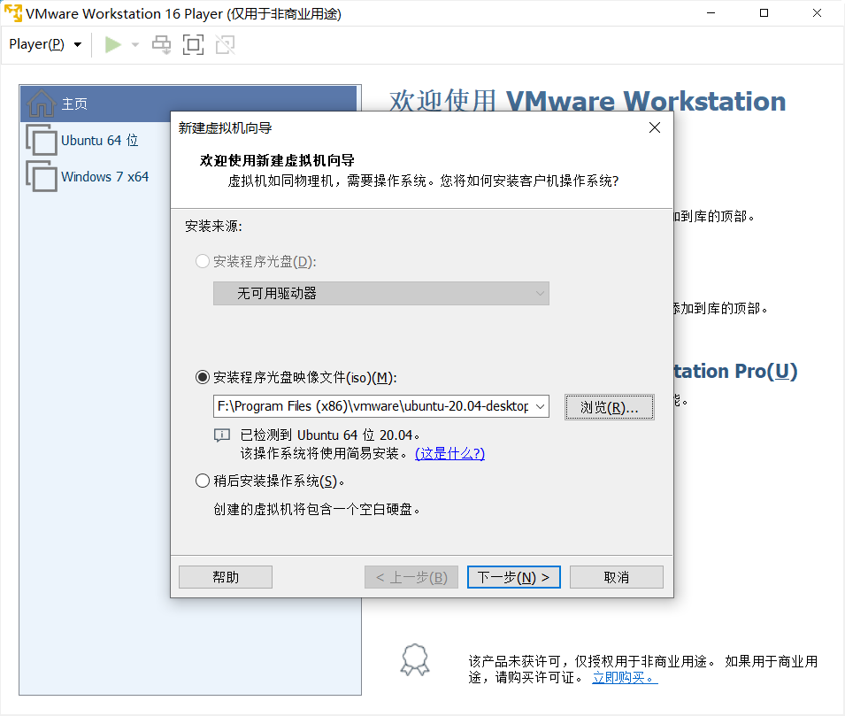

## Linux 安装

### VMware Workstation下载

[登录官网](https://customerconnect.vmware.com/cn/login?bmctx=296D2E0AAD70CA31C97E695D763C13F7622392514A6552A849FE0184F298DF1D&contextType=external&username=string&OverrideRetryLimit=1&action=%252F&password=secure_string&challenge_url=https%253A%252F%252Fcustomerconnect.vmware.com%252Flogin&creds=username%20password&request_id=-6550745593058096905&authn_try_count=0&locale=zh_CN&resource_url=%25252Fuser%25252Floginsso)

注册登录后点击这里的所有产品


打开后直接`ctrl+f`搜索`workstation`就找到了，选 player~（需要多处理器等高级功能就下Pro，但是需要许可证）


### VMware 配置

下载完成后安装，无脑下一步即可

安装的时候，来到这个网站找系统镜像

[NEXT, ITELLYOU](https://next.itellyou.cn/)

找到想要的系统迅雷下载~

安装完成后打开，选择创建新虚拟机


点击浏览找到下好的镜像系统



输入用户名密码


起个名字，在电脑里找个地方大的位置


无脑下一步开始啦


点击自定义硬件


差不多这么设置下就行了，以后也可以再改


等待安装完成进入系统后，登录账户（微软账户即可），然后一直`next`就完成了

### 相关软件包安装

#### 安装 Vim

`Linux` 必不可少的，先装个 `Vim`

`sudo apt install vim`    

输入密码，敲个`Yes`或者`Y`等他自己安装就行~轻轻松松

#### 安装 Git

在配置服务器或者共享文件夹之前，`git`用来互相传文件还是挺好用的

`sudo apt install git`

还是输入密码，确认后自动安装完成~

#### 安装 Flex

向作业低头，被迫下载

`sudo apt-get install flex`

#### 安装 bison

为了作业再低一次头

`sudo apt-get install bison`

#### 安装 python-qt4

低了两次也不少这一次了

`sudo apt-get install python-qt4`

不出意外会因为少什么东西报错。。。。

先输入`sudo add-apt-repository ppa:rock-core/qt4`

然后跳转到`download`目录下`cd ~/Downloads`

依次输入

`wget http://archive.ubuntu.com/ubuntu/pool/universe/q/qt-assistant-compat/libqtassistantclient4_4.6.3-7build1_amd64.deb`

`sudo apt-get install ./libqtassistantclient4_4.6.3-7build1_amd64.deb`

`wget http://archive.ubuntu.com/ubuntu/pool/universe/p/python-qt4/python-qt4_4.12.1+dfsg-2_amd64.deb`

`sudo apt-get install ./python-qt4_4.12.1+dfsg-2_amd64.deb`

`wget http://archive.ubuntu.com/ubuntu/pool/universe/p/python-pyaudio/python-pyaudio_0.2.11-1build2_amd64.deb	`

`sudo apt-get install ./python-pyaudio_0.2.11-1build2_amd64.deb`

然后再进行`sudo apt-get install python-qt4`就好啦~


成功打开~~


如果出现如下错误：

`Failed to load module "canberra-gtk-module"`

输入：`sudo apt-get install libcanberra-gtk-module`即可


### 文件交互


## 指令操作

 `ctrl c`：取消命令，并且换行

`ctrl u`：清空本行命令

`tab键`：可以补全命令和文件名，如果补全不了快速按两下tab键，可以显示备选选项

`ls`：列出当前目录下所有文件，蓝色的是文件夹，白色的是普通文件，绿色的是可执行文件

`pwd`：显示当前路径

`cd XXX`：进入`XXX`目录下, 

`cd ../`：返回上层目录

`cp XXX YYY`：将xx文件复制成`YYY`，`XXX`和`YYY`可以是一个路径，比如`../dir_c/a.txt`，表示上层目录下的`dir_c`文件夹下的文件`a.txt`

`mkdir XXX`：创建目录`XXX`

`rm XXX`：删除普通文件：

`rm XXX -r`：删除文件夹

`mv XXX YYY`：将`XXX`文件移动到`YYY`，和`cp`命令一样，`XXX`和`YYY`可以是一个路径﹔重命名也是用这个命令

`touch XXX`：创建一个文件

`cat XXX`：展示文件`XXX`中的内容

### 相关练习

0. 进入homework_0文件夹，分别创建文件夹`dir_a, dir_b,dir_c`

```shell
cd homework_0
mkdir dir_a dir_b dir_c

```

1. 进入homework_1文件夹，将a.txt，b.txt,c.txt分别复制成:`a.txt.bak, b.txt.bak,c.txt.bak`

```shell
cd homework_1
for var in *.txt;
do 
    cp "$var" "${$var%.txt}.txt.bak"
done
```

2. 进入homework 2文件夹，将`a.txt,b.txt,c.txt`分别重命名为:`a_new.txt,b_new.txt,c_new.txt`

```shell
cd homework_2
for var in *.txt;
do 
    cp "$var" "${$var%.txt}.new.txt"
done
```


3. 进入`homework _3`文件夹，将`dir_a`文件夹下的`a.txt,b.txt,c.txt`分别移动到文件夹`dir_b`下

```shell
cd homework_3
mv dir_a/* dir_b
```

4. 进入`homework_4`文件夹，将普通文件`a.txt, b.txt,c.txt`删除

```shell
cd homework_4
rm *
```

5. 进入`homework_5`文件夹，将文件夹`dir_a, dir b, dir_c`删除

```shell
cd homework_5
rm * -r
```

6. 进入`homework_6`文件夹，查看`task.txt`的内容，并按其指示进行操作

```shell
cd homework_6
cat task.txt
// 将task.txt重命名为done.txt，创建目录dir_a，将done.txt移动到目录dir_a下
mkdir dir_a
mv task.txt dir_a/done.txt
```


7. 进入`homework_7`文件夹，创建文件夹`dir_0, dir_1, dir_2`,将`a.txt,b.txt,c.txt`复制到`dir_0`下，重命名为`a0.txt,b0.txt,c0.txt`;将`a.txt,b.txt,c.txt`复制到`dir_1`下，重命名为`a1.txt, b1.txt,c1.txt`;将`a.txt,b.txt,c.txt`复制到`dir_2`下，重命名为`a2.txt,b2.txt,c2.txt`;

```shell
cd homework_7
for i in {0..2}
do 
	mkdir "dir_$i"
	for var in *.txt
	do 
		cp "$var" "dir_$i/${var%.txt}$i.txt"
	done
done
```


8. 进入`homework_8`文件夹，分别在`dir_a, dir_b, dir_c`文件夹下查看`task.txt`的内容，并分别按照指示进行操作

```shell
cd homework_8cd dir_acat task.txt// 将a.txt删除rm a.txtcd ../dir_bcat task.txt// 将b.txt重命名为b_new.txtmv b.txt b_new,txtcd ../dir_ccat task.txt// 将c.txt复制成c.txt.bakcp c.txt c.txt.bak
```

9. 进入`homework_9`文件夹，将其中所有`txt`类型的文件删除

```shell
cd homework_9r
```


## tmux 教程

### 功能

1. 分屏。

2. 允许断开Terminal连接后，继续运行进程。

### 结构


​    一个`tmux`可以包含多个`session`，一个`session`可以包含多个`window`，一个`window`可以包含多个pane。

### 实例

```shell
        tmux:
            session 0:
                window 0:
                    pane 0
                    pane 1
                    pane 2
                    ...
                window 1
                window 2
                ...
            session 1
            session 2
            ...
```


### 操作

​    

1. tmux：新建一个session，其中包含一个window，window中包含一个pane，pane里打开了一个shell对话框。

2. 按下Ctrl + a后手指松开，然后按%：将当前pane左右平分成两个pane。

3. 按下Ctrl + a后手指松开，然后按"：将当前pane上下平分成两个pane。

4. Ctrl + d：关闭当前pane；如果当前window的所有pane均已关闭，则自动关闭window；如果当前session的所有window均已关闭，则自动关闭session。

5. 鼠标点击可以选pane。

6. 按下ctrl + a后手指松开，然后按方向键：选择相邻的pane。

7. 鼠标拖动pane之间的分割线，可以调整分割线的位置。

8. 按住ctrl + a的同时按方向键，可以调整pane之间分割线的位置。

9. 按下ctrl + a后手指松开，然后按z：将当前pane全屏/取消全屏。

10. 按下ctrl + a后手指松开，然后按d：挂起当前session。

11. tmux a：打开之前挂起的session。

12. 按下ctrl + a后手指松开，然后按s：选择其它session。

​        方向键 —— 上：选择上一项 session/window/pane

​        方向键 —— 下：选择下一项 session/window/pane

​        方向键 —— 右：展开当前项 session/window

​        方向键 —— 左：闭合当前项 session/window

13. 按下Ctrl + a后手指松开，然后按c：在当前session中创建一个新的window。

14. 按下Ctrl + a后手指松开，然后按w：选择其他window，操作方法与12. 完全相同。

15. 按下Ctrl + a后手指松开，然后按PageUp：翻阅当前pane内的内容。

16. 鼠标滚轮：翻阅当前pane内的内容。

## vim 教程

### 功能

1. 命令行模式下的文本编辑器。

2. 根据文件扩展名自动判别编程语言。支持代码缩进、代码高亮等功能。

### 模式

1. **一般命令模式**

​        默认模式。命令输入方式：类似于打游戏放技能，按不同字符，即可进行不同操作。可以复制、粘贴、删除文本等。

2. **编辑模式**

​        在一般命令模式里按下`i`，会进入编辑模式。

​        按下`ESC`会退出编辑模式，返回到一般命令模式。

3. **命令行模式**

​        在一般命令模式里按下`:/?`三个字母中的任意一个，会进入命令行模式。命令行在最下面。

​        可以查找、替换、保存、退出、配置编辑器等。

### 操作

1. `i`：进入编辑模式

2. `ESC`：进入一般命令模式

3. `h` 或 左箭头键：光标向左移动一个字符

4. `j` 或 向下箭头：光标向下移动一个字符

5. `k` 或 向上箭头：光标向下移动一个字符

6. `l` 或 向右箭头：光标向右移动一个字符

7. `n`<Space>：n表示数字，按下数字后再按空格，光标会向右移动这一行的n个字符

8. `0` 或 功能键<Home>：光标移动到本行开头

9. `$` 或 功能键<End>：光标移动到本行末尾

10. `G`：光标移动到最后一行

11. :`n` 或 `nG`：`n`为数字，光标移动到第`n`行

12. `gg`：光标移动到第一行，相当于`1G`

13. `n`<Enter>：`n`为数字，光标向下移动`n`行

14. `/word`：向光标之下寻找第一个值为`word`的字符串。

15. `?word`：向光标之上寻找第一个值为`word`的字符串。

16. `n`：重复前一个查找操作

17. `N`：反向重复前一个查找操作

18. `:n1,n2s/word1/word2/g`：`n1`与`n2`为数字，在第`n1`行与`n2`行之间寻找`word1`这个字符串，并将该字符串替换为`word2`

19. `:1,$s/word1/word2/g`：将全文的`word1`替换为`word2`

20. `:1,$s/word1/word2/gc`：将全文的`word1`替换为`word2`，且在替换前要求用户确认。

21. `v`：选中文本

22. `d`：删除选中的文本

23. `dd`: 删除当前行

24. `y`：复制选中的文本

25. `yy`: 复制当前行

26. `p`: 将复制的数据在光标的下一行粘贴

27. `u`：撤销

28. `Ctrl + r`：取消撤销

29. `Shift + >`：将选中的文本整体向右移动

30. ` Shift + <`：将选中的文本整体向左移动

31. ` :w` 保存

32. ` :w!` 强制保存

33. ` :q` 退出

34. ` :q!` 强制退出

35. ` :wq` 保存并退出

36. ` :set paste` 设置成粘贴模式，取消代码自动缩进

37. ` :set nopaste` 取消粘贴模式，开启代码自动缩进

38. ` :set nu` 显示行号

39. ` :set nonu` 隐藏行号

40. ` gg=G`：将全文代码格式化

41. ` Ctrl + q`：当vim卡死时，可以取消当前正在执行的命令


### 相关练习


1. 进入`homework_0`文件夹，创建文件`names.txt`，并顺次将下列姓名写入该文件，每个名字占一行。
    `AcWing、yxc、Bob、张强、李明、Alice`

```shell
  cd homework_0
  vim names.txt
  iAcwing<Enter>yxc<Enter>Bob<Enter>张强<Enter>李明<Enter>Alice
  <Esc>
  :wq
```

  

2. 进入`homework_1`文件夹，打开`problem.txt`，并依次删除下列字符：

      3. 最后一行第`101`个字符.
      2. 第`3`行第`8`个字符
      3. 第`1`行第`30`个字符
      4. 第`16`行第`55`个字符
      5. 第`9`行第`80`个字符
      6. 最后保存文件并退出。


```shell
cd homework_1
vim problem.txt
G101<Space>i<backspace>Esc
3G8<Space>i<backspace>Esc
gg30<Space>i<backspace>Esc
16G55<Space>i<backspace>Esc
9G80<Space>i<backspace>Esc
:wq
```

3. 进入 `homework_2`文件夹，打开`problem.txt`，并依次执行如下操作：
    1. 在第1个`"two"`的后面添加`"abc"`
    2. 在第2个`"two"`的前面添加`"def"`
    3. 将第3个`"two"`后面的连续12个字符删掉
    4. 将第4个`"two"`所在的行删掉
    5. 最后保存文件并退出。

```shell
cd homework_2
vim problem.txt
gg
/two<Enter>
3<Space>iabc<Esc>
nidef<Esc>n
n3<Space>d12<Space>
ndd
:wq
```

4. 进入`homework_3`文件夹，打开`problem.txt`，并依次执行如下操作：

      1. 将第`5`行至第`15`行中所有`of`替换成`OF`。
      2. 将全文中所有的`the`替换成`THE`。
      3. 将第偶数个`is`替换成`IS`，第奇数个`is`不变。下标从`1`开始。

```shell
cd homework_3
vim problem.txt
:5,15s/of/OF/g
:1,$s/the/THE/g
:1,$s/is/IS/gcnynynynynyny...
```


5. 进入`homework_4`文件夹，打开`problem.txt`，并依次执行如下操作：

      1. 删除第`11`行
      2. 将所删除的行粘贴到文件最后一行的下一行

      2. 复制第`5`行

      3. 将所复制的行粘贴到文件当前最后一行的下一行

```shell
cd homework_4
vim problem.txt
11GddGp5GyyGp
:wq
```


6.  进入homework_5文件夹，打开problem.txt，并依次执行如下操作：
    1. 删除第11行第15个字符（包含该字符）至第13行第5个字符（包含该字符）
    2. 将所删除的内容粘贴到文件末尾（注意不要另起一行）
    3. 复制第5行第88个个字符（包含该字符）至第7行第6个字符（包含该字符）
    4. 将所复制的内容粘贴到当前文件末尾（注意不要另起一行）

```shell
cd homework_5
vim problem.txt
11G14<Space>v13G5<Space>dG$p
5G87<Space>v7G6<Space>yG$p
```


7. 进入`homework_6`文件夹，并依次执行如下操作：
    1. 清空`source0.cpp`
    
    2. 将`source1.cpp`中的第`1-3`行和第`12-24`行复制到`source0.cpp`中

```shell
cd homework_5
vim source0.cpp
ggdG:wq
vim source1.cpp
1Gv3G$y:q
vim source0.cpp
p:wq
vim source1.cpp
12Gv24G$y:q
vim source0.cpp
G$i<Right><Enter><Esc>p:wq
```


8. 进入`homework_7`文件夹，格式化`source.cpp`


```shell
cd homework_7
vim source.cpp
gg=G
```


9. 进入`homework_8`文件夹，打开`source.cpp`，并依次执行如下操作：
    1. 将第`15-21`行向右缩进`2`次
    2. 将第`22-23`行向左缩进`1`次。


```shell
cd homework_8
vim source.cpp
15Gv21G>15Gv21G>
22Gv23G<
```


​    

​    

9. 进入homework_9文件夹，打开链接：https://www.acwing.com/activity/content/code/content/1694465/新建文件source.cpp，将链接中的代码抄进source.cpp文件中。


```shell
cd homework_9
vim source.cpp
#include <iostream>

using namespace std;

int main()
{
    int a, b;
    cin >> a >> b;
    cout << a + b << endl;
    return 0;
}
<Esc>:wq
```


​    

   ## Shell 学习


`Linux`系统中一般默认使用`bash`，文件格式为`.sh`

文件开头需要写`#! /bin/bash`，指明`bash`为脚本解释器。


### 运行方式

````shell
$ chmod +x test.sh  # 使脚本具有可执行权限
$ ./test.sh  # 当前路径下执行
$ bash test.sh	# 用解释器执行
````


### 注释

```shell
# 单行注释
:<<{string}
	多行注释，string为任意字符串
{string}
```


### 变量

#### 定义变量

不加空格

`power=Gettler`

#### 使用变量

大括号加不加均可，起标记边界作用

`echo ${power}`

#### 只读变量

使用`readonly`或者`declare`可以将变量变为只读。

```shell
name=yxc
readonly name
declare -r name  # 两种写法均可

name=abc  # 会报错，因为此时name只读
```


#### 删除变量

`unset`可以删除变量。

```shell
name=yxc
unset name
echo $name  # 输出空行
```

#### 变量类型

1. 自定义变量（局部变量）子进程不能访问的变量
2. 环境变量（全局变量）子进程可以访问的变量

**自定义变量改成环境变量：**

```shell
$ name=yxc  # 定义变量
$ export name  # 第一种方法
$ declare -x name  # 第二种方法
```

**环境变量改为自定义变量：**

```shell
$ export name=yxc  # 定义环境变量
$ declare +x name  # 改为自定义变量
```


#### 字符串

字符串可以用单引号，也可以用双引号，也可以不用引号。

**单引号与双引号的区别：**

1. 单引号中的内容会原样输出，不会执行、不会取变量；

2. 双引号中的内容可以执行、可以取变量；

 ``` shell
    name=yxc  # 不用引号
    echo 'hello, $name \"hh\"'  # 单引号字符串，输出 hello, $name \"hh\"
    echo "hello, $name \"hh\""  # 双引号字符串，输出 hello, yxc "hh"
 ```

**获取字符串长度**

```shell
name="yxc"
echo ${#name}  # 输出3
```

**提取子串**

```shell
name="hello, yxc"
echo ${name:0:5}  # 提取从0开始的5个字符
```

 


### 数组

数组中可以存放多个不同类型的值，==只支持一维数组==，初始化时不需要指明数组大小。
数组下标从0开始。

**定义**

数组用小括号表示，元素之间用空格隔开。例如：

```shell
array=(1 abc "def" yxc)
```


也可以直接定义数组中某个元素的值：

```shell
array[0]=1
array[1]=abc
array[2]="def"
array[3]=yxc
```

**读取数组中某个元素的值**

格式：

```shell
${array[index]}
```


例如：

```shell
array=(1 abc "def" yxc)
echo ${array[0]}
echo ${array[1]}
echo ${array[2]}
echo ${array[3]}
```

**读取整个数组**

格式：

```shell
${array[@]}  # 第一种写法
${array[*]}  # 第二种写法	
```

例如：

```shell
array=(1 abc "def" yxc)

echo ${array[@]}  # 第一种写法
echo ${array[*]}  # 第二种写法
```


### 相关练习

0. 进入`homework_0`文件夹，编写自动完成`lesson_1`作业的脚本`helper.sh`。要求：
     1. 当前目录下仅包含`helper.sh`

     2. `helper.sh`具有可执行权限

     3. 在任意路径依次执行下列命令后，`lesson_1`的作业可以得到满分：

```shell
homework 1 create
/home/acs/homework/lesson_3/homework_0/helper.sh
```
```shell
# echo "helloworld"

# homework_0

dir=/home/acs/homework/lesson_1/homework_

for i in dir_a dir_b dir_c
do
    mkdir ${dir}0/$i
done

# homework_1


for i in a b c
do
    cp ${dir}1/${i}.txt ${dir}1/${i}.txt.bak
done

# homework_2

for i in a b c
do
    mv ${dir}2/${i}.txt ${dir}2/${i}_new.txt
done

# homework_3

for i in a b c
do
    mv ${dir}3/dir_a/${i}.txt ${dir}3/dir_b/${i}.txt
done

# homework_4

for i in a b c
do
    rm ${dir}4/${i}.txt
done

# homework_5

for i in a b c
do
    rm ${dir}5/dir_${i} -r
done


# homework_6

mkdir ${dir}6/dir_a
mv ${dir}6/task.txt "${dir}6/done.txt"

mv "${dir}6/done.txt" "${dir}6/dir_a"

# homework_7

for i in $(seq 0 2)
do
    mkdir ${dir}7/dir_${i}
    for j in a b c
    do
        cp ${dir}7/${j}.txt ${dir}7/dir_${i}/${j}${i}.txt
    done
done

# homework_8

rm ${dir}8/dir_a/a.txt

mv ${dir}8/dir_b/b.txt ${dir}8/dir_b/b_new.txt

cp ${dir}8/dir_c/c.txt ${dir}8/dir_c/c.txt.bak

# homework_9

rm ${dir}9/*.txt
```
1. 进入`homework_1`文件夹，编写脚本`check_file.sh`。要求：
    1. 当前目录下仅包含`check_file.sh`。
    2. `heck_file.sh`具有可执行权限。
    3. `check_file.sh`接收一个传入参数。格式为 `./check_file.sh file`
    4. 判断传递参数，分别在标准输出中输出如下内容（不包括双引号）：
        1. 如果传入参数个数不是`1`，则输出一行：`arguments not valid`，然后退出，退出状态等于`1`。
        2. 如果`file`文件不存在，则输出一行：`not exist`，然后退出，退出状态等于2。
        3. 如果`file`文件存在，则输出分别进行如下`5`个判断，然后退出，退出状态等于0。
            1. 如果`file`为普通文件，则输出一行：`regulare file`
            2. 如果`file`为目录（文件夹），则输出一行：`directory`
            3. 如果`file`具有可读权限，则输出一行：`readable`
            4. 如果`file`具有可写权限，则输出一行：`writable`
            5. 如果`file`具有可执行权限，则输出一行：`executable`

```shell
#! /bin/bash

if [ $# -ne 1 ]
then
    echo arguments not valid
    exit 1
fi

if [ -e "$1" ]
then
    if [ -f "$1" ]
    then
        echo regulare file
    fi

    if [ -d "$1" ]
    then
        echo directory
    fi

    if [ -r "$1" ]
    then
        echo readable
    fi
    
    if [ -w "$1" ]
    then
        echo writable
    fi
    
    if [ -x "$1" ]
    then
        echo executable
    fi
    
    exit 0
else
    echo not exist
    exit 2
fi
```

2. 进入`homework_2`文件夹，编写脚本`main.sh`。要求：
   
      1. 当前目录下仅包含`main.sh`
      2. `main.sh`具有可执行权限
      3. 该文件从`stdin`(标准输入)中读取一个整数`n`
      4. 在`stdout`(标准输出)输出斐波那契数列的第n项。即：`a[0] = 1, a[1] = 1, a[i] = a[i - 1] + a[i - 2]`, 求`a[n]`。
      5.  数据保证 `0 <= n <= 20`，脚本不需要判断n的合法性。
```shell
#! /bin/bash
read n
a[0]=1
a[1]=1
for((i=2;i<=n;i++))
do
    a[i]=$(expr ${a[i-1]} + ${a[i-2]})
done
echo ${a[n]}
```

3. 进入`homework_3`文件夹，编写脚本`main.sh`。要求：
       1. 当前目录下仅包含`main.sh`
           2. `main.sh`具有可执行权限
           3. 该文件从`stdin`(标准输入)中读取两行整数`n`和`m`
           4. 在`stdout`(标准输出)中输出`1~n`的按字典序从小到大的顺序数第`m`个全排列，输出一行，用空格隔开所有数，行末可以有多余空格。
           5. 数据保证 `1 <= n <= 10, 1 <= m <= min(100, n!)`，脚本不需要判断数据的合法性。
```shell
#! /bin/bash

read n
read m

for ((i = 1; i <= n; i++))
do
    st[$i]=0
done

dfs(){
    if [ $1 -eq $n ]
    then
        m=`expr $m - 1`
        if [ $m -eq 0 ]
        then
            echo ${path[@]}
            return 0
        fi
        return 1
    fi
    local j=0
    for((j = 1; j <= n; j++))
    do
        if [ ${st[$j]} -eq 0 ]
        then
            path[$1]=$j
            st[$j]=1
            if dfs `expr $1 + 1`
            then
                return 0
            fi

            st[$j]=0
        fi
    done

    return 1
}


dfs 0
```

==*if 后边必须加空格！！！*==

4. 进入`homework_4`文件夹，编写脚本`main.sh`。要求：
    1. 当前目录下仅包含`main.sh`
    2. `main.sh`具有可执行权限
    3. `main.sh`接收两个传入参数。格式为 `./main.sh input_file output_file`
    4. 从`input_file`中读取一个正整数`n`，然后将前`n`个正整数的平方和写入`output_file`中
    5. 数据保证 `1 <= n <= 100`，脚本不需要判断所有数据的合法性。

```shell
#! /bin/bash

input_file=$1
output_file=$2

read n < $input_file

sum=0

for ((i = 1; i <= n; i++))
do
    a=`expr $i \* $i`
    sum=`expr $sum + $a`
done

echo $sum > $output_file

```


## ssh 相关操作

### ssh 登录

```shell
ssh user@hostname
```

- user: 用户名

- hostname: IP地址或域名

第一次登录时会提示：

```shell
    The authenticity of host '123.57.47.211 (123.57.47.211)' can't be established.
    ECDSA key fingerprint is SHA256:iy237yysfCe013/l+kpDGfEG9xxHxm0dnxnAbJTPpG8.
    Are you sure you want to continue connecting (yes/no/[fingerprint])?
```

​    

输入`yes`，然后回车即可。

这样会将该服务器的信息记录在`~/.ssh/known_hosts`文件中。

然后输入密码即可登录到远程服务器中。

默认登录端口号为`22`。如果想登录某一特定端口：

`ssh user@hostname -p 22`

配置文件

创建文件 `~/.ssh/config`。

然后在文件中输入：

```shell
Host myserver1
    HostName IP地址或域名
    User 用户名

Host myserver2
    HostName IP地址或域名
    User 用户名
```

之后再使用服务器时，可以直接使用别名`myserver1`、`myserver2`。

**密钥登录**

创建密钥：

`ssh-keygen`

然后一直回车即可。

执行结束后，`~/.ssh/`目录下会多两个文件：

- id_rsa：私钥

- id_rsa.pub：公钥

之后想免密码登录哪个服务器，就将公钥传给哪个服务器即可。

例如，想免密登录`myserver`服务器。则将公钥中的内容，复制到`myserver`中的`~/.ssh/authorized_keys`文件里即可。

也可以使用如下命令一键添加公钥：

`ssh-copy-id myserver`

执行命令

命令格式：

`ssh user@hostname command`

例如：

`ssh user@hostname ls -a`

或者

##### ==单引号中的$i可以求值==

`ssh myserver 'for ((i = 0; i < 10; i ++ )) do echo $i; done'`

或者

##### ==双引号中的$i不可以求值==

`ssh myserver "for ((i = 0; i < 10; i ++ )) do echo $i; done"`


### scp 传文件

**基本用法**

命令格式：

`scp source destination`

将`source`路径下的文件复制到`destination`中

一次复制多个文件：

`scp source1 source2 destination`

复制文件夹：

`scp -r ~/tmp myserver:/home/acs/`

将本地家目录中的tmp文件夹复制到`myserver`服务器中的`/home/acs/`目录下。

`scp -r ~/tmp myserver:homework/`
将本地家目录中的`tmp`文件夹复制到`myserver`服务器中的`~/homework/`目录下。

`scp -r myserver:homework .`

将`myserver`服务器中的`~/homework/`文件夹复制到本地的当前路径下。

指定服务器的端口号：

`scp -P 22 source1 source2 destination`

注意： `scp`的`-r -P`等参数尽量加在`source`和`destination`之前。

使用`scp`配置其他服务器的`vim`和`tmux`

`scp ~/.vimrc ~/.tmux.conf myserver:`


### 相关练习

创建好作业后，先进入文件夹`/home/acs/homework/lesson_4/`，然后：

0. 进入`homework_0`文件夹，要求：

     1.  该文件夹内容为空

     2. 配置服务器账号的密钥登陆方式。服务器信息可以通过如下命令获得：

         `homework 4 getinfo`

         将服务器账号的名称`（Host）`配置成：`myserver`
         
```shell
Host myserver
HostName 123.57.47.211
User acs_911
```

​         

1. 入`homework_1`文件夹，下列描述中的“本地”均表示当前文件夹。要求：

    1. 在`myserver`服务器上创建并清空文件夹：`~/homework/lesson_4/homework_1/`
    
    2. 将本地的`main.cpp`文件上传到`myserver`中的`~/homework/lesson_4/homework_1/`目录中。
    
    3. 在本地创建文件夹`dir`。
    
    4. 将`myserver`中的`/etc/lsb-release`文件复制到`dir`中。
    
        

```shell

```

​         


2. 进入`homework_2`文件夹，下列描述中的“本地”均表示当前文件夹，要求：

    1. 在`myserver`服务器上创建并清空文件夹：`~/homework/lesson_4/homework_2/`
    2. 将本地的`dir`文件夹上传到`myserver`中的`~/homework/lesson_4/homework_2/`目录中。


```shell

```

​         


3. 进入`homework_3`文件夹，下列描述中的“本地”均表示当前文件夹，要求：

    1. 在本地创建文件夹`dir`。
    2. 将`myserver`中的`/var/lib/locales/supported.d`文件夹下载到本地dir文件夹中。


```shell

```

 


4. 进入`homework_4`文件夹，编写脚本`remote_mkdir.sh`和`remote_rmdir.sh`，要求：

    1. 在`myserver`服务器上创建并清空文件夹：`~/homework/lesson_4/homework_4/`

    2. 本地目录下仅包含`remote_mkdir.sh`和`remote_rmdir.sh`

    3.  `remote_mkdir.sh`和`remote_rmdir.sh`具有可执行权限

    4.  `remote_mkdir.sh`接收一个传入参数。格式为 `./remote_mkdir.sh directory_name`

        ​		该操作可以在`myserver`服务器上的`~/homework/lesson_4/homework_4/`目录下，创建一个名为`directory_name`的文件夹

    5. `remote_rmdir.sh`接收一个传入传输。格式为 `./remote_rmdir.sh directory_name`
              
       
       ​		该操作可以将`myserver`服务器上的`~/homework/lesson_4/homework_4/`目录下的名为`directory_name`的文件夹删掉。
       ​            
       
     6. 注意：传入的文件参数可能包含空格。两个脚本均不需要判断传入参数的合法性。


```shell

```

